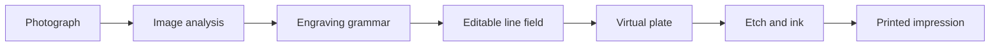

<p align="center">
  
</p>

<h1 align="center">Etchloom</h1>

<p align="center"><strong>Weave images into digital prints.</strong></p>

<p align="center">
  A local-first studio for generative engraving, virtual plates, etching, and printmaking.
</p>

<p align="center">
  <a href="README.md">English</a> · <a href="README.zh-CN.md">简体中文</a>
</p>

<p align="center">
  
  
  
  <a href="LICENSE"></a>
</p>


Etchloom translates a photograph into an editable language of engraved marks. Regional hatching follows form, cross-hatching grows through shadow, micro-marks retain small structures, and deterministic seeds produce controlled variations. The drawing then becomes a virtual plate that can be etched, inked, pressed, and printed.

## Highlights

- **Image-aware engraving** — contours, tone, local texture, and structural direction drive every mark.
- **Multi-scale detail** — broad tonal masses, coherent hatch bundles, and fine needle marks work together.
- **Editable line fields** — guide direction, recover white, or protect a finished region.
- **Virtual printmaking** — work with plate depth, resist, acid, plate tone, ink, pressure, and paper.
- **Reproducible variations** — the same image, settings, and seed always rebuild the same design.
- **Print-oriented export** — export physical-scale PNG, SVG paths, recipes, and complete virtual plates.
- **Private by design** — images remain in the browser and are never uploaded.

## From image to impression



The plate stores depth, exposed material, and stop-out separately from its printed appearance. A single design can therefore produce different impressions as wiping, ink, pressure, and paper change.

## Quick start

Etchloom has no build step and no runtime packages.

### Open it directly

Double-click `index.html` for a completely offline session. Detailed generations run on the main browser thread in this mode.

### Run the local studio

With Node.js 20 or newer:

```bash
npm start
```

Open <http://127.0.0.1:4173/>. The local server enables background generation through a Web Worker. To load the included sample automatically, open:

```text
http://127.0.0.1:4173/?demo=1
```

## Engraving vocabulary

| Layer | What it contributes |
|---|---|
| Regional hatching | Stable local direction and hand-cut bundle rhythm |
| Cross-hatching | Progressive density through midtones and shadows |
| Micro engraving | Fine edges, hair, foliage, masonry, and surface changes |
| Lost-and-found contour | Open weak edges and decisive silhouettes |
| Dark mass | Depth with small retained paper openings |
| Background field | Environmental tone that stops around strong subject edges |

## Editing and plate tools

| Tool | Purpose |
|---|---|
| Direction guide | Bend marks toward a chosen local direction |
| White | Remove marks and recover paper |
| Protect | Freeze a finished region during later variations |
| Needle / Drypoint | Draw directly into the virtual plate |
| Stop-out / Burnisher | Protect or reduce existing plate depth |

## Export and reproducibility

Etchloom exports print-ready PNG with physical DPI metadata, scalable SVG engraving paths, deterministic design recipes, and complete virtual plates. Target needle width and ink-gain compensation affect plate transfer, PNG, and SVG output.

Saved recipes contain the grayscale analysis, parameters, and random seeds. They do not contain the original color photograph. Older `kejian-design` recipes and browser favorites remain readable.

## Project structure

```text
.
├─ index.html                 Browser entry and virtual plate studio
├─ src/
│  ├─ core/                  Generation, engraving, and plate codecs
│  ├─ ui/                    Image workflow and local editing
│  └─ workers/               Background generation worker
├─ styles/                   Workbench styles
├─ tests/                    Deterministic Node test suite
├─ examples/                 Programmatically created sample images
├─ docs/                     Algorithm notes and refinement plans
├─ scripts/                  Local server and benchmark
└─ .github/workflows/        Continuous integration
```

## Development

```bash
npm test          # Run all 33 tests
npm run benchmark # Update BENCHMARK.json
npm start         # Start the local studio
```

The core remains compatible with browsers and Node tests. The suite covers deterministic generation, fine-feature retention, regional engraving grammar, plate persistence, physical stroke scaling, Worker cancellation, and direct-file operation.

Read the [engraving texture plan](docs/LINE_TEXTURE_PLAN.md), review the [refinement record](docs/REFINEMENT_PLAN.md), or see [CONTRIBUTING.md](CONTRIBUTING.md) before submitting a change.

## Material calibration

Needle-width conversion is physically scaled. Paper absorption, etching expansion, and pressure presets are visual models until they can be calibrated against real printed sheets.

## License

[MIT](LICENSE) © 2026 Contributors
