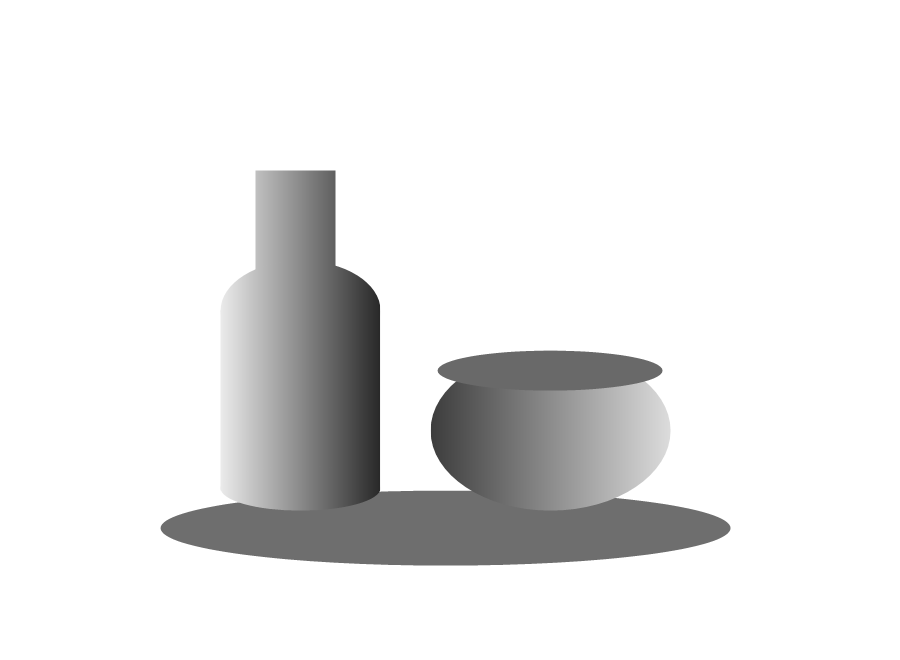

# 刻间 · 数字版画实验台

一个无需安装依赖、可在浏览器中运行的数字蚀刻实验。上传 JPG 或 PNG 后，程序会把明暗、轮廓和局部纹理转换成区域排线、交叉排线、微细节针痕与暗部墨团，再将刻线转入虚拟铜版进行腐蚀和压印。



## 快速开始

最简单的方式是直接双击根目录的 `index.html`。图片只在本机处理；这种模式不使用 Web Worker，复杂图片生成时界面可能短暂停顿。

推荐使用 Node.js 20 或更高版本启动本地预览：

```bash
npm start
```

然后打开 <http://127.0.0.1:4173/>。项目没有第三方运行时依赖，也不需要执行 `npm install`。

## 使用方法

1. 上传 JPG 或 PNG，选择分析精度与构图。
2. 调节细节、明暗、轮廓、排线和几何纹理。
3. 生成变奏，并用引导方向、留白和保护工具进行局部修整。
4. 进入制版，调整腐蚀、墨量、压力和纸张。
5. 导出 PNG、SVG、方案文件或完整虚拟版。

同一个方案由图片灰度分析、参数和随机种子决定，因此可以复现。保存方案不包含原始彩色图片；恢复后可以继续生成，但重新裁切需要再次上传原图。

## 项目结构

```text
.
├─ index.html                 浏览器入口与虚拟铜版工作台
├─ src/
│  ├─ core/                  图案生成、图片刻线与制版编码
│  ├─ ui/                    图片工作流与局部修整界面
│  └─ workers/               后台生成 Worker
├─ styles/                   工作台样式
├─ tests/                    Node 内置测试
├─ examples/                 可公开使用的程序化示例图片
├─ docs/                     算法设计与精进记录
├─ scripts/                  本地服务器与性能基准
└─ .github/workflows/        GitHub Actions
```

## 开发命令

```bash
npm test          # 运行全部自动测试
npm run benchmark # 更新 BENCHMARK.json
npm start         # 启动本地预览
```

核心代码保持无构建步骤的 UMD/浏览器脚本形式，既能由 Node 测试加载，也能通过 `file://` 直接运行。算法说明见 [线条纹理计划](docs/LINE_TEXTURE_PLAN.md)，历史交付记录见 [精进记录](docs/REFINEMENT_PLAN.md)。

## 当前边界

针宽与增墨补偿已经作用于制版、PNG 和 SVG 输出，但纸张吸墨、腐蚀扩张和压力仍是视觉模型。真实材料预设需要用实物印样标定。

## 贡献

提交改动前请运行 `npm test`。问题报告和算法讨论所需的信息见 [CONTRIBUTING.md](CONTRIBUTING.md)。

本项目采用 [MIT License](LICENSE)。
