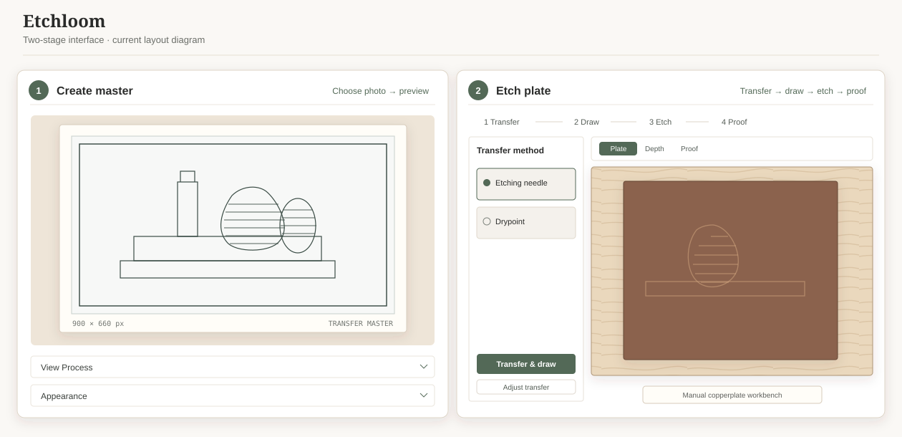

<p align="center">
  
</p>

<h1 align="center">Etchloom: Digital Classical Printmaking Studio</h1>

<p align="center"><strong>Photo-to-master printmaking and a hands-on virtual copperplate studio</strong></p>

<p align="center">
  <a href="README.md">English</a> · <a href="README.zh-CN.md">简体中文</a>
</p>

<p align="center">
  
  
  <a href="LICENSE"></a>
</p>



The diagram shows the current layout rather than a screen capture. First, choose a photo to make a line master; the process cards and appearance controls stay collapsed until needed. Then transfer the master to the copperplate and draw, etch, and proof it by hand.

---

## 1. Executive Summary

Etchloom is a local-first, open-source studio for computational geometry, photography, and digital intaglio printmaking. It transforms photographs into vector masters and print previews using geometric image processing and a two-dimensional plate grid simulation.

The architecture strictly decouples algorithmic computational engines from host presentation layers:
- **Pure Algorithmic Core (`src/core/`)**: A 5-stage discrete mathematical pipeline based on 2D guided filtering, structure tensor fields, and Jobard-Lefer streamline integration, maintained as strictly isomorphic between Node.js and browser runtimes;
- **Virtual Copperplate Simulation (`src/core/plate/`)**: Solves 2D partial differential equations (PDE) for isotropic lateral acid bite and drypoint burr displacement across contiguous 1D row-major TypedArray memory grids;
- **Frontend (`src/ui/`, `index.html`)**: A small HTML entry that mounts ES module templates; the five-stage process view is available on demand.

---

## 2. Core Architectural Highlights

1. **5-Stage Discrete Mathematical Geometry Pipeline**:
   Spans grayscale line extraction (Stage 1), multi-scale tone field & contour tangent field decomposition (Stage 2), 3D depth-driven aerial perspective contouring (Stage 3), 15-module surface-conforming geometric hatching (Stage 4), and final master vector synthesis (Stage 5).
2. **Partial Differential Equation (PDE) Chemical Acid Bite Simulation**:
   Numerically solves 4-neighborhood lateral acid bite and vertical depth deepening PDEs on 1500×1100 or 3000×2200 physical grids, with full support for stop-out varnish masking and drypoint metal burr acid erosion.
3. **Headless Computation and Automated Tests**:
   Most computational operators and the plate simulation run in Node.js; canvas helpers and inference requests retain browser or network adapters. Run `npm test` for the current test count. Passing tests do not establish code coverage.
4. **DAG Incremental State Caching & Preemptive Task Scheduling**:
   Monitors parameter changes with deterministic 32-bit DJB2 hashing. Modifying hatching parameters recomputes Stages 4–5 when earlier stages are cached. `AbortController` cancels obsolete computations at stage boundaries; an active synchronous stage cannot be interrupted immediately.

---

## 3. Directory Layout & Submodule Index

```text
.
├─ index.html                               # Small HTML entry; UI templates mount at runtime
├─ package.json                             # Project manifest (npm test / npm start)
├─ src/
│  ├─ main.js                               # Frontend entry point (Native ES Modules)
│  ├─ core/                                 # Layer 1: 5-Stage Algorithmic Core [Documentation](src/core/README.md)
│  │  ├─ pipeline/                          # 5-Stage pipeline operators & dispatcher
│  │  ├─ codecs/                            # Contiguous physical plate serializing & decoding
│  │  ├─ image/                             # Photographic tone analysis & seed variations
│  │  ├─ hatching/                          # 15 Hatching & vector flow modules [Documentation](src/core/hatching/README.md)
│  │  └─ plate/                             # Copperplate physical simulation [Documentation](src/core/plate/README.md)
│  │     ├─ engine/                         # Virtual plate studio coordinator & history stack
│  │     ├─ physics/                        # 2D PDE chemical acid bite & drypoint physics
│  │     └─ renderer/                       # Intaglio press debossing & specular lighting
│  ├─ orchestration/                        # Layer 2: Scheduling & Caching [Documentation](src/orchestration/README.md)
│  │  ├─ engine/                            # DAG pipeline coordinator
│  │  ├─ scheduler/                         # Debounced task queue & preemptive cancellation
│  │  ├─ cache/                             # Deterministic DJB2 hash-keyed stage cache
│  │  ├─ export/                            # Multi-format vector & raster exporters
│  │  └─ telemetry/                         # Execution profiling & event logging
│  ├─ services/                             # Layer 2: Service Gateway [Documentation](src/services/README.md)
│  │  └─ client/                            # Dual-backend WebAI & remote client gateway
│  └─ ui/                                   # Layer 3 & 4: Presentation & Studio UI [Documentation](src/ui/README.md)
│     ├─ i18n/                              # Chinese, English, and Vietnamese dictionary & binder
│     ├─ templates/                         # Modular HTML component templates
│     ├─ controllers/                       # Decoupled UI event controllers [Documentation](src/ui/controllers/README.md)
│     ├─ components/                        # UI widgets, step flow grid, & loupe magnifier [Documentation](src/ui/components/README.md)
│     └─ store/                             # Reactive unidirectional state store [Documentation](src/ui/store/README.md)
├─ services/                                # Layer 0: Python Neural Microservices
│  ├─ informative_drawings/                 # Grayscale line extraction service [Documentation](services/informative_drawings/README.md)
│  └─ lotus_geometry/                       # Lotus depth & surface normal service [Documentation](services/lotus_geometry/README.md)
├─ styles/                                  # Fresh Atelier Light design system CSS (app.css)
├─ tests/                                   # Node.js test suites discovered by scripts/test-runner.cjs
├─ docs/                                    # Technical specifications & engineering standards [Documentation Index](docs/README.md)
└─ archive/                                 # Historical experimental prototypes & research notes
```

---

## 4. Mathematical Principles & Numerical Modeling

- **Guided Filter Tone Decomposition**:
  $$a = \frac{\text{cov}(I, p)}{\text{var}(I) + \epsilon}, \quad b = \bar{p} - a \cdot \bar{I}$$
- **Aerial Perspective Depth-Modulated Stroke Width**:
  $$w(z) = w_0 \cdot \max\left(1 - \alpha, 1 - \alpha \cdot \frac{z - 0.35}{0.65}\right)$$
- **2D PDE Isotropic Acid Bite Diffusion**:
  $$E^{t+\Delta t} = \min\left(1.0, E^t + \max(0, E_{\text{edge}} - E^t) \cdot \Delta t \cdot S \cdot (0.14 + 0.55 G \eta)\right)$$

---

## 5. 3-Tier Execution Modes & Environment Specifications

The system can use three processing paths. Model availability is shown in the advanced controls; the base geometry path remains available without a model service:

| Execution Tier | Runtime Environment | Connectivity & Dependencies | Capabilities & Primary Use Case |
| :--- | :--- | :--- | :--- |
| **1. Base Offline**<br>`Offline Mode (Geometric)` | Browser with a local HTTP server (`npm start`) | Base geometry processing requires no external network or runtime packages | Native ESM modules need HTTP loading; direct `file://` opening is not a supported startup method. |
| **2. Local WebAI**<br>`Local Model (WebGPU/WASM)` | Modern Browser / Standalone App | Bundled local model weights (runtime requires initial load or cached ORT) | In-app neural inference with bundled Informative Drawings and MiDaS v2.1 Small ONNX models via WebGPU hardware acceleration (or WASM fallback); gracefully degrades to base geometry when offline or unavailable. |
| **3. Local Python AI** | Host Python environment | Optional service at `http://127.0.0.1:7861` | Runs available neural inference locally; acceleration depends on the installed runtime and hardware. |

### 5.1 Quick Start Frontend Studio
```bash
npm start
```
Open <http://127.0.0.1:4173/> in your browser. Use the language tabs, or append `?lang=en`, `?lang=zh`, or `?lang=vi` to select a starting language.

### 5.2 Optional Local Python AI Service
```powershell
powershell -ExecutionPolicy Bypass -File scripts/start-model.ps1
```
When the service is available on port `7861`, the frontend gateway can select it for inference. Hardware acceleration depends on the local environment.

### 5.3 Standalone Desktop Application (GitHub Releases)
The repository contains a Tauri desktop configuration and a Windows/macOS release workflow. Check [Releases](https://github.com/gongzhimin/Etchloom/releases) for available builds and their current filenames. To prepare the web assets locally, run `npm run build`; building a desktop installer also requires the Tauri toolchain for your platform.

---

## 6. Testing & Quality Assurance

```bash
npm test
```
The test runner discovers all `tests/*.test.cjs` files and prints the current totals. Test counts and duration change as the project evolves.
Refer to [docs/verification/TESTING.md](docs/verification/TESTING.md) for testing methodologies and coverage requirements.

---

## 7. License & Contributing

- **License**: Released under the [MIT License](LICENSE);
- **Contribution Standards**: Please review [CONTRIBUTING.md](CONTRIBUTING.md) and [docs/README.md](docs/README.md).
