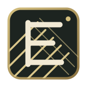
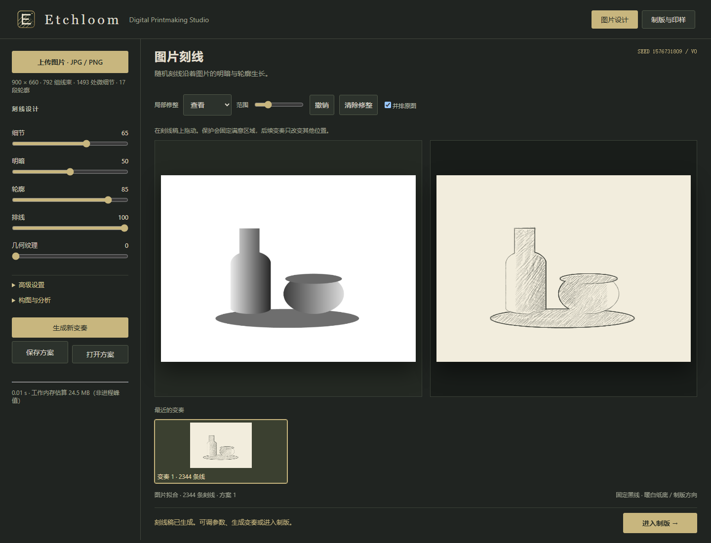
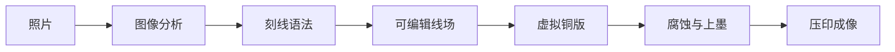

<p align="center">
  
</p>

<h1 align="center">Etchloom</h1>

<p align="center"><strong>让图像在刻线中重新生长。</strong></p>

<p align="center">
  一套本地运行的生成式数字版画工作台：从图片刻线、虚拟制版到腐蚀与压印。
</p>

<p align="center">
  <a href="README.md">English</a> · <a href="README.zh-CN.md">简体中文</a>
</p>

<p align="center">
  
  
  
  <a href="LICENSE"></a>
</p>



Etchloom 将照片重新组织成可编辑的版画刻线。区域排线跟随形体，交叉排线进入阴影，微细节针痕保留小尺度结构，随机种子则让每次变奏都可以复现。完成的刻线可以转入虚拟铜版，继续腐蚀、上墨、加压并得到印样。

## 核心能力

- **图片驱动的刻线**：轮廓、明暗、局部纹理与结构方向共同决定线条。
- **多尺度细节**：大明暗块、中尺度线束和微细针痕共同刻画图像。
- **可编辑线场**：引导局部方向、恢复留白或保护已经完成的区域。
- **虚拟制版**：分别控制刻深、防蚀层、酸液、擦版留墨、压力和纸张。
- **可复现变奏**：相同图片、参数和种子会得到相同的版画设计。
- **面向印刷的导出**：支持物理尺寸 PNG、SVG、设计方案和完整虚拟版。
- **图片留在本机**：所有分析与生成均在浏览器内完成。

## 从图像到印样



虚拟版会分别保存刻深、暴露材料和防蚀保护。同一块版可以通过不同的墨量、擦版、压力与纸张得到不同印样。

## 快速开始

Etchloom 没有构建步骤，也没有第三方运行依赖。

### 直接打开

双击根目录的 `index.html` 即可离线使用。复杂图片会在浏览器主线程中生成，期间界面可能短暂停顿。

### 启动本地工作台

推荐使用 Node.js 20 或更高版本：

```bash
npm start
```

打开 <http://127.0.0.1:4173/>。本地服务器会启用 Web Worker，让精细生成在后台运行。下面的地址会自动载入仓库示例：

```text
http://127.0.0.1:4173/?demo=1
```

## 刻线语言

| 层次 | 作用 |
|---|---|
| 区域排线 | 建立稳定的局部方向和成束针痕节奏 |
| 交叉排线 | 随中间调与暗部逐渐增加密度 |
| 微细刻线 | 保留发丝、叶缘、砖缝和表面变化 |
| 失落轮廓 | 省略弱边缘，同时保留关键剪影 |
| 暗部墨团 | 加深最暗区域，并留下少量纸面亮孔 |
| 背景线场 | 塑造环境调子，在主体强边缘前停止 |

## 局部编辑与制版工具

| 工具 | 用途 |
|---|---|
| 引导方向 | 将选区内刻线弯向指定方向 |
| 留白 | 移除刻线并恢复纸面 |
| 保护 | 固定满意区域，使后续变奏不再改变它 |
| 刻针 / 干刻针 | 直接在虚拟版上增加刻痕 |
| 防蚀层 / 刮磨器 | 阻止继续腐蚀或减浅已有刻痕 |

## 导出与复现

Etchloom 可以导出带物理 DPI 的 PNG、可缩放 SVG 刻线路径、可复现设计方案，以及包含刻深和防蚀数据的完整虚拟版。目标针宽与增墨补偿会真正作用于制版、PNG 和 SVG 输出。

方案文件保存灰度分析、参数和随机种子，不保存原始彩色照片。旧版 `kejian-design` 方案和浏览器收藏仍然可以读取。

## 项目结构

```text
.
├─ index.html                 浏览器入口与虚拟铜版工作台
├─ src/
│  ├─ core/                  生成、刻线与制版编码
│  ├─ ui/                    图片工作流与局部编辑
│  └─ workers/               后台生成 Worker
├─ styles/                   工作台样式
├─ tests/                    可复现的 Node 测试
├─ examples/                 程序生成的公开示例图片
├─ docs/                     算法说明与精进计划
├─ scripts/                  本地服务器与性能基准
└─ .github/workflows/        持续集成
```

## 开发

```bash
npm test          # 运行全部 33 项测试
npm run benchmark # 更新 BENCHMARK.json
npm start         # 启动本地工作台
```

核心代码同时兼容浏览器和 Node 测试。自动测试覆盖生成复现、细节保留、区域刻线语法、虚拟版保存、物理线宽换算、Worker 取消和直接文件运行。

进一步阅读：[刻线纹理计划](docs/LINE_TEXTURE_PLAN.md)、[精进记录](docs/REFINEMENT_PLAN.md)和[贡献指南](CONTRIBUTING.md)。

## 实物标定

针宽已经按物理尺寸换算。纸张吸墨、腐蚀扩张和压力预设目前仍是视觉模型，需要通过真实印样继续标定。

## 许可证

[MIT](LICENSE) © 2026 Contributors
