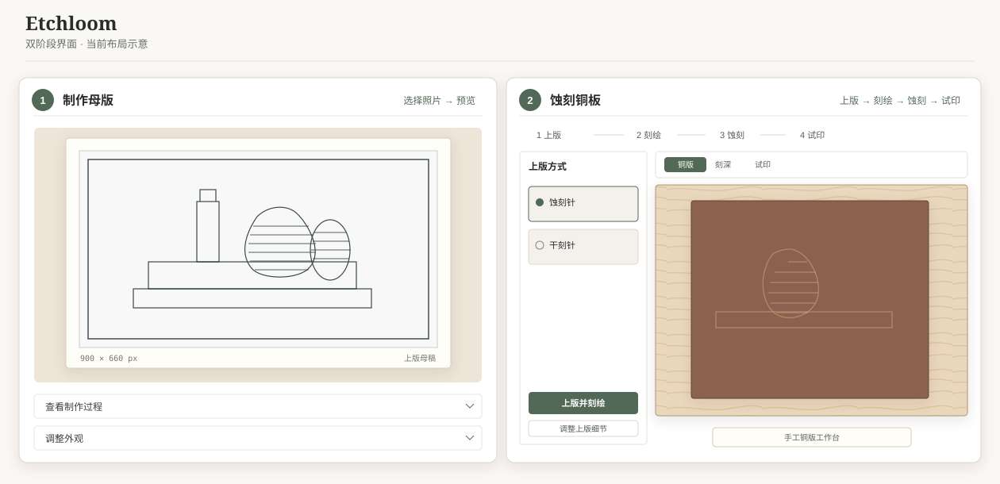

<p align="center">
  
</p>

<h1 align="center">Etchloom (数字古典版画工坊系统)</h1>

<p align="center"><strong>照片制版与亲手刻绘的虚拟铜版工作台</strong></p>

<p align="center">
  <a href="README.md">English</a> · <a href="README.zh-CN.md">简体中文</a>
</p>

<p align="center">
  
  
  <a href="LICENSE"></a>
</p>



上图是当前界面结构示意，并非屏幕截图。先选择照片制作线条母版；制作过程卡片和外观参数按需展开。随后把母版上版到铜板，亲手刻绘、蚀刻并试印。

---

## 1. 系统概览与工程定位 (Executive Summary)

Etchloom 是一套面向计算机图形学、计算摄影与数字版画制作的本地优先开源系统。工程核心目标在于将自然光摄影图像，通过几何管线与二维版面网格仿真，转换为具有顺形排线与凹版压印特征的数字版画与矢量母版。

系统彻底解耦了图像算法核心与前端展现宿主：
- **纯计算算法核心 (`src/core/`)**：基于二维导向滤波、结构张量场与 Jobard-Lefer 流线积分的 5 阶段离散数学管线，保持 Node.js/Browser 同构；
- **虚拟铜版物理仿真 (`src/core/plate/`)**：基于一维行优先平铺连续 TypedArray 内存网格，数值求解 2D 偏微分方程各向同性侧蚀扩散与干刻金属毛刺外翻；
- **前端界面 (`src/ui/`, `index.html`)**：由 HTML 入口装配 ES 模块模板，五阶段制作过程按需展开。

---

## 2. 核心架构亮点 (Core Architectural Highlights)

1. **5 阶段离散计算数学管线**：
   从图像灰度线描感知抽取（Stage 1）、多尺度色调场与等高切线场分解（Stage 2）、Lotus 3D 深度空气透视骨干轮廓（Stage 3）、15 模块曲面空间几何顺形排线（Stage 4），到最终母版矢量合成（Stage 5）。
2. **偏微分方程化学酸蚀仿真**：
   在 1500x1100 或 3000x2200 物理网格上数值解算 4-邻域侧向咬蚀与纵向深化偏微分方程，支持防蚀漆阻断掩膜与干刻金属毛刺酸溶衰减。
3. **算法核心与自动化测试**：
   主要算子与物理仿真可在 Node.js 环境测试；图像画布与推理请求仍包含浏览器或网络适配代码。运行 `npm test` 可查看当前测试数量；测试通过率不代表代码覆盖率。
4. **DAG 状态增量缓存与阶段边界取消**：
   采用 32-bit DJB2 确定性哈希监听参数变化，修改排线参数时可复用前置阶段；`AbortController` 在阶段边界中止陈旧任务，正在执行的同步阶段无法立即打断。

---

## 3. 严谨物理目录拓扑 (Directory Layout & Submodule Index)

```text
.
├─ index.html                               # 简明 HTML 入口，运行时装配界面模板
├─ package.json                             # 项目配置 (npm test / npm start)
├─ src/
│  ├─ main.js                               # 前端主入口 (Native ES Modules)
│  ├─ core/                                 # Layer 1: 5阶段算法核心 [查看文档](src/core/README.md)
│  │  ├─ pipeline/                          # 5 阶段管线算子与调度器
│  │  ├─ codecs/                            # 纯连续物理版面编解码
│  │  ├─ image/                             # 摄影图像分析与种子变奏
│  │  ├─ hatching/                          # 15 个排线与流场算法模块 (fields, rules, curves) [查看文档](src/core/hatching/README.md)
│  │  └─ plate/                             # 铜版物理仿真引擎 [查看文档](src/core/plate/README.md)
│  │     ├─ engine/                         # 虚拟铜版画核心装配引擎
│  │     ├─ physics/                        # 2D偏微分酸蚀扩散物理仿真
│  │     └─ renderer/                       # 凹版压印与光影着色器
│  ├─ orchestration/                        # Layer 2: 任务调度与增量缓存 [查看文档](src/orchestration/README.md)
│  │  ├─ engine/                            # DAG 管线调度编排核心
│  │  ├─ scheduler/                         # 任务队列与微任务抢占器
│  │  ├─ cache/                             # DJB2 确定性哈希阶段缓存
│  │  ├─ export/                            # 矢量与位图序列化导出器
│  │  └─ telemetry/                         # 性能时延与阶段日志探针
│  ├─ services/                             # Layer 2: 微服务网关 [查看文档](src/services/README.md)
│  │  └─ client/                            # 前端微服务通信与容灾降级网关 (WebAI & Remote)
│  └─ ui/                                   # Layer 3 & 4: 前端界面总装 [查看文档](src/ui/README.md)
│     ├─ i18n/                              # 中、英、越三语国际化词条字典
│     ├─ templates/                         # HTML UI 装配微模板
│     ├─ controllers/                       # 业务控制器 [查看文档](src/ui/controllers/README.md)
│     ├─ components/                        # 原子组件与放大镜交互 [查看文档](src/ui/components/README.md)
│     └─ store/                             # 应用状态中心 [查看文档](src/ui/store/README.md)
├─ services/                                # Layer 0: Python 神经网络微服务
│  ├─ informative_drawings/                 # 灰度线描推理服务 [查看文档](services/informative_drawings/README.md)
│  └─ lotus_geometry/                       # Lotus 深度与法线模型 [查看文档](services/lotus_geometry/README.md)
├─ styles/                                  # 莫兰迪古典浅色工作室设计系统 CSS (Fresh Atelier Light app.css)
├─ tests/                                   # scripts/test-runner.cjs 自动发现 Node.js 测试文件
├─ docs/                                    # 规范工程技术规范与数据字典 [查看索引](docs/DOCUMENTATION_INDEX.md)
└─ archive/                                 # 历史归档资产与探索性实验
```

---

## 4. 核心算法原理与数学建模摘要 (Mathematical Principles)

- **导向滤波色调分解**：$a = \frac{\text{cov}(I, p)}{\text{var}(I) + \epsilon}, \quad b = \bar{p} - a \cdot \bar{I}$
- **空气透视深度线宽衰减**：$w(z) = w_0 \cdot \max(1 - \alpha, 1 - \alpha \cdot \frac{z - 0.35}{0.65})$
- **2D 偏微分方程各向同性侧蚀扩散**：$E^{t+\Delta t} = \min(1.0, E^t + \max(0, E_{\text{edge}} - E^t) \cdot \Delta t \cdot S \cdot (0.14 + 0.55 G \eta))$

---

## 5. 三级运行模式与环境配置 (3-Tier Execution Modes & Environments)

系统可使用三种处理路径。模型可用性显示在高级设置中；不启动模型服务时仍可使用基础几何处理：

| 模式层级 | 运行环境 | 依赖与网络需求 | 核心能力与适用场景 |
| :--- | :--- | :--- | :--- |
| **1. 基础离线模式**<br>`Offline Mode (Geometric)` | 浏览器 + 本地 HTTP 服务（`npm start`） | 基础几何计算无需外网或第三方运行依赖 | 基于几何算子与铜版网格仿真；原生 ESM 入口需要经 HTTP 服务加载，不保证直接打开 `file://` 可运行 |
| **2. 本地 WebAI 模式**<br>`Local Model (WebGPU/WASM)` | 现代化浏览器 / 独立客户端 | 零外网依赖，双神经网络模型内置于本地 | 基于本地内置的 Informative Drawings 与 MiDaS v2.1 Small ONNX 模型，利用 WebGPU 显卡硬件加速（或多核 WASM）进行秒级本地离线推理 |
| **3. 本机 Python 服务模式** | 本地 Python 环境 | 可选服务地址 `http://127.0.0.1:7861` | 在本机执行可用的神经网络推理；是否加速取决于已安装的运行库与硬件。 |

### 5.1 快速启动前端工坊
```bash
npm start
```
浏览器访问 <http://127.0.0.1:4173/>。可用顶栏语言选项卡切换，也可用 `?lang=zh`、`?lang=en`、`?lang=vi` 指定初始语言。

### 5.2 启动 Python AI 本地辅助服务（可选）
```powershell
powershell -ExecutionPolicy Bypass -File scripts/start-model.ps1
```
服务在 `7861` 端口可用时，前端网关可选用它进行推理。是否使用硬件加速取决于本机环境。

### 5.3 跨平台桌面独立客户端 (Desktop Release)
仓库包含 Tauri 桌面配置及 Windows/macOS 发布工作流。请在 [Releases](https://github.com/gongzhimin/Etchloom/releases) 查看实际可下载版本及文件名。本地运行 `npm run build` 可准备前端资源；构建桌面安装包还需相应平台的 Tauri 工具链。

---

## 6. 自动化测试与质量保障体系 (Testing & Quality Assurance)

```bash
npm test
```
测试运行器自动发现所有 `tests/*.test.cjs` 文件并输出实时统计；用例数量与耗时会随代码和运行环境变化。
详见 [docs/03_testing_qa/TEST_SPECIFICATION.md](docs/03_testing_qa/TEST_SPECIFICATION.md)。

---

## 7. 开源许可证与贡献指南 (License & Contributing)

- **开源协议**：本项目基于 [MIT 许可证](LICENSE) 开源；
- **贡献规范**：请审阅 [CONTRIBUTING.md](CONTRIBUTING.md) 与 [docs/DOCUMENTATION_SPECIFICATION.md](docs/DOCUMENTATION_SPECIFICATION.md)。
