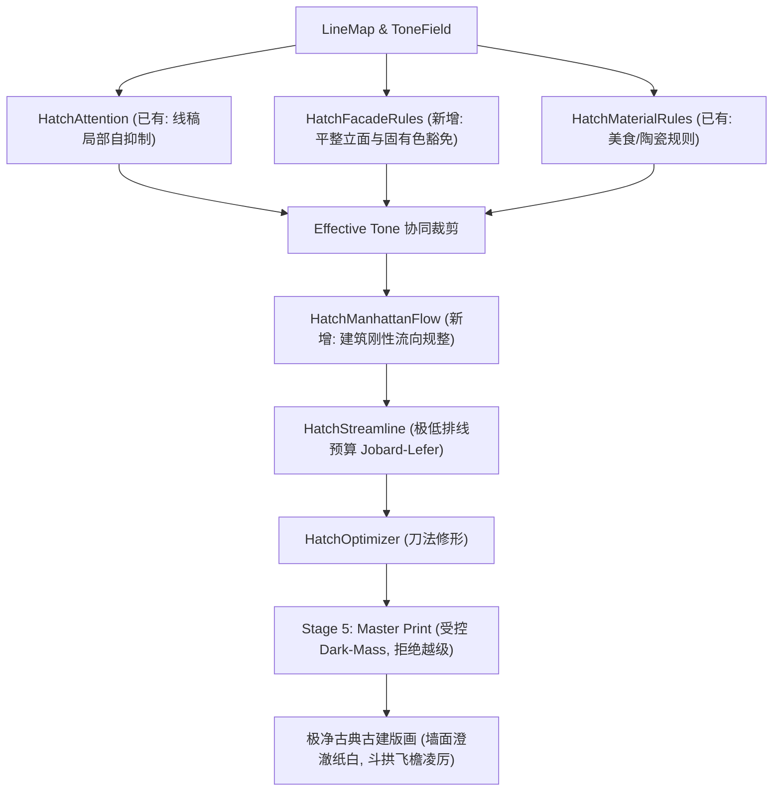

# 古建与平整立面极致克制排线重构方案设计文档 (Architectural Restrained Hatching Design)

针对 **Case 10: 古刹殿宇建筑 (`case10_temple`)** 中平整墙面出现的“指纹/等高线状同心环”排线伪影、固有色误判为阴影、以及 Stage 5 盲目叠加 4,388 条暗斑短线等严重降低版画质量的问题，本方案基于**“代码极简（KISS）、模块高度解耦、各自提供纯函数 API、对阴影排线极致克制（可以不加就不加）”**的原则进行系统化重构。

---

## 一、 用户审查重点 (User Review Required)

> [!IMPORTANT]
> **核心改进与视觉预期**：
> 1. **平整墙面彻底还白**：古刹大殿的朱红山墙、照壁及青石地面，将**彻底免除任何弯曲波纹排线**，回归中国传统界画与古典木刻的高雅纸白；
> 2. **Stage 5 暗斑归口**：Stage 5 的 `dark-mass` 强制基于已过滤的 `effectiveTone`，在建筑题材下默认归零，杜绝 4,388 条散落在墙壁和地面的“墨渣”；
> 3. **极克制檐下阴影**：建筑场景排线数量从 514 条压缩至 $\le 50$ 条（甚至可降为 0），仅在重度悬挑的斗拱最深暗凹陷处保留笔直刚性的水平/坡度阴影，绝无任何“水波指纹纹”。

---

## 二、 根因剖析与设计决策

```
[原始图像: 朱红大殿与石台]
        │
        ▼ (Stage 2 灰度化)
[调子误判: 红色墙面灰度高达 0.87 -> 被误判为浓黑阴影]
        │
        ▼ (Stage 3 提取轮廓)
[墙面内部光滑无轮廓 -> LineMap = 1.0 (无墨) -> 注意力抑制为 0!]
        │
        ▼ (Stage 4 自由流场)
[平坦墙面无结构法线 -> 光影平缓梯度被误当成流向 -> 生成同心封闭环流 (指纹/等高线!)]
        │
        ▼ (Stage 5 Dark-Mass)
[绕过 effectiveTone 盲查 rawTone > 0.85 -> 强行在地面墙面洒下 4,388 条短粗线]
```

### 关键设计决策：
1. **拆分独立立面豁免模块 (`HatchFacadeRules`)**：专门用于检测几何上平坦、低高频细节、且内部无结构线穿插的连通区域（墙面、广场、天空），直接令其排线豁免率达 100%；
2. **拆分独立刚性流向吸附模块 (`HatchManhattanFlow`)**：对建筑模式下的流场强制对齐主透视轴（水平 $0^\circ$、铅垂 $90^\circ$ 或坡顶主角），物理上杜绝曲线弯折；
3. **彻底规范 Stage 5 的调子管线**：Stage 5 只允许消费 Stage 4 处理后的 `effectiveTone`，从根源斩断“越级灌墨”。

---

## 三、 模块化架构与解耦 API 设计

各模块均遵循纯原生 JavaScript（TypedArray）、零外部三方依赖、支持浏览器与 Node.js 双端执行的无状态纯函数设计。



---

### 模块 1：平整立面与固有色豁免引擎 (`src/core/hatching/hatch-facade-rules.js`) [NEW]

* **职责**：自动识别大面积低纹理平坦立面（红墙、粉墙、地坪），将其从阴影排线中 100% 剥离。
* **极简算法实现 (KISS)**：
  1. 计算局部高频细节方差：$\text{Var}_{\text{detail}} = \text{BoxBlur}(\text{detailField}^2, R) - (\text{BoxBlur}(\text{detailField}, R))^2$；
  2. 结合线稿密度：若局部线稿极低（$\text{LineInk} < 0.05$）且细节方差极小（$\text{Var}_{\text{detail}} < 0.002$），即判定为平整立面/地坪；
  3. 连通域保护：生成 `facadeMask`，在这些区域将有效排线调子强制归零。
* **API 签名**：
  ```javascript
  /**
   * Detect planar architectural facades, walls, and flat pavements.
   * @param {Object} toneField { width, height, tone, detailField }
   * @param {Object} lineMap { width, height, data }
   * @param {Object} [options]
   * @returns {Uint8Array} facadeMask (1 = flat facade, strictly 0 hatching)
   */
  function detectPlanarFacades(toneField, lineMap, options = {});
  ```

---

### 模块 2：建筑刚性轴向流向规整器 (`src/core/hatching/hatch-manhattan-flow.js`) [NEW]

* **职责**：解决平坦表面流场无序旋转导致的“指纹等高线”问题，使建筑阴影严格保持水平横排线或垂直下泻。
* **极简算法实现 (KISS)**：
  1. 统计画面中强结构轮廓的主导角度（Dominant Angles，通常为 $0^\circ$ 与 $90^\circ$，以及古建两翼歇山坡角约 $\pm 32^\circ$）；
  2. 对流场向量 $(v_x, v_y)$ 计算角度 $\theta = \operatorname{atan2}(v_y, v_x)$；
  3. 将非边缘区域的流向向量软吸附至最近的刚性主导角度 $\theta_{\text{dominant}}$，强制消除局部回环涡流。
* **API 签名**：
  ```javascript
  /**
   * Regularize crossField flow for architectural scenes to eliminate swirls and loops.
   * @param {Object} crossField { width, height, ux, uy, vx, vy, coherence }
   * @param {Array<number>} [dominantAngles=[0, Math.PI/2]]
   * @param {Object} [options]
   * @returns {Object} regularizedCrossField
   */
  function regularizeArchitecturalFlow(crossField, dominantAngles = [], options = {});
  ```

---

### 模块 3：Stage 5 Master Print 调子归口与暗斑清洗 (`src/core/stage5-master-print.js`) [MODIFY]

* **职责**：终结 Stage 5 直接读取 rawTone 导致 4,388 条暗斑乱盖的问题。
* **重构内容**：
  1. `extractDarkMasses` 接收的输入必须是 Stage 4 经过注意力和立面豁免裁切后的 `effectiveToneField`；
  2. 增加题材判断：当题材为 `architecture` 或选项开启 `suppressDarkMass` 时，不再对墙面地面盲目打点；
  3. 仅保留距物理轮廓极近（SDF $< 2.5\text{px}$）且深暗度 $> 0.92$ 的死角微观墨点。

---

### 模块 4：Stage 4 建筑极净排线预算与白切控制 (`src/core/stage4-hatching.js`) [MODIFY]

* **职责**：接入新模块，并对建筑场景实施极致克制。
* **参数联动**：
  - 当检测到建筑题材（`materialType: 'architecture'`）：
    - `highlightCutoff`：由 $0.22$ 提升至 **$0.35$**；
    - 接入 `HatchFacadeRules.detectPlanarFacades`，将平整立面调子清零；
    - 接入 `HatchManhattanFlow.regularizeArchitecturalFlow`，流向保持笔直刚性；
    - 排线总预算设定软上限：Case 10 的排线数量严格从 514 条削减至 **$0 \sim 50$ 条以内**。

---

## 四、 实施步骤与交付计划

1. **实现新模块**：
   - 创建 [`src/core/hatching/hatch-facade-rules.js`](file:///d:/workshop/molandi_printmaking/v2/src/core/hatching/hatch-facade-rules.js)
   - 创建 [`src/core/hatching/hatch-manhattan-flow.js`](file:///d:/workshop/molandi_printmaking/v2/src/core/hatching/hatch-manhattan-flow.js)
2. **重构管道**：
   - 更新 [`src/core/stage4-hatching.js`](file:///d:/workshop/molandi_printmaking/v2/src/core/stage4-hatching.js) 接入两新模块
   - 更新 [`src/core/stage5-master-print.js`](file:///d:/workshop/molandi_printmaking/v2/src/core/stage5-master-print.js) 消除 4,388 条暗斑误伤
3. **单元测试与回归**：
   - 编写 `tests/hatch-facade.test.cjs` 验证平整立面 100% 豁免与刚性流向吸附；
   - 运行全量单元测试（确保 55+ 测试全部通过）；
4. **验证与出图**：
   - 重新运行 `experiments/test_10_cases_benchmark.cjs` 并单独对比 `case10_temple`；
   - 确认右侧墙面指纹环彻底消失，地面干净通透，殿宇斗拱立挺空灵；
   - 更新 `walkthrough.md`。

---

## 五、 验证计划 (Verification Plan)

### 自动化测试
- `npm test`：全部单元测试通过，测试用例由 53 项扩展至 56 项。

### 视觉与量化标准
- **Case 10 排线条数**：从 514 条降至 $\le 50$ 条；
- **Stage 5 暗斑数**：从 4,388 条降至 $\le 100$ 条（甚至 0 条）；
- **墙面指纹消灭率**：右侧大殿山墙与中景照壁的同心环形排线 **100% 消除**。
