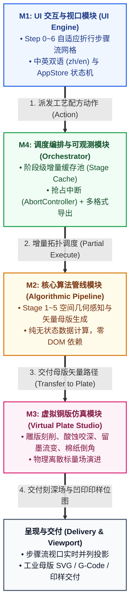

# Etchloom v2 内部开发与设计文档索引 (Internal Architecture & Design Index)

> **声明**：本索引文档仅供内部架构设计与开发实施查阅。面向 GitHub 用户的产品说明书请参见项目根目录的 [`README.md`](../README.md) 与 [`README.zh-CN.md`](../README.zh-CN.md)。

本项目遵循**顶层架构牵引、模块绝对解耦、契约明确定义、极简无冗余设计 (KISS)**的工程原则。整个系统的架构文档分为顶层总览、四大核心模块详细设计文档、跨模块规范及工程实施路线图：

---

## 架构与设计文档清单 (Architecture & Design Suite)

| 文档类型 | 文档标题 | 核心内容 | 文档链接 |
| :--- | :--- | :--- | :--- |
| **顶层架构** | **顶层架构设计规范** *(High-Level Architecture)* | 产品定位、古典版画质感表现、四大核心模块划分、无环流水线框架图、全局质量底线 | [📘 TOP_LEVEL_ARCHITECTURE_DESIGN.md](./TOP_LEVEL_ARCHITECTURE_DESIGN.md) |
| **一致性规范** | **跨模块一致性规范与交叉评审报告** *(Consistency Spec)* | Step 0~6 动线统一映射、RecipeState 22项参数单一事实源、Action/Event 通信矩阵、零 DOM 隔离 | [📋 CROSS_MODULE_CONSISTENCY_SPEC.md](./CROSS_MODULE_CONSISTENCY_SPEC.md) |
| **M1 表现层** | **UI 交互与视口详细设计** *(UI Engine & i18n)* | 莫兰迪暗调工坊美学、ASCII 布局线框图、步骤流网格与局部放大镜、中英双语国际化 (zh/en)、AppStore 状态机 | [🎨 MODULE_DESIGN_M1_UI.md](./MODULE_DESIGN_M1_UI.md) |
| **M2 算法层** | **核心算法管线详细设计** *(Algorithmic Pipeline)* | Stage 1~5 空间几何感知与矢量母版生成、纯无状态数据运算、PipelineRunner 增量执行驱动 | [⚙️ MODULE_DESIGN_M2_PIPELINE.md](./MODULE_DESIGN_M2_PIPELINE.md) |
| **M3 仿真层** | **虚拟铜版仿真详细设计** *(Virtual Plate Studio)* | 刻针/干刻/防蚀漆/刮磨器、偏微分双向动态微扩散酸蚀、凹版留墨流变、纯棉纸 Bevel 倒角凹印 | [🔨 MODULE_DESIGN_M3_PLATE_STUDIO.md](./MODULE_DESIGN_M3_PLATE_STUDIO.md) |
| **M4 中枢层** | **调度编排与可观测详细设计** *(Orchestrator & Observability)* | 阶段级增量缓存池 (StageCache)、原生 AbortController 抢占中断与防抖、全格式工业导出、度量流 | [🚦 MODULE_DESIGN_M4_ORCHESTRATOR.md](./MODULE_DESIGN_M4_ORCHESTRATOR.md) |
| **工程实施** | **系统工程实施与重构路线图** *(Implementation Roadmap)* | 分阶段落地计划 (Phase 1~6)、任务清单、测试矩阵、零破坏性回归保障 | [🚀 IMPLEMENTATION_ROADMAP.md](./IMPLEMENTATION_ROADMAP.md) |

---

## 模块通信与契约关系图 (Contract Architecture)

