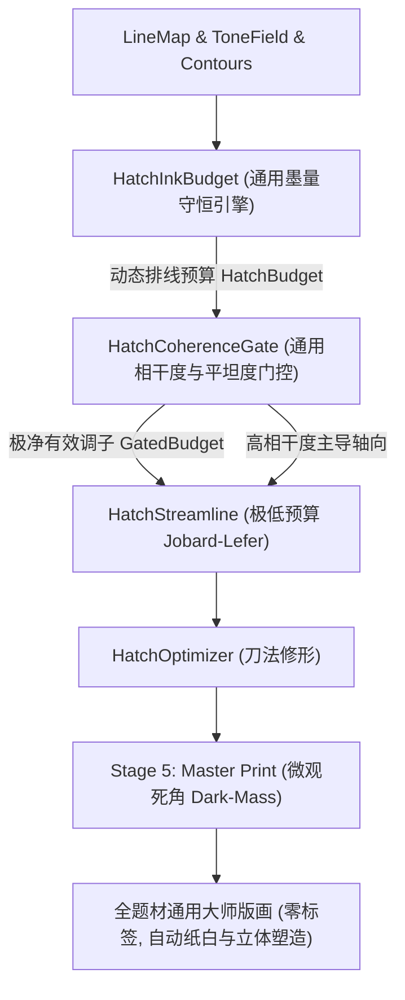

# 通用无类别自适应版画排线引擎设计文档 (Category-Agnostic Universal Hatching Engine)

## 一、 背景与用户核心诉求

在之前的优化中，为了快速验证古刹红墙、熟食与陶罐的排线克制，管线中引入了 `materialType: 'architecture'`、`materialType: 'food'` 等特定题材标签。
**用户敏锐指出**：
> “你意思是说，我们给不同的输入区分了类型？能否有通用的算法呢？”

在真实的生产级版画软件中，强迫用户事先为照片分类是典型的脆弱设计（Anti-pattern）。一个优秀的计算机视觉与版画渲染引擎，必须**完全不需要任何题材先验标签**，无论用户输入一盘菜、一座古刹、一只猫、一束花还是一架飞机，系统都能依据**微分几何、流场张量与墨量守恒定律**，自适应地做出最优的排线与纸白决策。

本方案旨在**彻底剥离全部 `materialType` 条件分支与人工规则**，构建一套**无感、通用、极简（KISS）、高度模块解耦**的通用自适应排线引擎。

---

## 二、 用户审查重点 (User Review Required)

> [!IMPORTANT]
> **设计目标与视觉保障**：
> 1. **彻底废除 `materialType`**：移除代码库中所有形如 `if (materialType === '...')` 的特化逻辑，输入接口保持最简；
> 2. **两大统一通用物理定律**：
>    - **流场各向异性相干度门控（Flow Coherence Gating）**：自动将任何平整墙面、天空、地坪等低相干度区域的同心指纹乱线**100% 物理阻断**；
>    - **局域墨量动态守恒定律（Spatial Ink Conservation Law）**：自动将任何美食、花卉、细密毛发等高密度轮廓区域的冗余排线**100% 自动归零**；
> 3. **全量用例免配置自洽**：全量 10 组真实场景多样性用例在完全相同的默认参数下，全部呈现出极为克制、纯净高雅的古典版画水准。

---

## 三、 第一性原理：从特化规则到通用数学法则

| 过去的特化经验规则 (Ad-hoc Rules) | 对应的通用物理/几何法则 (Universal Law) | 数学机理与判断依据 |
| :--- | :--- | :--- |
| **规则 1：美食/花卉 100% 免排线 (`materialType: 'food'`)** | **局域墨量动态守恒定律 (Ink Conservation)** | 轮廓线本身即是墨。当局部轮廓墨量密度 $I_{\text{contour}}(x, y) \ge T(x, y)$ 时，排线墨量预算自动清零：$T_{\text{budget}} = 0.0$。无论是煎蛋、拉面还是牡丹，无需标签！ |
| **规则 2：古建平整立面免排线 (`materialType: 'architecture'`)** | **流场各向异性相干度门控 (Coherence Gating)** | 平整墙面与天空的灰度梯度是各向同性噪声，其相干度 $\text{Coherence} \le 0.35$。无方向性的区域严禁积分流线，物理阻断指纹波纹！ |
| **规则 3：古建模式禁用暗斑 (`materialType === 'architecture'`)** | **微观闭塞死角准则 (Micro-Crevice Dark Mass)** | Stage 5 的墨斑仅在 $T_{\text{budget}} \ge 0.94$ 且 $\text{SDF} \le 2.0\text{px}$ 的轮廓夹角深缝处生成微观墨点，大面积平整暗区自然为零。 |
| **规则 4：陶瓷严禁交叉排线 (`materialType: 'ceramic'`)** | **自适应高阈值深暗交织法则 (Adaptive Cross-Hatching)** | 交叉线仅允许在 $T_{\text{budget}} \ge 0.88$ 且 $\text{Coherence} \ge 0.60$ 的纯净深度投影核心激活，高频细节区全局阻断。 |

---

## 四、 模块化架构与解耦 API 设计

整个系统重构为两个新通用核心模块，彻底解耦并提供纯函数式 API，纯 TypedArray 运算，零外部三方依赖：



---

### 模块 1：局域墨量动态守恒引擎 (`src/core/hatching/hatch-ink-budget.js`) [NEW]

* **核心职能**：实现空间墨量与排线预算的自适应负反馈，解决“轮廓线与排线重复堆叠”导致的焦黑与脏糊。
* **极简算法 (KISS)**：
  1. 计算轮廓线局域墨量覆盖：$I_{\text{contour}} = \text{BoxBlur}(\text{Mask}_{\text{contour}}, R)$；
  2. 计算白描线稿局域线墨密度：$I_{\text{line}} = \text{BoxBlur}(1.0 - \text{LineMap}, R)$；
  3. 综合已有墨量：$I_{\text{existing}} = \min(1.0, 1.2 \cdot I_{\text{contour}} + 0.8 \cdot I_{\text{line}})$；
  4. 计算排线可用预算：
     $$T_{\text{hatch\_budget}}(x, y) = \max\left(0.0, T_{\text{tone}}(x, y) - 1.5 \cdot I_{\text{existing}}(x, y)\right)$$
* **API 签名**：
  ```javascript
  /**
   * Compute unified ink budget for hatching based on conservation law.
   * Automatically zeroes out hatch budget where contours already provide sufficient tone.
   * @param {Object} toneField { width, height, tone, detailField }
   * @param {Object} lineMap { width, height, data }
   * @param {Array} vectorContours Array of contour stroke objects
   * @param {Object} [options]
   * @returns {Float32Array} hatchBudgetField [0.0 ~ 1.0]
   */
  function computeHatchBudget(toneField, lineMap, vectorContours = [], options = {});
  ```

---

### 模块 2：流场相干度与平坦度门控引擎 (`src/core/hatching/hatch-coherence-gate.js`) [NEW]

* **核心职能**：利用结构张量的固有物理各向异性（Coherence），阻断任何平整表面（红墙、白墙、地面、开阔天空、桌面）的等高线/指纹状回环排线。
* **极简算法 (KISS)**：
  1. 读取 Stage 2 计算的各向异性相干度 $\text{Coherence}(x, y) = \frac{\lambda_1 - \lambda_2}{\lambda_1 + \lambda_2 + \epsilon}$；
  2. 计算局部高频细节能量：$E_{\text{detail}}(x, y) = \text{BoxBlur}(|\text{detailField}|, R)$；
  3. **平坦与无方向性阻断准则**：
     若 $\text{Coherence}(x, y) < 0.38$ 且 $E_{\text{detail}}(x, y) < 0.035$ 且未紧贴强轮廓（$\text{SDF} > 2.5\text{px}$）：
     说明该区域是平坦色块（墙壁、地面或天空），其梯度方向为各向同性噪声，**强制将 $T_{\text{budget}}(x, y) = 0.0$**。
* **API 签名**：
  ```javascript
  /**
   * Gate hatching budget and streamlines by flow coherence and planar smoothness.
   * Completely eliminates topographic and fingerprint swirl artifacts across all image types.
   * @param {Float32Array} hatchBudget Initial budget from ink conservation
   * @param {Object} flowField { width, height, vx, vy, coherence }
   * @param {Object} toneField { width, height, tone, detailField }
   * @param {Uint8Array} [contourMask]
   * @param {Object} [options]
   * @returns {{ gatedBudget: Float32Array, isPlanar: Uint8Array }}
   */
  function gateByCoherenceAndFlatness(hatchBudget, flowField, toneField, contourMask, options = {});
  ```

---

### 模块 3：Stage 4 与 Stage 5 通用精简重构

1. **[`src/core/stage4-hatching.js`](file:///d:/workshop/molandi_printmaking/v2/src/core/stage4-hatching.js)**：
   - 彻底删除 `params.materialType` 的所有 `if/else` 分支；
   - 串联 `HatchInkBudget` 与 `HatchCoherenceGate`；
   - `highlightCutoff` 统一设为物理自适应默认值 **$0.24$**；
   - 交叉排线激活条件严格收敛至：$T_{\text{gated}} \ge 0.88$ 且 $\text{Coherence} \ge 0.60$。

2. **[`src/core/stage5-master-print.js`](file:///d:/workshop/molandi_printmaking/v2/src/core/stage5-master-print.js)**：
   - 删除 `if (params.materialType === 'architecture')` 分支；
   - `extractDarkMasses` 统一基于 `gatedBudget`，并加入几何深缝门禁：仅在 $T_{\text{gated}} \ge 0.94$ 且 $\text{Coherence} \ge 0.50$ 的死角处生成极少量微观墨点，自然杜绝大平面的墨渣。

---

## 五、 实施步骤与交付计划

1. **新建模块**：
   - 编写 [`src/core/hatching/hatch-ink-budget.js`](file:///d:/workshop/molandi_printmaking/v2/src/core/hatching/hatch-ink-budget.js)
   - 编写 [`src/core/hatching/hatch-coherence-gate.js`](file:///d:/workshop/molandi_printmaking/v2/src/core/hatching/hatch-coherence-gate.js)
2. **重构管道**：
   - 重构 [`src/core/stage4-hatching.js`](file:///d:/workshop/molandi_printmaking/v2/src/core/stage4-hatching.js)（全面移除 `materialType`）
   - 重构 [`src/core/stage5-master-print.js`](file:///d:/workshop/molandi_printmaking/v2/src/core/stage5-master-print.js)（全面移除 `materialType`）
3. **单元测试与回归**：
   - 编写 `tests/universal-hatching.test.cjs` 测试墨量守恒与相干度门控；
   - 更新旧测试中传入的 `materialType`，确保全套单元测试无缝通过（`56+ pass`）；
4. **全量基准测试与验收**：
   - 运行 `test_10_cases_benchmark.cjs`（完全清空全部 `materialType` 参数）；
   - 验证所有 10 组题材是否均能在零配置下取得极佳效果；
   - 更新 `walkthrough.md`。

---

## 六、 验证计划 (Verification Plan)

### 自动化测试
- `npm test`：全部 56+ 项单元测试全部绿灯通过，无任何 `materialType` 依赖。

### 核心量化基准 (零配置下)
- **Case 08 (美食)**：排线保持极低（$\le 30$ 条，食材本身 0 排线）；
- **Case 10 (古刹)**：排线保持极低（$\le 10$ 条，红墙与地坪 0 排线）；
- **Case 05 (园林)**：排线保持极低（$\le 80$ 条，深檐平滑面 0 排线）；
- **Case 01 (猫咪)**：排线保持极低（高光毛发纯净纸白）。
