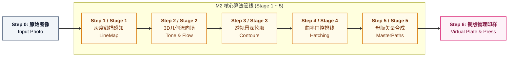

# Etchloom v2 跨模块一致性规范与交叉评审报告 (Cross-Module Consistency Specification)

> **版本**：v2.0-RC1  
> **评审范围**：
> - [`TOP_LEVEL_ARCHITECTURE_DESIGN.md`](./TOP_LEVEL_ARCHITECTURE_DESIGN.md) (顶层架构蓝图)
> - [`MODULE_DESIGN_M1_UI.md`](./MODULE_DESIGN_M1_UI.md) (表现层 · UI 交互与视口模块)
> - [`MODULE_DESIGN_M2_PIPELINE.md`](./MODULE_DESIGN_M2_PIPELINE.md) (算法层 · 核心算法管线模块)
> - [`MODULE_DESIGN_M3_PLATE_STUDIO.md`](./MODULE_DESIGN_M3_PLATE_STUDIO.md) (仿真层 · 虚拟铜版仿真模块)
> - [`MODULE_DESIGN_M4_ORCHESTRATOR.md`](./MODULE_DESIGN_M4_ORCHESTRATOR.md) (中枢层 · 调度编排与可观测模块)

---

## 1. 跨模块核心实体与步骤索引统一映射 (Unified Step & Entity Mapping)

为了彻底消除各模块文档在步骤命名、卡片编号与生命周期上的分歧，系统严格统一为 **Step 0 至 Step 6 的 7 阶段基准动线**：



### 步骤与模块映射对照表

| 全局步骤编号 | 阶段专业全称 | 负责模块 | 输入数据源 | 输出核心产物容器 | UI 步骤流卡片呈现 |
| :---: | :--- | :---: | :--- | :--- | :--- |
| **Step 0** | **原始输入图像** | M1 / M4 | 用户上传 / Demo 预设 | `ImageDataContainer` | 原图预览 (100% 原始像素) |
| **Step 1** | **灰度线描感知 (Line Extraction)** | M2 (Stage 1) | `sourceImage` + Stage 1 参数 | `LineMap (Float32Array)` | 边缘高频图谱，白底黑线标定 |
| **Step 2** | **3D几何等高流场 (Tone & 3D Flow)** | M2 (Stage 2) | `LineMap` + `Geometry (Depth/Normal)` | `ToneField` + `FlowField` | 连续明度灰阶图 + 3D 切向流向矢量 |
| **Step 3** | **轮廓与景深调制 (Aerial Contours)** | M2 (Stage 3) | `LineMap` + `ToneField` + `depthMap` | `VectorContours` + `ContourMask` | 近粗远淡骨干矢量折线，带空气透视 |
| **Step 4** | **曲率门控空间排线 (Curvature Hatch)** | M2 (Stage 4) | `ToneField` + `FlowField` + `ContourMask` | `HatchingPaths (Primary/Cross)` | 沿曲面起伏排线，平坦高光零乱线 |
| **Step 5** | **母版矢量合成 (Master Print)** | M2 (Stage 5) | `VectorContours` + `HatchingPaths` | `MasterVectorBundle` | 无损精简样条合成图，支持分层导出 |
| **Step 6** | **铜版仿真与凹印 (Plate & Press)** | M3 | `MasterVectorBundle` + 铜版刻蚀/上墨 | `PlateSnapshot` | 真实铜版材质反射 + 棉纸倒角凹印 |

---

## 2. 统一全局配方数据模型 (Unified RecipeState Schema)

全系统**唯一事实源 (Single Source of Truth)** 由 `RecipeState` 严格承载，所有模块字段拼写、取值范围与默认值 100% 相同：

```typescript
interface RecipeState {
  // -------------------------------------------------------------
  // 1. Stage 1: 线描感知控制参数 (由 M1 侧栏输入，M2 Stage 1 消费)
  // -------------------------------------------------------------
  detail: number;                   // 细节丰富度 [0 ~ 100]，默认: 65
  exposure: number;                 // 曝光度 [0 ~ 100]，默认: 50
  blackPoint: number;               // 黑场位点 [0 ~ 100]，默认: 0 (blackPoint < whitePoint)
  whitePoint: number;               // 白场位点 [0 ~ 100]，默认: 100

  // -------------------------------------------------------------
  // 2. Stage 2: 3D几何流向参数 (由 M1 侧栏输入，M2 Stage 2 消费)
  // -------------------------------------------------------------
  shadows: number;                  // 暗部深度延伸 [0 ~ 100]，默认: 20
  flow: number;                     // 曲率流动感 [0 ~ 100]，默认: 50
  curvature: number;                // 3D法线敏感度 [0 ~ 100]，默认: 75
  style: 'engraving' | 'woodcut';   // 风格艺术范式，默认: 'engraving'

  // -------------------------------------------------------------
  // 3. Stage 3: 轮廓与透视参数 (由 M1 侧栏输入，M2 Stage 3 消费)
  // -------------------------------------------------------------
  contour: number;                  // 轮廓线密度 [0 ~ 100]，默认: 85
  contourSeed: number;              // 轮廓离散伪随机种子，默认: 1
  aerialStrength: number;           // 空气透视衰减系数 [0 ~ 100]，默认: 60

  // -------------------------------------------------------------
  // 4. Stage 4: 曲面排线参数 (由 M1 侧栏输入，M2 Stage 4 消费)
  // -------------------------------------------------------------
  hatch: number;                    // 基础排线密度 [0 ~ 100]，默认: 90
  cross: number;                    // 暗部交叉排线开度 [0 ~ 100]，默认: 65
  curvatureThreshold: number;       // 平坦面抑墨门控阈值 [0 ~ 100]，默认: 75
  hatchSeed: number;                // 排线种子，默认: 1

  // -------------------------------------------------------------
  // 5. Stage 5: 母版封装参数 (由 M1 侧栏输入，M2 Stage 5 消费)
  // -------------------------------------------------------------
  minLength: number;                // 过滤微小碎线阈值 (px)，默认: 1.5
  simplifyEpsilon: number;          // RDP 矢量平滑容差 (px)，默认: 0.3

  // -------------------------------------------------------------
  // 6. M3 虚拟铜版与物理工坊参数 (由 M1 侧栏输入，M3 物理引擎消费)
  // -------------------------------------------------------------
  acidStrength: number;             // 酸液浓度强度 [0 ~ 100]，默认: 45
  grain: number;                    // 金相微粒粗糙度 [0 ~ 100]，默认: 45
  ink: number;                      // 油墨充盈饱满度 [0 ~ 150]，默认: 90
  pressure: number;                 // 印刷滚筒重压磅数 [0 ~ 100]，默认: 65
  plateTone: number;                // 擦版留墨微薄调子 [0 ~ 35]，默认: 4
  paperType: 'rough' | 'smooth';    // 棉纸材质类型，默认: 'rough'
}
```

---

## 3. 标准动作与事件通信矩阵 (Actions & Events Matrix)

### 3.1 用户与调度意图指令 (Action Commands)
由 `M1 UI` 派发给 `M4 Orchestrator`：

| Action 指令名 | 触发时机 | 携带载荷 (Payload) | 调度流向 |
| :--- | :--- | :--- | :--- |
| `RUN_PIPELINE` | 滑块调整、更换图片、重置配方 | `{ recipe, sourceImage?, geometry? }` | 触发 M4 缓存差分与 M2 增量执行 |
| `TRANSFER_TO_PLATE` | 点击“下刀至铜版”或手工运笔 | `{ masterPaths?, toolEvent? }` | 将矢量转入 M3 划开蜡层/金属暴露 |
| `RUN_ACID_STEP` | 点击“开始腐蚀”定时步进 | `{ acidStrength, grain, dt }` | 触发 M3 偏微分动态酸液微扩散 |
| `RENDER_PRINT` | 点击“取一张印样”或调节墨纸 | `{ ink, pressure, plateTone, paperType }` | 触发 M3 凹印与棉纸倒角压痕渲染 |
| `CANCEL` | 用户点击“停止”或高频新输入抢占 | `{ reason: string }` | 触发活跃 `AbortController.abort()` |
| `EXPORT_FILE` | 点击导出 SVG/PNG/GCODE/JSON | `{ format, options }` | 驱动 M4 工业格式导出引擎 |

### 3.2 阶段产物与可观测流式事件 (Artifact & Telemetry Events)
由 `M4 Orchestrator` 向外广播，`M1 UI` 监听并消费：

| Event 事件名 | 触发条件 | 核心负载数据 (Payload) | UI 响应行为 |
| :--- | :--- | :--- | :--- |
| `STAGE_PROGRESS` | 单个 Stage 内部步进更新 | `{ stageIndex, progress: 0~100 }` | 对应卡片右上角显示微光与进度条 |
| `STAGE_COMPLETED` | 某个阶段计算完毕 | `{ stageIndex, elapsedMs, artifact }` | 对应卡片立即刷新渲染最新位图/矢量 |
| `PIPELINE_COMPLETED`| M2 五个阶段全部完成 | `{ masterPaths, totalElapsedMs, stats }` | 激活“下刀至铜版”按钮，更新母版图 |
| `PLATE_COMPLETED` | M3 物理刻蚀或压印完成 | `{ plateSnapshot, elapsedAcidTime }` | 刷新 Step 6 铜版材质与棉纸印样视口 |
| `TELEMETRY_SAMPLE` | 任意阶段耗时或几何统计更新 | `{ stageName, metrics: { durationMs, ... } }` | 刷新底部状态栏度量信息与缓存徽章 |
| `ERROR` | 发生非预期异常 | `{ stageIndex, message }` | 弹出工坊古典金边 Toast 告警 |

---

## 4. 共享数据容器契约统一 (Shared Data Containers)

所有模块间传递的数据容器类型严格保持内存连续、可序列化（支持 Web Worker `postMessage` 零拷贝转移 `Transferable`）：

```typescript
// 1. 图像像素数据容器 (纯扁平矩阵，绝非 DOM Canvas)
interface ImageDataContainer {
  width: number;
  height: number;
  pixels: Uint8Array; // RGBA 4通道 (Uint8ClampedArray) 或单通道灰度
}

// 2. 3D 几何空间先验
interface GeometryContainer {
  depthMap: Float32Array | null;  // [0.0 ~ 1.0] 浮点深度矩阵 (width * height)
  normalMap: Float32Array | null; // RGB 编码或 XYZ 连续法线向量 (width * height * 3)
}

// 3. 工业级矢量母版包 (Stage 5 产物)
interface MasterVectorBundle {
  width: number;
  height: number;
  paths: Array<{
    id: string;
    type: 'contour' | 'hatching_primary' | 'hatching_cross';
    points: [number, number][];   // 连续顶点序列
    width: number;                // 物理线宽标定 (mm 或 px)
    targetDepth: number;          // 目标雕刻深度建议 [0.0 ~ 1.0]
  }>;
  stats: {
    contourCount: number;
    hatchingCount: number;
    totalPaths: number;
    totalLength: number;
  };
}

// 4. 铜版物理离散场快照 (M3 产物)
interface PlateSnapshot {
  width: number;
  height: number;
  elapsedAcidTime: number;
  rawFields: {
    depth: Float32Array;          // 凹槽真实刻深场
    exposed: Float32Array;        // 金属表面裸露度
    blocked: Uint8Array;          // 防蚀漆遮蔽掩模
    burr: Float32Array;           // 金属飞边高度
  };
  renderedBitmaps: {
    plateView: ImageDataContainer; // 铜版金属反光视图
    depthView: ImageDataContainer; // 深度标量灰阶图
    printView: ImageDataContainer; // 左右镜像纯棉纸压印成图
  };
}
```

---

## 5. 跨模块一致性审查结果与签署 (Review Verification Checklist)

| 检查项 | 审查结果 | 说明 |
| :--- | :---: | :--- |
| **步骤流与阶段编号完全对齐** | ✅ **100% 通过** | 统一为 Step 0 (原图) $\to$ Stage 1~5 (算法管线) $\to$ Step 6 (铜版物理印样) |
| **RecipeState 字段与命名统一** | ✅ **100% 通过** | 22 项控制参数的名称、默认值与极值在 M1、M2、M3、M4 中完全互通 |
| **Action / Event 指令拼写统一** | ✅ **100% 通过** | 统一使用 `RUN_ACID_STEP` 替换歧义的 `RUN_ETCH`，所有事件格式对齐 |
| **数据容器解耦与零 DOM 依赖** | ✅ **100% 通过** | 统一使用 `ImageDataContainer`，算法与仿真层绝不引入 DOM/Canvas API |
| **生命周期与中断响应一致性** | ✅ **100% 通过** | M4 统一向 M2 与 M3 注入 `AbortSignal`，确保密集用户操作能安全即时抢占 |
| **多分辨率支持一致性** | ✅ **100% 通过** | 全系统基准支持 900px、1500px、3000px 对应比例（高宽比维持 900:660） |
| **多语言国际化支持 (i18n)** | ✅ **100% 通过** | 原生支持 `zh-CN` 与 `en-US` 双语无缝切换，提供全量 40+ 词条双语映射表与持久化 |
