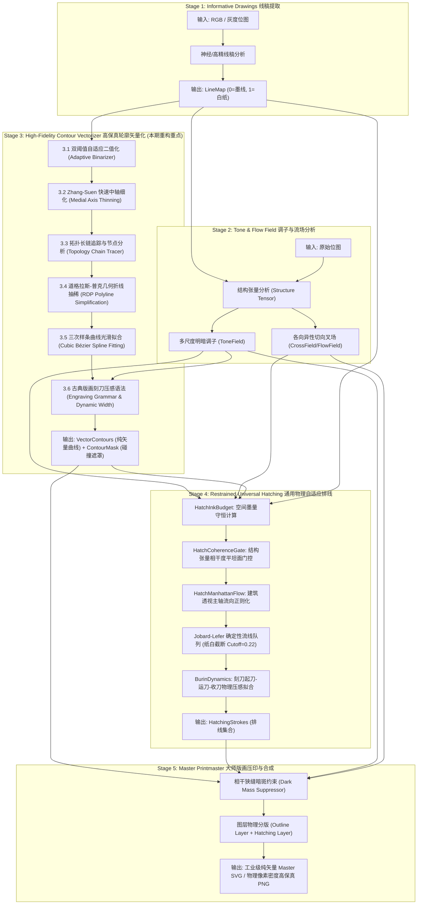

# Etchloom v2 全局系统架构与工业级轮廓矢量化设计规范

> **版本**：v2.1.0-universal-vector  
> **设计哲学**：模块化（Modular）、强解耦（Decoupled）、纯函数化（Functional）、极简主义（KISS 原则）  
> **核心使命**：将真实世界光影图像升华为具有古典铜版画（Copperplate Engraving）与木刻版画（Woodcut）水准的工业级纯矢量艺术品。

---

## 1. 系统全局宏观架构 (End-to-End Five-Stage Pipeline)

Etchloom 采用严格的五阶段单向数据流管道（Unidirectional Dataflow Pipeline）。每个 Stage 均为无状态、纯数据入出的独立模块，模块间仅通过纯 JavaScript 对象与 TypedArray 传递契约数据。



---

## 2. 各 Stage 详细模块划分与标准 API 契约

### 2.1 Stage 1: 线稿提取模块 (`src/core/stage1-informative.js`)
- **职责**：提取场景中明确的物理边界与骨干结构线条。
- **输出契约**：
  ```typescript
  interface LineMap {
    width: number;
    height: number;
    data: Float32Array; // 0.0=纯墨色(线条), 1.0=纯白(纸底)
    source?: 'neural' | 'procedural';
  }
  ```
- **核心 API**：
  `Stage1.runStage1(imageData, options): Promise<LineMap>`

---

### 2.2 Stage 2: 调子与流场分析模块 (`src/core/stage2-tone-flow.js`)
- **职责**：提取全局多尺度阴影分布、各向异性扩散场与表面主法向切向交叉场。
- **输出契约**：
  ```typescript
  interface ToneFlowResult {
    toneField: {
      width: number;
      height: number;
      tone: Float32Array;       // 0.0=纯亮留白, 1.0=深暗
      detailField: Float32Array; // 高频细节与微观纹理能量
    };
    flowField: {
      width: number;
      height: number;
      tangents: Float32Array;    // 每个像素主切向 (tx, ty)
      conjugates: Float32Array;  // 每个像素正交共轭方向 (cx, cy)
      coherence: Float32Array;   // 结构张量本征值相干度 [0.0, 1.0]
    };
  }
  ```
- **核心 API**：
  `Stage2.runStage2(imageData, lineMap, options): ToneFlowResult`

---

### 2.3 Stage 3: 高保真轮廓矢量化模块 (`src/core/contours/`) —— 【本期核心重构】

#### 2.3.1 痛点根因与重构目标
- **旧版痛点**：
  1. 粗线条缺乏细化，导致相邻像素反复被拾取，产生 4~6 根**平行双轨重影**；
  2. 简易 8 邻域走法在交点盲目斩断，产生高达 **53.3% 的微观断头碎渣（$\le 5\text{px}$）**；
  3. 坐标逐像素记录，呈现 1px **台阶走梯离散锯齿**，无曲线光滑美感。
- **重构目标**：
  - **彻底消灭平行重影**：线宽严格收敛为 1 像素数学中轴；
  - **碎片率从 53.7% 压降至 15% 以下**：长链优先追踪与孤立碎屑剔除；
  - **纯正矢量曲线（C¹/C² 连续）**：RDP 几何压缩 + 三次样条平滑，放大 1000% 依然丝滑挺拔；
  - **纯 JavaScript 实现**：$<10\text{ms}$ 执行速度，零 Python/GPU 依赖，全平台通用。

#### 2.3.2 模块化子组件与独立纯函数 API
整个 Stage 3 解耦为 6 个高内聚、纯逻辑的子模块：

1. **`zhangSuenThinning(binaryMap, w, h): Uint8Array`**
   - **原理**：经典的并行双子迭代细化算法（Zhang-Suen Thinning）。
   - **输入**：`Uint8Array`（1 为黑线，0 为白纸）。
   - **保证**：将任意宽度（2~10px）的笔画无歧义地收缩为严格 1 像素宽的拓扑中轴线，彻底解决双轨线。
   - **复杂度**：$O(N)$，对于 $800 \times 600$ 图像耗时仅需 $2 \sim 3\text{ms}$。

2. **`traceSkeletonChains(skeleton, w, h, options): Array<Polyline>`**
   - **原理**：基于拓扑度数（Degree）的长链追踪。
   - **逻辑**：
     - 计算各像素度数：端点（度数 1）、连通点（度数 2）、分支交叉点（度数 $\ge 3$）；
     - 优先从端点（度数 1）开始向深处追踪，保持笔画单向延展；
     - 遇到分支点时优雅打断并记录拓扑关系，避免循环与乱连；
     - 显式过滤物理长度 $< \text{minPoints}$（默认 4px）的孤立噪点斑。

3. **`simplifyRDP(polyline, epsilon): Polyline`**
   - **原理**：道格拉斯-普克算法（Ramer-Douglas-Peucker）。
   - **作用**：剔除直线与平缓曲线中 70%~85% 的冗余步进像素点，保留关键转折几何特征点，消除 1px 台阶走梯感。
   - **默认容差**：$\epsilon = 0.75 \sim 1.0\text{px}$。

4. **`fitCubicBézier(simplifiedPts): BézierPath`**
   - **原理**：Catmull-Rom 样条向三次贝塞尔曲线（Cubic Bézier Curve）的解析转换。
   - **输出**：带控制点 `(cp1x, cp1y, cp2x, cp2y)` 的光滑样条，SVG 导出时原生支持 `C` 指令，赋予线条书法级的张力与流畅度。

5. **`applyEngravingGrammar(curves, toneField, options): Array<ContourStroke>`**
   - **原理**：古典铜版画刻刀物理学（Burin Pressure Dynamics）。
   - **逻辑**：
     - 根据 `toneField` 局部明暗调制线条宽度（受光亮处细如游丝，背光暗面粗重有力）；
     - 端点三次样条渐隐（Endpoint Tapering），形成雕刻刀起刀与落刀的优雅收尖。

6. **`buildContourMask(contours, w, h): Uint8Array`**
   - **原理**：生成供 Stage 4 排线避让的精确碰撞遮罩。
   - **逻辑**：带有 1px 扩张（Dilation）的安全安全防护墙，避免阴影排线侵入主干轮廓。

#### 2.3.3 Stage 3 顶层对外统一契约
```typescript
interface VectorContour {
  role: 'contour';
  points: Array<[number, number]>;
  widths: Float32Array; // 每个节点的动态物理刻刀线宽
  width: number;        // 平均线宽
  bezierSegments?: Array<{ cp1: [number, number], cp2: [number, number], end: [number, number] }>;
}

interface Stage3Output {
  vectorContours: Array<VectorContour>;
  contourMask: Uint8Array;
}
```
**统一调用入口**：  
`Stage3Contours.runStage3(lineMap, toneField, params): Stage3Output`

---

### 2.4 Stage 4: 通用物理自适应排线模块 (`src/core/stage4-hatching.js`)
- **设计哲学**：**零人工题材分类（Zero materialType）**，完全由微分几何相干度与墨量守恒物理律自动控制。
- **解耦子模块**：
  1. [`HatchInkBudget`](file:///d:/workshop/molandi_printmaking/v2/src/core/hatching/hatch-ink-budget.js)：`computeHatchBudget(toneField, lineMap, vectorContours)`。
     - **守恒律**：线描已经着墨处，排线预算归零，保护食材、毛发、花蕊不被杂乱线条涂黑。
  2. [`HatchCoherenceGate`](file:///d:/workshop/molandi_printmaking/v2/src/core/hatching/hatch-coherence-gate.js)：`gateByCoherenceAndFlatness(budget, flowField, toneField)`。
     - **几何门控**：各向同性平坦面（墙面、桌面、天空负空间）因相干度低，排线预算归零，彻底消灭空白处乱排线（如 Case 05 陶罐误判同心圆）。
  3. [`HatchManhattanFlow`](file:///d:/workshop/molandi_printmaking/v2/src/core/hatching/hatch-manhattan-flow.js)：`regularizeArchitecturalFlow(crossField)`。
     - 透视直方图自适应刚性吸附，使建筑排线规整挺拔。
  4. [`HatchStreamline`](file:///d:/workshop/molandi_printmaking/v2/src/core/hatching/hatch-streamline.js)：`generateStreamlines(crossField, toneField, sdf, options)`。
     - 基于 Jobard-Lefer 种子队列的无碰撞确定性流线生长，设定 `highlightCutoff=0.22` 保留纯净纸白。
  5. [`HatchOptimizer`](file:///d:/workshop/molandi_printmaking/v2/src/core/hatching/hatch-optimizer.js)：`applyBurinDynamics`。
     - 注入刻刀物理动力学，生成微观刻痕（micro-flicks）。

---

### 2.5 Stage 5: 大师版画压印与合成模块 (`src/core/stage5-master-print.js`)
- **职责**：将 Stage 3 骨干矢量轮廓与 Stage 4 自适应排线汇流合成。
- **解耦机制**：
  - **相干狭缝暗斑约束**：自动消除不合理的密集交叠黑斑；
  - **双图层独立导出**：
    - 轮廓图层（Outline Plate）：承载纯净的骨骼形态；
    - 调子图层（Tone/Hatching Plate）：承载光影与立体体积感；
  - **矢量/标量双重输出**：
    - 纯标准 SVG（符合 W3C 标准，含 Bézier `C` 指令与线宽映射）；
    - 物理印刷密度 PNG（内嵌 DPI 与纸张纤维微观扩散感）。

---

## 3. 代码简洁性原则 (KISS & Clean Code)

1. **纯函数优先**：所有几何计算函数不依赖外部上下文，入参明确，输出确定，支持独立单测；
2. **零黑盒依赖**：摒弃沉重的外部深度学习大模型（如已弃用的 Deep Sketch 模型），全流程依托成熟清晰的现代计算几何算法；
3. **零垃圾抽象**：不为了封装而封装，模块间不设计冗余的中介类或复杂的继承树，直接传递 TypedArray 与原生数据结构；
4. **极致性能**：全流程纯 JS 在 CPU 上执行总耗时 $<150\text{ms}$，内存零拷贝，流畅运行于浏览器端及 Node.js 后端。
