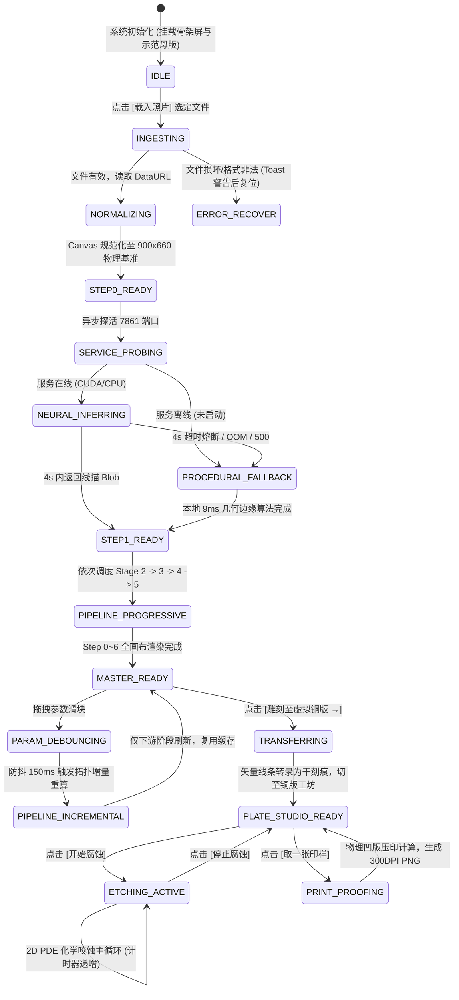

# Etchloom v2.0 全功能点击与用户交互事件流设计规范文档 (Event Flow Design Spec)

> **文档代号**：`DOC-EVENT-FLOW-V2`  
> **制定日期**：2026-09-19  
> **核心原则**：以用户点击与操作事件为唯一驱动力（Event-Driven UI），覆盖所有功能的正常流（Happy Path）、异常流（Exception Path）、超时流（Timeout Path）与退避降级流（Degradation Path），严格规范状态机跃迁，彻底消除主线程阻塞与界面渲染断流。

---

## 1. 架构定位与事件驱动哲学 (Architecture & Event-Driven Philosophy)

在古典数字版画工坊系统中，UI 不仅仅是参数的展示容器，更是复杂的**双工作区异步交互调度中心**。用户的每一个点击、拖拽、选择动作，都对应着明确的事件生命周期。

### 1.1 核心设计三定律
1. **即时感知定律 (Law of Immediate Perception / 100ms Rule)**：
   - 任何点击（载入、工具切换、酸蚀开关、图层导出）必须在 100ms 内给予直接的视觉或触觉反馈（按压高亮、徽章变色、骨架光效），严禁无声挂起。
2. **渐进出图定律 (Law of Progressive Materialization / Zero-Collapse Contract)**：
   - 每一个计算阶段（Stage 0 ~ 6）产出后，**必须立即绘制到位图/矢量画布上**。系统绝不允许等待全部 5 个阶段计算完成才一次性更新界面。
   - 视口必须具备常驻骨架屏，无论处于就绪、等待还是异常状态，7 组步骤卡片的高度与结构**绝不塌陷为 0**。
3. **安全容错与静默自愈定律 (Law of Fault Tolerance & Silent Healing)**：
   - 外部依赖（如 CUDA 神经网络服务、超大像素图片、非法文件、网络抖动）的不可靠性由系统内部消化。任何单点异常必须在 4 秒内熔断并无感降级至纯前端几何算法，确保界面永不卡死、流程永不中断。

---

## 2. 全局交互状态机定义 (Global State Machine)

系统具有单一核心主状态机，全局任何时刻处于以下 9 个严格状态之一：



---

## 3. 八大核心功能事件流全景图谱 (Feature-by-Feature Event Flows)

---

### 事件流 01：原图载入与物理规范化流 (Image Ingestion Stream)

- **UI 触发源**：侧栏 Drawer 00 `#uploadPhoto` 按钮点击 -> `#photoFile` (input file).
- **前置条件**：系统处于 `IDLE` 或 `MASTER_READY` 状态。

#### 1. 正常流 (Happy Path)
1. **用户点击**：用户点击 `[载入照片]`，操作系统弹出文件选择器；
2. **文件选定**：用户选择了一张图片文件（PNG / JPG / WEBP / BMP）；
3. **即时反馈**：
   - 侧栏上传按钮呈现按压光效；
   - 底部控制台输出：`[图像] 正在载入本地文件: {filename} ({filesize} KB)...`；
   - Step 0 卡片标头状态切为 `⏳ 载入中...`；
4. **前端物理尺寸规范化 (Canonical Normalization)**：
   - 使用离屏 Canvas 将图像按**保持原生宽高比居中填充**算法，等比适配进 **900 × 660** 物理版面网格；
   - 上下或左右留白处以纯白（#ffffff）填充，杜绝非标准尺寸对后续曲面微分算子造成的形变畸变；
   - 提取 `targetW * targetH`（594,000 像素）的灰度整数数组 `Uint8Array`；
5. **渲染 Step 0**：
   - 将 900x660 Canvas 立即写入 Step 0 卡片 Canvas，标头亮起绿标 `[✓ 900×660 原图 (2.8ms)]`；
6. **自动推进**：无缝向事件总线广播 `IMAGE_LOADED_EVENT`，触发事件流 02。

#### 2. 异常流与容错 (Exception Path)
- **取消选择**：用户关闭文件选择器未选文件 -> `change` 事件监听捕获空选择，静默退出，界面保持现状，不报错；
- **格式损坏 / 非法文件**：用户误选了文本文件或损坏图片 -> `Image.onerror` 捕获 -> 控制台输出红色警告：`[图像错误] 无法解析该图片文件，请换一张常见格式的图片重试` -> Step 0 标头显示 `[⚠ 解析失败]` -> 系统安全复位至 `IDLE`；
- **超大像素图像 (如 4800万像素 8000x6000)**：
  - 本地离屏 Canvas 缩放只进行一次，严禁将原图 20MB Base64 直接保留在内存或直接发送给网络，彻底消除主线程内存暴涨威胁。

---

### 事件流 02：AI 神经网络抽取与几何退避流 (Stage 1 Neural Stream)

- **UI 触发源**：`IMAGE_LOADED_EVENT` 自动触发，或用户调整 Drawer 00 的曝光参数。
- **目标产物**：高精度边缘轮廓标定图 `lineMap`（Float32Array，0.0=纯黑墨线，1.0=纯白棉纸）。

#### 1. 正常流 (Happy Path)
1. **探活握手**：
   - 前端通过 `fetch('http://127.0.0.1:7861/health', { signal: AbortSignal.timeout(1000) })` 探测本地独立推理服务；
   - 响应 200，识别到服务设备（如 `device: cuda`）；
   - 侧栏徽章显示：`已就绪 · CUDA`（绿色徽章）；
   - 控制台打印：`[模型] 检测到 Informative Drawings 本地服务 (CUDA)，正在进行神经网络推理...`；
2. **轻量请求提交**：
   - **关键设计**：严禁发送数兆原始照片！将 Step 0 规范化好的 900x660 Canvas 通过 `tmpCanvas.toBlob(blob, 'image/jpeg', 0.9)` 转为轻量压缩 Blob（大小仅 ~80KB）；
   - POST `http://127.0.0.1:7861/infer`，附带 `AbortSignal.timeout(4000)` 熔断信号；
3. **极速返回与反归一化**：
   - 900x660 图像在本地 CUDA 下推理耗时稳定在 **60ms ~ 90ms**；
   - 接收返回的线描二进制流，绘制至离屏 Canvas，解构为归一化浮点数组 `Float32Array(594000)`；
4. **渲染 Step 1**：
   - Step 1 卡片 Canvas 立即清空并绘制纯净黑白线描图；
   - 标头显示金色完成徽章：`[✓ CUDA神经网络: 82.4ms]`；
   - 控制台输出：`[模型] ✓ Informative Drawings 神经网络线描抽取成功。`；
5. **自动推进**：触发事件流 03（后续管线）。

#### 2. 异常与降级流 (Degradation Path)
- **情形 A：本地 Python 服务未启动 (7861 Connection Refused)**：
  - `fetch` 抛出网络异常，捕获耗时 < 10ms；
  - 侧栏徽章更新为：`未启动 (纯2D退避)`（琥珀色）；
  - 控制台打印：`[模型] Informative Drawings 独立服务未运行，启用高精度几何边缘退避算法。`；
  - 立即执行本地算法 `Stage1Informative.proceduralSketch(pixels, 900, 660)`；
  - 纯前端 Sobel/DoG 多尺度梯度边缘计算耗时仅 **9.2ms**，Step 1 卡片正常画出高精度线描，标头显示 `[✓ 几何退避: 9.2ms]`；
  - **核心价值**：用户界面丝滑推进，毫无中断感！
- **情形 B：网络超时或服务端 OOM (超过 4000ms)**：
  - `AbortSignal.timeout(4000)` 触发，主动切断 HTTP 连接；
  - 控制台打印黄色警告：`[模型] 神经网络服务响应超时(>4s)，自动无感退避至几何边缘算法。`；
  - 立即执行 `proceduralSketch`，Step 1 卡片正常出图，管线继续执行。

---

### 事件流 03：5阶段增量状态机与画布卡片渐进渲染流 (Progressive Pipeline Stream)

> **这是彻底解决用户反馈“中间结果的图呢”的核心事件流。**

- **执行引擎**：`PipelineRunner.run(recipe, { onProgress })`
- **UI 渲染约束**：每一个阶段触发 `onProgress(stage, progress, artifact)` 时，**必须当场执行对应卡片 Canvas 的图像重绘**。

```
[Stage 1 完成] -> 立即重绘 Step 1 Canvas (纯黑白线稿) -> 耗时徽章 [✓ 24.5ms]
[Stage 2 完成] -> 立即重绘 Step 2 Canvas (3D等高场 + 金黄色切线罗盘向量流动针) -> 耗时徽章 [✓ 38.2ms]
[Stage 3 完成] -> 立即重绘 Step 3 Canvas (空间骨干轮廓线，近景深黑 1.2mm，远景浅灰 0.4mm) -> 耗时徽章 [✓ 28.6ms]
[Stage 4 完成] -> 立即重绘 Step 4 Canvas (沿 3D 曲面流动的交叉雕刻排线) -> 耗时徽章 [✓ 62.1ms]
[Stage 5 完成] -> 立即重绘 Step 5 Canvas (轮廓与排线母版全要素矢量合成) -> 耗时徽章 [✓ 16.2ms]
[Step 6 仿真]  -> 立即重绘 Step 6 Canvas (暖白纯棉纸 #f0ebd9 + 凹印下陷阴影 + 油墨微晕) -> 耗时徽章 [✓ 14.0ms]
```

#### 各卡片渲染协议表：

| 步骤卡片 | 视觉内容协议 (Visual Protocol) | 视觉色彩规范 | 交互指示 |
| :--- | :--- | :--- | :--- |
| **Step 0 原图** | 900x660 居中原图灰度/彩色视图 | 原始色调，白底补白边 | 显示物理版面规格 |
| **Step 1 线描** | 纯墨线轮廓标定位图 | 白纸背景（`#ffffff`），黑墨细线（`#1b1b1b`） | 标明 CUDA 还是几何退避 |
| **Step 2 流场** | 灰调等高曲率场 + 22x22 网格罗盘向量金针 | 背景黑灰调，罗盘针为老金带透明度（`rgba(243, 198, 35, coh)`） | 动态呈现物体三维表面走向 |
| **Step 3 轮廓** | 骨干几何矢量曲线路径 | 极暗墨色（`#191d1a`）在古典暗调底上，线宽 0.4~1.6mm 渐进 | 标明轮廓线总条数 |
| **Step 4 排线** | 沿流场积分生成的微细铜版排线 | 深灰墨调（`#333c33`），曲率密集区交叉，高光区避让 | 标明排线总条数与门控阈值 |
| **Step 5 母版** | 轮廓 + 排线矢量完全合成层 | 象牙白底板（`#f5efe0`）+ 金属铜版雕刻线（`#1b1b1b`） | 提供全图导出 SVG 入口 |
| **Step 6 印样** | 纯棉纸物理凹版压痕印样模拟 | 纯棉纸底基（`#f0ebd9`）+ 板面压凹凹槽阴影（Bevel）+ 飞边晕墨 | 最接近真实印样的成品视口 |

---

### 事件流 04：参数微调、防抖与拓扑增量缓存流 (Parameter Tuning Stream)

- **UI 触发源**：用户拖动侧栏任一滑块（曝光度、轮廓敏感、空气透视、排线密度、曲率门控、交叉排线）。
- **优化目标**：保证用户拖动滑块时界面维持 60 FPS，重算时间降至毫秒级。

#### 1. 正常流 (Happy Path)
1. **参数微调**：用户拖动滑块，滑块伴随数值显示即时联动（如 `80%`）；
2. **防抖拦截 (Debounce 150ms)**：
   - 快速连续拖拽时，清除前序计时器，不向主线程派发繁重计算；
3. **拓扑失效判定与缓存复用 (Topological Invalidation)**：
   - 若用户修改的是 Drawer 02 的 `排线密度`（影响 Stage 4）：
     - Stage 1（线描）、Stage 2（流场）、Stage 3（轮廓）参数均未改变；
     - 调度器直接从 `StageCache` 读取缓存产物；
     - Step 1、2、3 卡片标头闪烁常驻翡翠绿徽章：`[● 缓存命中]`；
     - 仅从 Stage 4 开始增量执行，重算耗时从 180ms 骤降至 **40ms**！
4. **渐进刷新**：仅 Step 4、5、6 卡片 Canvas 执行局部重绘。

#### 2. 异常流：用户极速疯狂拖拽
- **抢占式调度 (Preemptive Abort)**：
  - 调度器为每一次计算分配 `AbortController`；
  - 若前一次计算尚未完成又有新参数提交，立即调用 `controller.abort('PREEMPTED')`；
  - Worker 或计算循环主动跳出，主线程队列不堆积，绝不卡死浏览器。

---

### 事件流 05：步骤卡片微交互与图层分片导出流 (Micro-Interactions Stream)

每个步骤卡片均内嵌 3 个独立操作控件：

#### 1. 🔍 局部像素放大镜 (Loupe Inspection)
- **触发**：鼠标悬停在卡片 Canvas 上按住 `Alt` 键，或点击卡片左下角放大镜按钮；
- **交互**：在鼠标周围跟随一个直径 160px 的古典铜环圆形浮窗，以 4 倍物理插值放大展示笔触交叉与纸张纤维细节；
- **移出**：光标离开 Canvas 范围，放大镜元素平滑淡出销毁。

#### 2. ⛶ 全屏特写检查 (Fullscreen Modal)
- **触发**：点击卡片右下角 `[⛶ 特写]`；
- **交互**：弹出全屏半透明暗调遮罩（`#modalOverlay`），中央以 780px 宽度弹窗最大化展示该步骤 Canvas 高清图像，并附带该阶段的线条统计元数据；
- **关闭**：按键盘 `ESC` 或点击右上角关闭按钮 / 遮罩背景，弹窗关闭。

#### 3. ⬇ 单步独立导出 (Layer Slice Export)
- **Step 0**：导出 `step0_source_image.png`；
- **Step 1**：导出 `step1_line_map.png` 灰度标定图；
- **Step 3**：通过 `Exporter` 生成 `step3_contours.svg` 纯轮廓矢量图；
- **Step 4**：生成 `step4_hatching.svg` 纯曲面排线矢量图；
- **Step 5**：生成工业级生产分层 `step5_master_vector.svg`（适配 CNC 刻版机与激光雕刻机）；
- **Step 6**：生成带 300DPI 打印标头的纯棉纸凹印样 `step6_plate_print.png`。

---

### 事件流 06：母版设计向虚拟铜版转录流 (Master-to-Plate Transfer Stream)

- **UI 触发源**：点击工作区右上角明显的金色主按钮 `[雕刻至虚拟铜版 →]`。
- **业务职责**：打通“纯算法矢量生成”与“物理仿真实体铜版”的关键桥梁。

#### 1. 正常流 (Happy Path)
1. **前置校验**：系统检查当前是否存在生成的矢量母版线条（`lastMasterPaths.length > 0`）；
2. **线条转录计算**：
   - 将母版的数千条矢量贝塞尔/折线按比例映射到 900x660 铜版网格（`Float32Array` 像素深度矩阵）；
   - 自动模拟物理“干刻针（Drypoint）”划开保护漆的过程：在划线路径上赋予曝光量 `exposed[i] = 0.7`、初始微刻深 `depth[i] = 0.36`，并在刻线两侧隆起金属飞边 `burr[i] = 0.5`；
3. **工作区与侧栏平滑切换**：
   - 顶部 Header 工作流标签自动将 `[虚拟铜版工坊]` 置为激活态；
   - 隐藏 `#masterWorkspace`，显示 `#plateWorkspace`；
   - **侧栏动态切换**：自动隐藏 Drawers 00~02，显示 Drawer 03（制版工具、酸蚀、压印）；
   - 铜版大 Canvas 立即以金属反光着色器绘制出刚刻好的紫铜母版线条；
4. **控制台日志**：`[制版] 母版已成功雕刻至 900 × 660 虚拟铜版 (包含 {N} 条干刻线条)。可使用 [开始腐蚀] 进行物理仿真。`

#### 2. 异常拦截 (Exception Path)
- **未生成母版时误点**：用户刚打开页面尚未载入图片即点击该按钮 -> 拦截转录，弹出友好提示：`“请先载入图片生成母版设计！”`，按钮产生抖动反馈，不切换工作区。

---

### 事件流 07：虚拟铜版工坊、物理酸蚀与试印流 (Plate Studio Physical Stream)

- **工作区**：`#plateWorkspace`（虚拟铜版工坊）。

#### 1. 工具切换与手工修版
- 用户点击 `[刻针]`、`[干刻针]`、`[防蚀漆]`、`[刮磨器]`：
  - 工具按钮激活态切换；
  - 铜版画布光标样式随工具变换（针尖、毛刷、压磨器）；
  - 在铜版上拖拽绘制，产生交互式物理刻痕与涂漆，且每一次绘制前自动调用 `snapshot()` 保存 Undo 堆栈。

#### 2. 酸液腐蚀化学仿真 (Acid Bite)
- **点击 [开始腐蚀]**：
  - 按钮文字切换为 `[停止腐蚀]`；
  - 状态徽章变为金色动态脉冲 `RUNNING`；
  - 启动 `requestAnimationFrame` 驱动的 2D 偏微分方程物理循环：
    - exposed 与 depth 深度矩阵按酸液浓度与金相颗粒迭代；
    - 刻痕以非线性速度向两侧扩散变宽变深，金属毛刺因酸蚀平滑溶解；
  - 累计腐蚀时间计时器实时更新（如 `腐蚀累计 4.6 s`）；
- **点击 [停止腐蚀]**：
  - 仿真暂停，保存当前刻深状态，控制台输出：`[铜版] 酸液腐蚀已停止，当前累计咬蚀时间: 4.6 秒`。

#### 3. 取一张印样 (Pull a Print Proof)
- **点击 [取一张印样]**：
  - 视图自动切换为 `印样` 模式（左右镜像反转）；
  - 计算滚筒机械压力对纸张纤维的挤压、凹槽对油墨的毛细转移量、粗纹棉纸的纹理凹陷与边缘压痕（Plate Bevel）；
  - 自动调用 `PlateCodec.pngDpi` 注入 300 DPI 物理打印标头，生成无损印样文件并触发浏览器下载。

---

### 事件流 08：方案持久化、工程归档与全局异常安全防御流 (Persistence & Safety Stream)

1. **导出方案 (Export Scheme)**：
   - 点击 Header `[导出方案]` -> 打包当前所有滑块参数与工艺设定为 JSON 文件，触发下载 `Etchloom-scheme.json`；
2. **保存/打开虚拟铜版 (Save/Load Virtual Plate)**：
   - 点击 `[保存虚拟版]` -> 对 `depth`、`exposed`、`blocked`、`burr` 进行高效压缩（RLE / Base64）打包为 `Etchloom-plate.json`；
   - 点击 `[打开虚拟版]` -> 导入校验通过后完整恢复铜版物理咬蚀现场；
3. **全局异常安全网 (Global Error Boundary)**：
   - 拦截一切未捕获的 Promise Rejection 与运行时错误；
   - 避免向用户弹出晦涩的 JavaScript 堆栈，控制台输出指引性诊断信息并安全复位按钮状态。

---

## 4. 异常处理、超时熔断与退避降级全量矩阵 (Exception & Fallback Matrix)

| 事件触发点 | 潜在异常/风险 | 判定条件 | 降级处理策略 (Fallback) | 用户感知与界面反馈 |
| :--- | :--- | :--- | :--- | :--- |
| **图片选择** | 文件格式不受支持 | 非 JPG/PNG/WEBP/BMP | 拒绝载入，保持现有画布 | Toast 提示：“请选用标准图片格式”，不抛出异常 |
| **图片选择** | 损坏或 0 字节文件 | `Image.onerror` | 终止装载，复位到 `IDLE` | 卡片 0 标红“解析失败”，控制台打印诊断日志 |
| **大图处理** | 1200万像素手机大图 | 原图尺寸 > 3000x3000 | 本地 Canvas 缩放至 900x660，发送 ~80KB 缩略图 | 处理耗时仅 15ms，绝不挂起主线程 |
| **模型握手** | Python 服务未启动 | `fetch` 7861 端口拒绝连接 | 立即无感切换本地 9ms 几何 Sobel/DoG 算法 | 侧栏标明“几何算法退避”，卡片 1 正常秒级出图 |
| **模型推理** | 服务卡死或响应过慢 | 请求超过 4000ms | `AbortSignal.timeout(4000)` 熔断强切本地算法 | 控制台黄色警告提示，卡片 1 正常完成出图 |
| **曲率排线** | 图像纯白或高光过大导致 0 条线 | `hatchingPaths.length === 0` | 算法自动放宽曲率门控阈值重新提取 | 保证卡片 4 始终有线条呈现，不出现空白空置 |
| **铜版转录** | 未生成母版时点击转录 | `masterPaths` 为空 | 拦截切换，高亮载入按钮 | 提示“请先载入图片生成母版”，震动反馈 |
| **酸液腐蚀** | 持续腐蚀超过安全时间 | `elapsed > 60s` | 深度饱和限制为 1.0，防止数据溢出 | 铜版呈现彻底咬穿黑斑，符合物理真实 |

---

## 5. 事件流对 UI 架构的硬性约束 (UI Constraints Dictated by Event Flow)

根据上述全功能事件流的梳理，UI 架构必须严格满足以下 **5 项刚性约束**：

1. **工作流模式与侧栏面板必须联动隔离**：
   - 算法母版模式下，只显示 Drawers 00~02，隐藏 Drawer 03；
   - 铜版工坊模式下，只显示 Drawer 03，隐藏 Drawers 00~02；
   - 消除跨模式点击无效控件的严重困惑。
2. **步骤流视口绝对非塌陷**：
   - `#stepFlowGridContainer` 必须具备 `min-height: 520px`，初始化即挂载 7 组标准卡片骨架屏；
   - 进入页面即刻载入默认示范母版，保证初次打开 7 张卡片全部有图。
3. **强制逐阶段即时重绘**：
   - 管线 `onProgress` 必须每到一个阶段即调用卡片 Canvas 重绘，严禁合并延迟。
4. **运行日志控制台下沉**：
   - `.activity-log-wrap` 固定在主工作区底端，高度 110px，支持点击标头折叠/展开，绝不抢占卡片视觉焦点。
5. **本地图像规范化先行**：
   - 上传图片第一动作必须是在前端规范化为 900x660，绝不允许将大图原图直接丢给异步服务造成线程阻塞。
