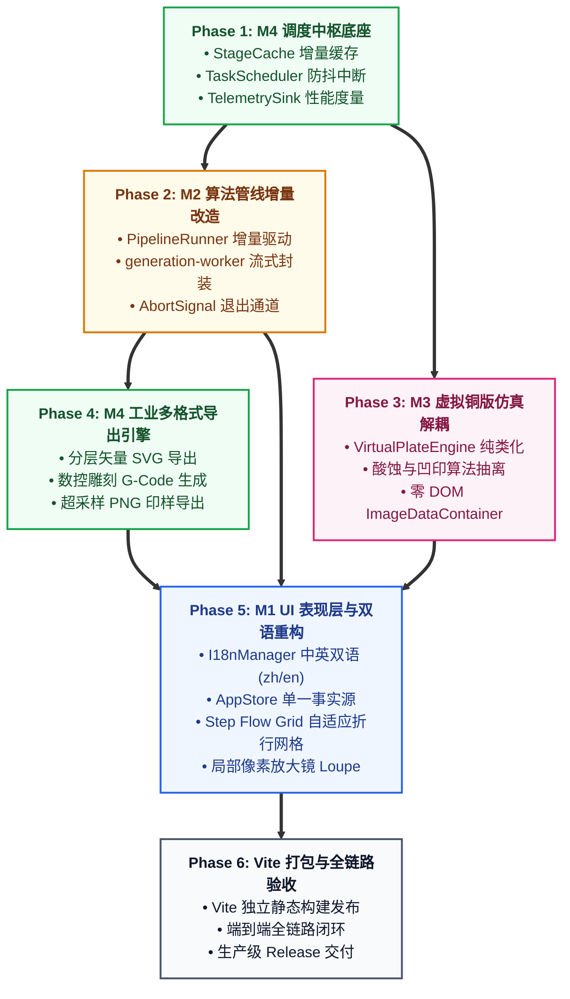

# Etchloom v2 系统工程实施与重构路线图 (Implementation Roadmap)

> **实施基准**：严格遵循 [`TOP_LEVEL_ARCHITECTURE_DESIGN.md`](./TOP_LEVEL_ARCHITECTURE_DESIGN.md) 顶层架构规范与四大模块详细设计。  
> **工程原则**：步步为营、底层先沉淀、中枢先闭环、表现层后装配；全程保障**零破坏性回归 (Zero Destructive Regression)**；各阶段单元测试即时验证，代码持续可运行。

---

## 1. 实施阶段依赖拓扑 (Phase Dependency Graph)

---

## 2. 详细阶段任务拆解与交付工件 (Detailed Phases & Tasks)

### 阶段一：M4 调度中枢与生命周期控制层 (Orchestrator Core)

- **目标**：建立系统核心中枢调度能力，确立增量缓存与取消信号链，不依赖任何 DOM。
- **具体任务清单**：
  1. [ ] **创建 `src/orchestration/stage-cache.js`**：
     - 实现轻量快速 DJB2 阶段签名计算；
     - 实现 `resolveInvalidation(hashes)`：比对各阶段差异，返回最小受影响起始阶段 $S_{\text{start}} \in [1, 6]$；
     - 维护各阶段产物内存快照与安全截断。
  2. [ ] **创建 `src/orchestration/task-scheduler.js`**：
     - 封装原生 `AbortController`；
     - 实现平滑防抖合并（默认 60ms 窗口）；
     - 新动作到达时自动抢占中断先前的活跃计算任务。
  3. [ ] **创建 `src/orchestration/telemetry-sink.js`**：
     - 非阻塞统计采集各阶段执行耗时、线条数、曲率拦截率；
     - 提供监听订阅能力，向上层流式推送度量事件。
  4. [ ] **编写单元测试 `tests/stage-cache.test.cjs` 与 `tests/task-scheduler.test.cjs`**：
     - 测试 100 次高频输入抢占中断的准确性；
     - 测试仅修改 Stage 4 参数时 Stage 1~3 缓存命中率 100%。

---

### 阶段二：M2 算法管线增量执行器与 Worker 改造 (Pipeline Incremental & Worker)

- **目标**：将现有的 5 阶段串行算法改造成支持任意中间点切入增量运行、可随时优雅退出的纯数据流。
- **具体任务清单**：
  1. [ ] **创建 `src/core/pipeline-runner.js`**：
     - 封装 `PipelineRunner.runIncremental(context, previousOutputs, params, startStage, signal, onProgress)`；
     - 各 Stage 之间插入 `signal?.aborted` 检查点，一旦中断立即退出释放内存；
     - 保证输入输出完全符合 `CROSS_MODULE_CONSISTENCY_SPEC.md` 中的标准容器规范。
  2. [ ] **重构 `src/workers/generation-worker.js` 为纯薄层包装**：
     - 仅负责接收调度计划，调用 `PipelineRunner`；
     - 阶段完成后逐步 `postMessage` 向外分发 `StepArtifactEvent`（携带预览图与统计元数据）；
     - 支持 `Transferable` 二进制零拷贝传输。
  3. [ ] **编写单元测试 `tests/pipeline-runner.test.cjs`**：
     - 验证传入 Stage 1~3 缓存并从 `startStage = 4` 运行，产物与从头全量运行严格等价；
     - 验证执行中途触发 Abort 信号能在 10ms 内极速安全退出。

---

### 阶段三：M3 虚拟铜版仿真模块解耦与纯类化 (Virtual Plate Engine)

- **目标**：将散落在 `index.html` 内嵌脚本中的物理仿真全局变量（`depth`, `exposed`, `blocked`, `burr`）彻底封装为独立的纯数据类，消除 DOM 耦合。
- **具体任务清单**：
  1. [ ] **创建 `src/core/plate/virtual-plate-engine.js`**：
     - 统一使用 `ImageDataContainer` 替换 DOM `ImageData`；
     - 维护扁平一维连续内存（`depthField`, `exposedField`, `blockedField`, `burrField`）；
     - 支持版面尺寸动态分配（900px, 1500px, 3000px，高宽比严格保持 900:660）。
  2. [ ] **创建 `src/core/plate/acid-simulator.js`**：
     - 封装偏微分动态双向微扩散有限差分算法；
     - 实现纵向加速咬深与横向微扩散，集成金相结晶白噪。
  3. [ ] **创建 `src/core/plate/press-renderer.js`**：
     - 封装凹版油墨非线性释放动力学；
     - 实现纯棉纸在数百磅机械压力下的哑光质感与金属倒角凹印（Plate Bevel）；
     - 严格实现印样水平左右镜像翻转（$x_{\text{print}} = W - 1 - x_{\text{plate}}$）。
  4. [ ] **编写单元测试 `tests/virtual-plate-engine.test.cjs`**：
     - 验证 4 种工具（刻针、干刻针、防蚀漆、刮磨器）的物理行为正交性；
     - 验证酸液微扩散面积与深度守恒；
     - 验证棉纸 Bevel 倒角压痕特征。

---

### 阶段四：M4 工业级多格式导出引擎实现 (Multi-Format Exporter)

- **目标**：提供符合工业生产标准的无损矢量母版、数控下刀 G-Code、印刷级 PNG 与配方 JSON。
- **具体任务清单**：
  1. [ ] **创建 `src/orchestration/exporter.js`**：
     - **分层 SVG 导出**：清晰保留 `<g id="contours">`、`<g id="hatchings_primary">`、`<g id="hatchings_cross">`，每条路径携带 `stroke-width` 与 `data-depth` 元数据；
     - **数控 G-Code 导出**：生成合规的标准 `G00 / G01 / G28` 指令，支持下刀深度、抬刀高度与进给速度调节；
     - **超采样 PNG 导出**：注入 300 DPI 物理打印分辨率元数据（pHYs chunk）；
     - **配方 JSON 导出**：基于标准 `RecipeState` 序列化，支持无损恢复。
  2. [ ] **编写单元测试 `tests/exporter.test.cjs`**：
     - 验证导出的 SVG XML 语法严密性；
     - 验证 G-Code 指令集坐标绝对无 NaN 与非法空行；
     - 验证 JSON 往返序列化 100% 数据一致。

---

### 阶段五：M1 UI 表现层重构与中英双语国际化 (UI Engine & i18n)

- **目标**：实现莫兰迪暗调工坊美学界面、Step 0~6 自适应折行网格、局部放大镜、以及中英双语一键切换。
- **具体任务清单**：
  1. [ ] **创建 `src/ui/i18n.js`**：
     - 实现零依赖字典查表管理器；
     - 录入包含 40+ 项专业工艺文案的中英双语词典（`zh-CN` / `en-US`）；
     - 集成 `localStorage` 持久化与浏览器语言自动嗅探。
  2. [ ] **创建 `src/ui/store/app-store.js`**：
     - 落实纯发布-订阅单向响应式状态机；
     - 纳管 `locale`、`recipe`、`stepFlow`、`artifacts`、`runtime`。
  3. [ ] **创建 `src/ui/styles/tokens.css` 与 `step-flow.css`**：
     - 落地老金（`#c8b67e`）、暗绿灰（`#191d1a`）、炭素表面（`#202421`）等全局 CSS 变量；
     - 编写自适应 CSS Grid 规则（超宽屏单行 6 列 $\to$ 标准桌面双行 3 列 $\to$ 移动端单列）。
  4. [ ] **创建步骤流与侧栏组件**：
     - `src/ui/components/step-flow-grid.js` 与 `step-card.js`：Step 0~6 独立卡片渲染、缓存状态徽章、计算中呼吸微光；
     - `src/ui/components/loupe.js`：$4\times \sim 8\times$ 局部像素悬浮放大镜；
     - `src/ui/components/sidebar-controls.js`：物理工序分层折叠抽屉面板；
     - `src/ui/components/header-bar.js`：顶部品牌区与 `[语言: 中 / EN]` 切换控件。
  5. [ ] **编写 `src/ui/dispatcher.js`**：
     - 连接 UI 事件与 M4 Orchestrator，打通参数输入到产物流式回传闭环。

---

### 阶段六：Vite 构建工程化与全链路集成验收 (Vite Release & End-to-End)

- **目标**：配置轻量现代打包脚手架，执行端到端全链路冒烟与性能测试，输出生产级 Release。
- **具体任务清单**：
  1. [ ] **配置 `package.json` 与 `vite.config.js`**：
     - 配置极简 Vite 构建指令（`npm run dev`, `npm run build`, `npm run preview`）；
     - 打包产物收敛至 `dist/`，产出零外部依赖的开箱即用离线分发包。
  2. [ ] **全链路集成与端到端回归测试**：
     - 运行全量测试套件（现有 69 项 + 新增各阶段测试全部绿灯通过）；
     - 验证照片上传 $\to$ Step 0~6 步骤实时渲染 $\to$ 中英语言切换 $\to$ 铜版手动下刀与酸蚀 $\to$ 最终多格式导出全流程。

---

## 3. 质量门禁与验收测试矩阵 (Quality Gates & Verification)

每个阶段必须通过以下质量门禁，方可准予合入与进入下一阶段：

| 实施阶段 | 质量门禁检查点 (Gate Checklist) | 自动化测试用例 |
| :--- | :--- | :--- |
| **Phase 1** | 连续 50 次高频输入，前 49 次被优雅中断，仅最后 1 次完整执行；增量哈希计算耗时 $< 0.1\text{ms}$ | `tests/stage-cache.test.cjs` `tests/task-scheduler.test.cjs` |
| **Phase 2** | `startStage = 4` 时上游阶段函数调用计数严格为 0；中途 Abort 能在 10ms 内极速退出 | `tests/pipeline-runner.test.cjs` |
| **Phase 3** | 虚拟铜版引擎与 DOM 完全解耦，在 Node.js 环境能脱机跑通完整 4 步物理工序 | `tests/virtual-plate-engine.test.cjs` |
| **Phase 4** | 导出的 SVG 能在标准矢量软件（Illustrator/Inkscape）中分层打开；G-Code 无语法错误 | `tests/exporter.test.cjs` |
| **Phase 5** | 窗口尺寸在 1600px / 1200px / 800px 间切换无任何排版崩溃；点击中/英按钮界面所有文案即时刷新 | 界面自适应与组件测试 |
| **Phase 6** | `npm run build` 单命令顺利输出 `dist/`，双击本地运行无任何缺失报错，全套测试绿灯 | 全量回归与构建测试 |
