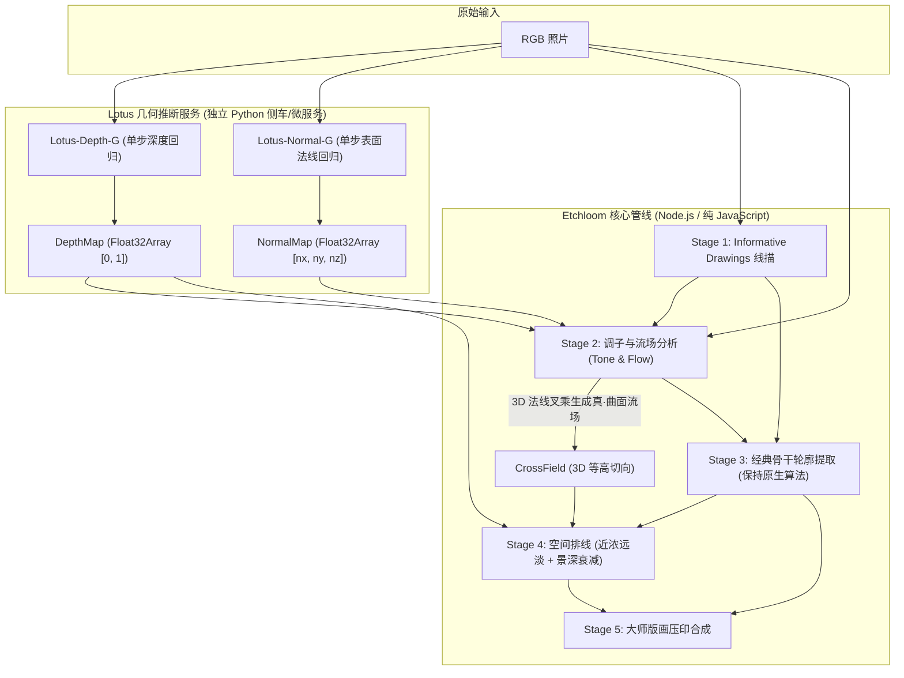

# Lotus 深度与表面法线增强版画引擎：全局设计规范

> **状态**：设计阶段 (Design Phase)  
> **模型选型**：[Lotus (EnVision-Research)](https://github.com/EnVision-Research/Lotus)（单步扩散几何基础大模型，Single-Step Diffusion for Depth & Surface Normals）  
> **核心宗旨**：模块解耦、KISS 极简设计、纯函数数据契约、向下完全兼容（零强绑定）。

---

## 1. 架构总览与解耦原则

Etchloom 的核心原则是**轻量纯粹、模块解耦、无缝降级**。Lotus 作为高维 3D 几何特征提供者，以**“可选旁路感知器（Optional Sidecar Sensor）”**形态接入系统：



### 解耦与降级保证 (Fault-Tolerant Contract)
- **非侵入式（Non-invasive）**：Etchloom 核心管线不包含任何 PyTorch 或庞大深度学习运行环境；
- **全自动降级（Auto-Fallback）**：
  - 若系统检测不到 Lotus 服务或未提供深度/法线数据，Stage 2 自动回退至现有的 2D 结构张量与各向异性扩散场；
  - 若提供了深度与法线数据，系统无缝升级为 **“3D 几何驱动雕刻模式”**，排线自动沿立体曲面经纬度环绕。

---

## 2. 标准数据接口契约 (Data Contracts)

保持数据结构的极致纯净，模块间仅通过纯 JavaScript 字典与 Float32Array 通信：

### 2.1 深度图规范 (`DepthMap`)
```typescript
interface DepthMap {
  width: number;
  height: number;
  // 归一化仿射深度：0.0 代表最近前景，1.0 代表最远背景
  data: Float32Array; // 长度 = width * height
}
```

### 2.2 表面法线图规范 (`NormalMap`)
```typescript
interface NormalMap {
  width: number;
  height: number;
  // 每个像素包含三维单位法向量 (nx, ny, nz)，范围 [-1.0, 1.0]
  // 长度 = width * height * 3
  normals: Float32Array;
}
```

---

## 3. 几何数学映射与 Stage 具体落地

### 3.1 Stage 2: 真实 3D 曲面排线流向生成 (Cross-Contour Tangents)

传统 2D 算法的流向是通过图像灰度梯度的正交方向估算的，遇到光照复杂或颜色贴图时容易产生错误紊乱。
有了 Lotus 输出的物理表面法向量 $\mathbf{n} = (n_x, n_y, n_z)$，排线方向将获得**解析级几何真值**：

1. **三维等高切向公式（Cross-Contour Formula）**：
   在正交投影下，视线方向为 $\mathbf{v} = (0, 0, 1)$。物体表面的水平等高环绕方向即为表面法向与视线方向的叉乘：
   $$\mathbf{T}_{\text{surface}} = \mathbf{n} \times \mathbf{v} = (n_y, -n_x, 0)$$
2. **二维流场归一化切向量**：
   $$t_x = \frac{n_y}{\sqrt{n_x^2 + n_y^2 + \epsilon}}, \quad t_y = \frac{-n_x}{\sqrt{n_x^2 + n_y^2 + \epsilon}}$$
   - **艺术效果**：排线直接沿陶罐球面、圆柱、手臂弧面、飞檐屋顶的 3D 几何经纬度整齐环绕，产生文艺复兴大师丢勒级的严谨体积雕塑感！

### 3.2 Stage 4: 空间空气透视衰减 (Depth-Atmospheric Attenuation)

传统版画中，远景（如远山、云彩）要求用刀极轻、甚至大面积留白，近景主体则要求深沉浓重：

1. **景深线宽调制**：
   $$W_{\text{actual}}(x, y) = W_{\text{base}}(x, y) \cdot (1.0 - 0.45 \cdot Z(x, y))$$
   - 近处物体（$Z \to 0$）获得 100% 饱满刀压；
   - 极远处物体（$Z \to 1$）线宽自然收缩 45%，空灵幽远。
2. **景深排线密度自适应截断**：
   - 设定远景纸白阈值：当 $Z(x, y) > 0.88$ 且局部明暗并不深沉时，直接触发留白豁免（Exemption），自动切断杂碎排线。

### 3.3 Stage 4: 真·几何平坦面识别 (Normal Flatness Gating)

解决“墙面、桌面、天空为何出现多余排线”的最坚实武器：
- 计算局部法线散度：
  $$\Delta \mathbf{n} = \|\nabla n_x\| + \|\nabla n_y\|$$
- 若 $\Delta \mathbf{n} < 0.05$（法线几乎处处相同，曲率为 0），则判定为绝对平整面，严格抑制排线生长。

---

## 4. 独立服务设计 (`services/lotus_geometry/`)

遵循高内聚原则，Lotus 模型服务完全封装在 `services/lotus_geometry/` 目录内，提供两种极简运行方式：

1. **命令行无头批处理 (`geometry_cli.py`)**：
   ```bash
   python geometry_cli.py --input test.jpg --output-dir ./out --device cuda --fp16
   ```
   输出纯净的 `.bin`（Float32 二进制）或标准 16-bit PNG，耗时约 150ms。
2. **可选轻量 HTTP 微服务 (`server.py`)**：
   监听本地 `http://127.0.0.1:7862/estimate`，接收图片返回 JSON / 二进制深度与法线。

---

## 5. 复杂度控制与风险防范

1. **不修改现有 Stage 3 经典轮廓算法**：
   前车之鉴，Stage 3 的灰度连续梯度脊线算法（`traceCenterlines`）表现极佳，保持现状不变，深度信息仅用于 Stage 2 流场与 Stage 4 排线疏密。
2. **纯数据单向流入**：
   核心管线仅增加一个可选入参 `geometryFields: { depthMap, normalMap }`，为 `null` 时无缝降级，保证 100% 回归安全。
