# M2: 核心算法管线模块详细设计与实施文档 (Algorithmic Pipeline)

> **设计基准**：严格遵循 [`TOP_LEVEL_ARCHITECTURE_DESIGN.md`](./TOP_LEVEL_ARCHITECTURE_DESIGN.md) 顶层架构规范。  
> **核心原则**：纯数学与几何无状态计算（Stateless）、100% 解耦无 DOM 依赖、阶段级标准契约（Input $\to$ Process $\to$ Output）、支持多线程 Worker 离线并行。

---

## 1. 模块定位与职责边界 (Scope & Boundaries)

M2 算法管线模块负责将静态输入图像与 3D 几何先验转化为高保真、富含三维曲面体块感与手工雕版韵味的矢量母版线集。

```mermaid
flowchart LR
    classDef s1Style fill:#eff6ff,stroke:#2563eb,stroke-width:1.5px,color:#1e3a8a;
    classDef s2Style fill:#f0fdf4,stroke:#16a34a,stroke-width:1.5px,color:#14532d;
    classDef s3Style fill:#fffbeb,stroke:#d97706,stroke-width:1.5px,color:#78350f;
    classDef s4Style fill:#fdf2f8,stroke:#db2777,stroke-width:1.5px,color:#831843;
    classDef s5Style fill:#f8fafc,stroke:#475569,stroke-width:2px,color:#0f172a;

    S1["<b>Stage 1</b><br/>灰度线描感知<br/>(Line Extraction)"]:::s1Style
    S2["<b>Stage 2</b><br/>3D等高流场<br/>(Surface Flow)"]:::s2Style
    S3["<b>Stage 3</b><br/>轮廓景深调制<br/>(Aerial Contours)"]:::s3Style
    S4["<b>Stage 4</b><br/>曲率门控排线<br/>(Curvature Hatch)"]:::s4Style
    S5["<b>Stage 5</b><br/>母版矢量合成<br/>(Master Paths)"]:::s5Style

    S1 ==>|"LineMap"| S2
    S2 ==>|"Tone & Flow"| S3
    S3 ==>|"Contours & Mask"| S4
    S4 ==>|"Hatching Paths"| S5
```



### 职责内边界 (In Scope)
1. **纯粹单向无状态流水线**：接收上一阶段产出的不可变数据容器，经过纯数学矩阵与几何追踪处理，产出当前阶段结果。
2. **五阶工序分工**：
   - Stage 1: 提取多尺度高频骨架与灰度感知场；
   - Stage 2: 依据法线与深度构建 3D 切向流场与调子场；
   - Stage 3: 提取结构性轮廓，并依据景深做近粗远细透视调制；
   - Stage 4: 基于曲率门控在曲面上追踪流线排线，平面绝对抑墨防乱线；
   - Stage 5: 合并图层、剪裁退化、封装工业级母版矢量。

### 职责外边界 (Out of Scope - 严禁越界)
- **严禁访问任何 DOM 元素、Canvas API 或浏览器特定上下文**（保证在 Node.js、Web Worker、无头测试环境中行为 100% 一致）；
- **严禁维护外部状态或全局单例变量**（相同的输入必产生完全一致的输出）；
- **严禁反向修改上游传入的数据缓冲区**（遵循不可变原则）。

---

## 2. 五大阶段标准接口契约 (Stage Contracts)

### 2.1 Stage 1: 灰度线描感知 (Informative Line Extraction)

- **输入 (Input)**：
  - `image`: `{ width: number, height: number, pixels: Uint8Array }`（归一化灰度或彩色矩阵）；
  - `params`: `{ detail: number, exposure: number, blackPoint: number, whitePoint: number }`。
- **处理过程 (Process)**：
  1. 多尺度高斯差分（DoG, Difference of Gaussians）捕获多频段边缘特征；
  2. 自适应局部对比度归一化，过滤平坦区域的高频噪点，保留真实物理明暗交界边缘；
  3. 输出平滑且边界锐利的标量标定线描场。
- **输出 (Output)**：
  - `lineMap`: `{ width: number, height: number, data: Float32Array }`（取值 $0.0 \sim 1.0$，$0$ 为极重黑线，$1.0$ 为纯白背景）。

---

### 2.2 Stage 2: 3D 几何等高流场 (Tone and 3D Surface Flow Field)

- **输入 (Input)**：
  - `image`: 原始图像容器；
  - `lineMap`: Stage 1 产出的线描场；
  - `geometry`（可选）: `{ depthMap: Float32Array, normalMap: Float32Array }`；
  - `params`: `{ shadows: number, flow: number, curvature: number, style: string }`。
- **处理过程 (Process)**：
  1. **调子场构建 (Tone Field)**：结合原图明度与局部线条密度，经非线性曲线矫正与黑白场重映射，生成连续灰阶明度场 $\text{Tone}(x, y) \in [0, 1]$；
  2. **流向场重构 (Flow Field)**：
     - 若提供 `normalMap`：沿三维曲面计算主曲率切向流场 $\mathbf{v} = (v_x, v_y)$，确保排线严格沿 3D 物体表面等高线起伏贴合（Cross-Contour）；
     - 若未提供 3D 先验（降级回退）：基于图像结构张量（Structure Tensor）进行特征分解，提取沿明暗主轴的相干矢量场。
- **输出 (Output)**：
  - `toneField`: `{ width: number, height: number, tone: Float32Array }`；
  - `flowField`: `{ width: number, height: number, vx: Float32Array, vy: Float32Array, coherence: Float32Array }`。

---

### 2.3 Stage 3: 轮廓与景深调制 (Aerial Perspective Contours)

- **输入 (Input)**：
  - `lineMap`: 来自 Stage 1 的线描感知场；
  - `toneField`: 来自 Stage 2 的连续调子场；
  - `geometry`（可选）: 深度图 `depthMap`；
  - `params`: `{ contour: number, contourSeed: number, aerialStrength: number }`。
- **处理过程 (Process)**：
  1. **骨干边缘矢量追踪**：基于非极大值抑制（NMS）与双阈值迟滞滞后连接，将标量黑线追踪为平滑连续的二维几何折线（Polyline Paths）；
  2. **空气透视景深衰减 (Aerial Modulation)**：
     - 查询每个骨架采样点在 `depthMap` 中的归一化景深值 $z \in [0, 1]$；
     - 依据文艺复兴空气透视法则，近处结构赋予饱满有力的物理刀宽（如 $0.8 \sim 1.2\text{mm}$），远处背景轮廓呈指数级衰减渐隐（如 $0.2 \sim 0.35\text{mm}$），营造深邃的空间进深感；
  3. **轮廓占用掩模 (Contour Mask)**：将骨干轮廓栅格化为防排线撞线碰撞掩模。
- **输出 (Output)**：
  - `vectorContours`: `Array<{ points: [number, number][], width: number, depth: number }>`；
  - `contourMask`: `Uint8Array`（布尔标记，防止 Stage 4 排线穿越主轮廓）。

---

### 2.4 Stage 4: 曲率门控空间排线 (Curvature-Gated Spatial Hatching)

- **输入 (Input)**：
  - `toneField`: 来自 Stage 2 的调子场；
  - `flowField`: 来自 Stage 2 的相干主曲率流向场；
  - `contourMask`: 来自 Stage 3 的轮廓空间排斥掩模；
  - `geometry`（可选）: 包含表面曲率与深度先验；
  - `params`: `{ hatch: number, cross: number, curvatureThreshold: number, hatchSeed: number }`。
- **处理过程 (Process)**：
  1. **曲率门控防乱线 (Curvature Gate)**：
     - 计算各区域的曲率张量与平坦度 $\kappa$；
     - 对平滑平整平面（如建筑白墙、光滑桌面、纯白背景）实施绝对抑墨（$\kappa < \kappa_0 \implies \text{Budget} = 0$），杜绝乱排线；
     - 仅对三维曲面（圆柱体、起伏衣褶、肌肉形体）开放排线配额；
  2. **自适应流线追踪 (Jobard-Lefer Streamlines)**：
     - 在调子密集区按泊松圆盘分布放置种子点；
     - 沿流场切线 $\mathbf{v}$ 进行 Runge-Kutta 积分追踪，自动保持线间距（Distance Separation）；
  3. **交叉网线分层 (Cross-Hatching)**：
     - 在最深暗影区（$\text{Tone} > 0.75$）沿共轭方向 $\mathbf{v}^\perp$ 生成第二层短排线，增加厚重调子。
- **输出 (Output)**：
  - `hatchingPaths`: `Array<{ points: [number, number][], width: number, layer: 'primary' | 'cross' }>`。

---

### 2.5 Stage 5: 母版矢量合成 (Master Print Synthesis)

- **输入 (Input)**：
  - `vectorContours`: 来自 Stage 3 的轮廓集；
  - `hatchingPaths`: 来自 Stage 4 的排线集；
  - `params`: `{ style: 'engraving' | 'woodcut', minLength: number, simplifyEpsilon: number }`。
- **处理过程 (Process)**：
  1. **拓扑剪裁与极短毛刺剔除**：去除由于积分截断产生的微小碎屑线段（长度 $< 1.5\text{px}$）；
  2. **折线多边形样条化 (Ramer-Douglas-Peucker 简化)**：对路径顶点进行自适应容差精简，保证在数控下刀与 SVG 缩放时的极致平滑度；
  3. **图层分级与母版封装**：将轮廓层与排线层有序打包，赋予层级元数据（用于后续铜版下刀深度映射与工业导出）。
- **输出 (Output)**：
  - `masterResult`: 
    ```typescript
    interface MasterVectorBundle {
      width: number;
      height: number;
      paths: Array<{
        id: string;
        type: 'contour' | 'hatching_primary' | 'hatching_cross';
        points: [number, number][];
        width: number;
        targetDepth: number; // 建议的金属刻槽雕刻深度 (0.0 ~ 1.0)
      }>;
      stats: {
        contourCount: number;
        hatchingCount: number;
        totalPaths: number;
        totalLength: number;
      };
    }
    ```

---

## 3. 极简无状态管线驱动器 (PipelineRunner)

为了杜绝模块耦合与复杂的中间态，M2 提供统一且极简的管线执行入口：

```javascript
class PipelineRunner {
  /**
   * 单向链式执行管线，支持从任意起始阶段增量重跑
   * @param {Object} context - 包含 sourceImage 与 geometry
   * @param {Object} previousOutputs - 上游已缓存的阶段产物
   * @param {Object} params - 当前配方切片
   * @param {number} startStage - 起始执行阶段 (1 ~ 5)
   * @param {AbortSignal} signal - 取消信号
   * @param {Function} onProgress - 进度通知回调 (stageIndex, progress, result)
   */
  static async runIncremental(context, previousOutputs, params, startStage = 1, signal = null, onProgress = null) {
    const outputs = { ...previousOutputs };
    const { sourceImage, geometry } = context;

    // Stage 1
    if (startStage <= 1) {
      if (signal?.aborted) throw new Error('ABORTED');
      outputs.stage1 = Stage1Informative.runStage1(sourceImage, params);
      if (onProgress) onProgress(1, 20, outputs.stage1);
    }

    // Stage 2
    if (startStage <= 2) {
      if (signal?.aborted) throw new Error('ABORTED');
      outputs.stage2 = Stage2ToneFlow.runStage2(sourceImage, outputs.stage1, geometry, params);
      if (onProgress) onProgress(2, 40, outputs.stage2);
    }

    // Stage 3
    if (startStage <= 3) {
      if (signal?.aborted) throw new Error('ABORTED');
      outputs.stage3 = Stage3Contours.runStage3(outputs.stage1, outputs.stage2.toneField, geometry, params);
      if (onProgress) onProgress(3, 60, outputs.stage3);
    }

    // Stage 4
    if (startStage <= 4) {
      if (signal?.aborted) throw new Error('ABORTED');
      outputs.stage4 = Stage4Hatching.runStage4(
        outputs.stage2.toneField,
        outputs.stage2.flowField,
        outputs.stage3.contourMask,
        geometry,
        params
      );
      if (onProgress) onProgress(4, 80, outputs.stage4);
    }

    // Stage 5
    if (startStage <= 5) {
      if (signal?.aborted) throw new Error('ABORTED');
      outputs.stage5 = Stage5MasterPrint.runStage5(
        outputs.stage3.vectorContours,
        outputs.stage4.hatchingPaths,
        outputs.stage2.toneField,
        params
      );
      if (onProgress) onProgress(5, 100, outputs.stage5);
    }

    return outputs;
  }
}
```

---

## 4. 实施规划与验收测试 (Implementation & Verification)

### 4.1 目录组织与现有代码复用
- 保持 `src/core/stage1-informative.js` 至 `stage5-master-print.js` 的单一职责；
- 新建 `src/core/pipeline-runner.js`，实现标准化的 `PipelineRunner` 单向执行接口；
- 重构 `src/workers/generation-worker.js`，使其作为纯薄包装（Thin Wrapper），仅接收来自 M4 的消息并驱动 `PipelineRunner`，支持 `Transferable` 二进制零拷贝传输与逐步 `postMessage` 事件回传。

### 4.2 验收测试用例 (Test Matrix)
1. **纯粹性与无 DOM 验证**：在 Node.js 无头环境下直接运行 5 阶段，无 `window / document / canvas` 报错；
2. **增量起始阶段正确性验证**：
   - 传入合法的 Stage 1~3 缓存，设定 `startStage = 4`，验证 Stage 1~3 函数绝对未被调用，且输出最终结果与全量生成完全等价；
3. **空气透视与曲率门控有效性验证**：
   - 验证极平坦平面（$\kappa = 0$）排线数量为 0；
   - 验证深度远处线宽衰减比例严格大于 50%；
4. **中断响应性验证**：在执行 Stage 2 期间触发 `AbortSignal`，管线能在 10ms 内立即退出并释放后续阶段的内存分配。
