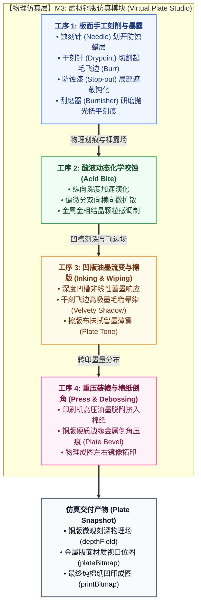

# M3: 虚拟铜版仿真模块详细设计与实施文档 (Virtual Plate Studio)

> **设计基准**：严格遵循 [`TOP_LEVEL_ARCHITECTURE_DESIGN.md`](./TOP_LEVEL_ARCHITECTURE_DESIGN.md) 顶层架构规范。  
> **核心原则**：纯数值离散场物理模拟、100% 解耦无 DOM 依赖、四大手工版画工序精确还原、标准契约（Input $\to$ Process $\to$ Output）、内存连续高效计算。

---

## 1. 模块定位与职责边界 (Scope & Boundaries)

M3 虚拟铜版仿真模块是传统手工版画物理工序的数字孪生工作台。它完全独立于前置算法管线（M2），专门负责承接矢量下刀轨迹或用户手工运笔，在离散物理标量场上真实模拟**版材刻削、化学酸蚀、高粘度油墨流变转印、以及重压棉纸版框倒角凹印**的全流程物理效应。



### 职责内边界 (In Scope)
1. **连续内存离散物理场管理**：维护板面尺寸（900px ~ 3000px）下的五大微观状态场（刻深、暴露、防蚀、飞边、结晶）；
2. **四大物理工序演进**：
   - 刻刀下刀与母版路径栅格化（划开蜡层或直接切割金属）；
   - 偏微分双向酸蚀演化（显式有限差分横向纵向腐蚀）；
   - 油墨转印与擦版留墨动力学映射；
   - 棉纸受压与金属倒角凹陷（Plate Bevel）光影合成。
3. **无损快照与状态撤销**：结合 `PlateCodec` 实现内存轻量化快照与历史回溯。

### 职责外边界 (Out of Scope - 严禁越界)
- **严禁直接绑定浏览器 DOM / Canvas / 事件侦听**（保持 100% 纯数值运算，渲染输出为纯 `ImageData` 像素数据，支持 Worker 离线计算）；
- **严禁执行图像几何识别与流线追踪**（这属于 M2 算法职责）；
- **严禁维护用户 UI 配置表单**（这属于 M1 职责）。

---

## 2. 微观物理场数据结构 (Physical Field Representation)

为保障超高分辨率（如 3000px 工业级板面）下的计算性能与零 GC 内存垃圾开销，所有物理场均使用一维扁平 `TypedArray` 连续内存存储：

```typescript
interface VirtualPlateContext {
  width: number;                    // 版面宽度 (px)，例如 900, 1500, 3000
  height: number;                   // 版面高度 (px)，例如 660, 1100, 2200
  pixelCount: number;               // N = width * height
  
  // 五大核心物理离散场
  depthField: Float32Array;         // 凹槽真实刻深场 [0.0 ~ 1.0]
  exposedField: Float32Array;       // 金属表面裸露受蚀度 [0.0 ~ 1.0]
  blockedField: Uint8Array;         // 防蚀漆保护层掩模 [0: 裸露, 1: 遮蔽]
  burrField: Float32Array;          // 干刻金属微观卷边高度 (Burr) [0.0 ~ 1.0]
  grainNoise: Float32Array;         // 金属金相结晶固有高频白噪 [0.0 ~ 1.0]

  // 状态与演进指标
  elapsedAcidTime: number;          // 累计腐蚀浸酸时长 (秒)
}
```

---

## 3. 四大工序数值演进模型 (Discrete Physics Formulations)

### 3.1 工序 1: 板面手工雕刻与材料暴露

根据不同物理工具有针对性地修改微观场：

1. **刻针 (Needle)**：尖锐针头划透防蚀蜡层，完全暴露金属基底，几乎不切入深层金属：
   $$\text{blocked}[i] \leftarrow 0, \quad \text{exposed}[i] \leftarrow \max(\text{exposed}[i], f), \quad \text{depth}[i] \leftarrow \text{depth}[i] + 0.0008 \times f$$
2. **干刻针 (Drypoint)**：硬质合金针直接深切金属，在划痕两旁翻起剧烈卷曲的金属飞边（Burr）：
   $$\text{exposed}[i] \leftarrow \max(\text{exposed}[i], 0.7f), \quad \text{depth}[i] \leftarrow \text{depth}[i] + 0.36f, \quad \text{burr}[i] \leftarrow \min(1.0, \text{burr}[i] + f_{\text{burr}})$$
3. **防蚀漆 (Stop-out)**：涂覆耐酸快干树脂，彻底钝化局部区域，阻止后续酸液渗透：
   $$\text{blocked}[i] \leftarrow 1, \quad \text{exposed}[i] \leftarrow 0, \quad \text{burr}[i] \leftarrow 0$$
4. **刮磨器 (Burnisher)**：物理研磨已深刻痕，抚平粗糙飞边、降低刻深以提亮高光：
   $$\text{burr}[i] \leftarrow \text{burr}[i] \times (1 - 0.88f_{\text{pol}}), \quad \text{depth}[i] \leftarrow \text{depth}[i] \times (1 - 0.32f_{\text{pol}})$$

---

### 3.2 工序 2: 酸液动态化学咬蚀 (Acid Bite)

模拟铜版浸泡于三氯化铁（$\text{FeCl}_3$）或稀硝酸槽中的化学蚀刻动力学。腐蚀不仅垂直向下咬深，而且伴随向防蚀层边缘下方的横向微扩散（Under-cutting）：

$$\text{next\_exposed}[i] = \min\left(1.0, \text{exposed}[i] + \max(0, \nabla^2 \text{exposed} - \text{exposed}[i]) \cdot \Delta t \cdot \alpha_{\text{acid}} \cdot (0.14 + 0.55 g \cdot \text{grain}[i])\right)$$
$$\text{depth}[i] = \min\left(1.0, \text{depth}[i] + \text{next\_exposed}[i] \cdot \Delta t \cdot \alpha_{\text{acid}} \cdot 0.058 \cdot (1 + g(\text{grain}[i] - 0.5))\right)$$
$$\text{burr}[i] = \max\left(0, \text{burr}[i] - \Delta t \cdot \alpha_{\text{acid}} \cdot 0.14\right) \quad (\text{酸液逐渐钝化并溶解尖锐细小飞边})$$

- $\Delta t$：单步腐蚀时间步长；
- $\alpha_{\text{acid}}$：酸液浓度强度系数；
- $g$：金相微粒粗糙度影响权重。

---

### 3.3 工序 3: 凹版油墨流变转印与擦版留墨 (Inking & Wiping)

凹版印痕的墨色绝非简单的黑白二值，而是由刻槽深度与擦版手法决定的连续非线性物理过程：

1. **凹槽深度油墨有效截留 (Ink Retention)**：
   若刻深低于印刷机接触脱附阈值 $d_{\text{drop}} = 0.07(1 - p_{\text{press}})$，油墨无法被棉纸吸出；深槽则呈指数级高效蓄墨：
   $$\text{TransferRate}(d) = 1 - \exp\left(-d_{\text{eff}} \cdot (1.8 + 13.0 \cdot p_{\text{press}})\right)$$
2. **干刻飞边毛糙吸墨 (Velvety Burr Ink)**：
   金属飞边的毛糙空隙能锁住大量油墨，并在高压下形成柔和晕化：
   $$\text{BurrInk} = \text{burr} \times 0.95 \times \text{ink} \times (0.30 + 0.70 \cdot p_{\text{press}})$$
3. **擦版布抹拭留墨薄雾 (Plate Tone)**：
   铜版光滑平面经擦版布擦拭后，残留的微量油墨油膜赋予画面古典温暖的调子薄雾：
   $$\text{SurfaceTone} = \text{tone} \times \text{ink} \times 0.32$$

---

### 3.4 工序 4: 重压装裱与棉纸倒角凹印 (Press & Debossing)

1. **棉纸微观凹凸响应**：
   受压后的纯棉纸呈现哑光沉稳质感，整体反射率依照综合受墨量产生对数加权减色衰减。
2. **金属版框倒角凹印 (Plate Bevel)**：
   铜版四周切割研磨出的 $45^\circ$ 金属斜边，在高压滚筒碾压下将厚重湿润的棉纸永久压出一条向内凹陷的规整压痕。该特征是鉴别传统手工凹版原作的关键物理印记：
   $$\text{Bevel}(d_{\text{border}}) = \begin{cases}
   -54 \cdot p_{\text{press}} \sin(t \pi) & (\text{背光阴影侧}) \\
   +38 \cdot p_{\text{press}} \sin(t \pi) & (\text{受光高光侧})
   \end{cases}$$
3. **左右镜像拓印 (Mirroring)**：
   印样在水平方向严格执行几何镜像变换：$x_{\text{print}} = W - 1 - x_{\text{plate}}$。

---

## 4. 标准接口契约 (Interface Contracts)

### 4.1 输入契约 (Input Contract)
```typescript
interface PlateStudioInput {
  action: 'INIT_PLATE' | 'APPLY_MASTER_PATHS' | 'APPLY_TOOL_STROKE' | 'RUN_ACID_STEP' | 'RENDER_PRINT';
  width?: 900 | 1500 | 3000;
  
  // 矢量母版输入 (来自 M2/M4)
  masterPaths?: Array<{ points: [number, number][]; width: number }>;
  
  // 手工交互工具输入
  toolEvent?: {
    tool: 'needle' | 'dry' | 'stop' | 'polish';
    size: number;
    points: Array<{ x: number; y: number; pressure: number }>;
  };

  // 工艺环境参数
  acidParams?: { acidStrength: number; grain: number; dt: number };
  pressParams?: { ink: number; pressure: number; plateTone: number; paperType: 'rough' | 'smooth' };
}
```

### 4.2 处理过程 (Process)
1. 无状态与纯数据驱动：内部封装在独立的 `VirtualPlateEngine` 类中；
2. 脏矩形（Dirty Rect）局部标记与双缓冲交换，保证连续交互时不卡顿。

### 4.3 输出契约 (Output Contract)
```typescript
interface PlateSnapshot {
  width: number;
  height: number;
  elapsedAcidTime: number;
  
  // 物理场原始数据 (用于快照保存与撤销)
  rawFields: {
    depth: Float32Array;
    exposed: Float32Array;
    blocked: Uint8Array;
    burr: Float32Array;
  };

  // 纯像素视口渲染结果 (用于 M1 视口直接呈现，零 DOM 依赖)
  renderedBitmaps: {
    plateView: ImageDataContainer;    // 真实铜版材质光泽视图
    depthView: ImageDataContainer;    // 灰度深度热力图
    printView: ImageDataContainer;    // 左右镜像纯棉纸压印成图
  };
}
```

---

## 5. 实施规划与验收测试 (Implementation & Verification)

### 5.1 目录组织与代码重构
- 新建核心引擎类：`src/core/plate/virtual-plate-engine.js`，将原本散落在 `index.html` 内嵌脚本中的全局状态完整封装为此纯类；
- 新建数值计算子模块：`src/core/plate/acid-simulator.js` 与 `src/core/plate/press-renderer.js`；
- 继承并兼容 `src/core/plate-codec.js` 的无损压缩序列化，确保旧版保存的 `.json` 练习版 100% 兼容恢复。

### 5.2 验收测试矩阵 (Test Matrix)
1. **工具正交物理行为验证**：
   - 验证 `needle` 仅增加 `exposed`，不显著增加 `depth`；
   - 验证 `dry` 同步剧烈增加 `depth` 与 `burr`；
   - 验证 `stop` 100% 抑制区域后续酸液演进；
   - 验证 `polish` 显著衰减 `burr` 与 `depth`。
2. **酸液微扩散守恒性验证**：
   - 浸酸 60 秒后，验证裸露边缘横向扩张宽度随时间收敛，数值无越界 NaN；
3. **镜像与棉纸倒角压痕验证**：
   - 验证最终印样图较版面发生严密的左右水平翻转；
   - 验证版框边缘存在明暗对称的 Plate Bevel 压痕。
