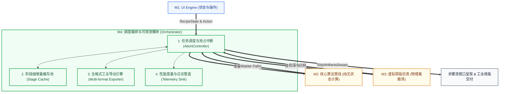

# M4: 调度编排与可观测模块详细设计与实施文档 (Orchestrator & Observability)

> **设计基准**：严格遵循 [`TOP_LEVEL_ARCHITECTURE_DESIGN.md`](./TOP_LEVEL_ARCHITECTURE_DESIGN.md) 顶层架构规范。  
> **核心原则**：保持极简设计（KISS）、模块职责绝对单一且解耦、纯数据契约（Input $\to$ Process $\to$ Output）、降低复杂度、零外部沉重依赖。

---

## 1. 模块定位与职责边界 (Scope & Boundaries)

M4 调度编排模块在系统中扮演**中枢总线与质量度量中心**的角色。它向上承接 UI 交互状态的变化，向下协调计算管线与仿真引擎，向外提供工业级格式导出与运行时度量监控。



### 职责内边界 (In Scope)
1. **生命周期与中断管理**：管理异步任务状态（IDLE, RUNNING, CANCELLED, ERROR），高频事件防抖，通过 `AbortController` 信号链抢占终止过时运算。
2. **阶段级增量缓存池**：依据依赖拓扑（Stage 1 $\to$ Stage 5），对各阶段参数做局部哈希校验，仅执行受参数变更影响的下游阶段，上游无损复用。
3. **全格式工业导出**：无损封装 SVG（保留分层与刀宽）、超采样棉纸印样 PNG、写字机数控 G-Code、全要素复现配方 JSON。
4. **性能度量与可观测性**：采集并分发执行耗时切片、线条物理长度、曲率门控拦截率等度量指标。

### 职责外边界 (Out of Scope - 严禁越界)
- **严禁包含任何数学与几何运算**（交由 M2 执行）；
- **严禁包含任何铜版物理蚀刻与印压模拟**（交由 M3 执行）；
- **严禁直接访问 DOM、Canvas 元素或样式表**（保持 100% 纯逻辑与数据流，交由 M1 渲染）。

---

## 2. 标准接口契约设计 (Interface Contracts)

M4 的所有通信均建立在明确的纯数据结构上，输入、输出及处理过程如下：

### 2.1 契约 A：UI 交互触发与产物流 (UI $\longleftrightarrow$ Orchestrator)

#### 输入 (Input)
```typescript
interface OrchestratorDispatchInput {
  action: 'RUN_PIPELINE' | 'TRANSFER_TO_PLATE' | 'RUN_ACID_STEP' | 'RENDER_PRINT' | 'CANCEL';
  recipe: RecipeState;              // 纯数据配方（包含几何加权、排线密度、酸蚀时长等全部控制项）
  sourceImage?: ImageDataContainer; // 原始像素数据（首次加载或换图时提供）
  geometry?: GeometryContainer;     // 3D 法线与深度数据（可选）
}

/** 统一全局工艺配方状态 (Single Source of Truth) */
interface RecipeState {
  // Stage 1: 线描感知
  detail: number;                   // 细节丰富度 0~100 (默认 65)
  exposure: number;                 // 曝光调节 0~100 (默认 50)
  blackPoint: number;               // 黑场位点 0~100 (默认 0)
  whitePoint: number;               // 白场位点 0~100 (默认 100)

  // Stage 2: 3D几何流向
  shadows: number;                  // 暗部深度 0~100 (默认 20)
  flow: number;                     // 流动曲率感 0~100 (默认 50)
  curvature: number;                // 3D法线敏感度 0~100 (默认 75)
  style: 'engraving' | 'woodcut';   // 风格流派 (默认 'engraving')

  // Stage 3: 轮廓与空气透视
  contour: number;                  // 轮廓敏感度 0~100 (默认 85)
  contourSeed: number;              // 轮廓离散种子
  aerialStrength: number;           // 空气透视近浓远淡强度 0~100 (默认 60)

  // Stage 4: 曲面空间排线
  hatch: number;                    // 排线密度 0~100 (默认 90)
  cross: number;                    // 交叉排线开度 0~100 (默认 65)
  curvatureThreshold: number;       // 平坦面抑墨门控阈值 0~100 (默认 75)
  hatchSeed: number;                // 排线种子

  // Stage 5: 母版合成
  minLength: number;                // 最小保留短线长 px (默认 1.5)
  simplifyEpsilon: number;          // RDP 样条容差 px (默认 0.3)

  // M3 虚拟铜版与物理工坊
  acidStrength: number;             // 酸液浓度 0~100 (默认 45)
  grain: number;                    // 金相结晶微粒感 0~100 (默认 45)
  ink: number;                      // 油墨饱满度 0~150 (默认 90)
  pressure: number;                 // 滚筒重压磅数 0~100 (默认 65)
  plateTone: number;                // 擦版留墨调子 0~35 (默认 4)
  paperType: 'rough' | 'smooth';    // 纸张材质 (粗纹棉纸 / 细纹象牙纸)
}

interface ImageDataContainer {
  width: number;
  height: number;
  pixels: Uint8Array | number[];    // 灰度/色彩像素矩阵
}

interface GeometryContainer {
  depthMap: Float32Array | null;
  normalMap: Float32Array | null;
}
```

#### 处理过程 (Process)
1. **任务抢占与防抖**：若上一个调度正在进行且新动作到达，立即触发当前活跃 `AbortController.abort()`，释放异步资源。
2. **拓扑差异比对**：
   - 提取各阶段对应的参数子集（`stage1Params`, `stage2Params`, ..., `stage5Params`）；
   - 与 `StageCache` 中各阶段的缓存签名（Hash / Fingerprint）进行逐级比对；
   - 确定最小需重算起始阶段 $S_{\text{start}}$（例如仅微调排线密度时，$S_{\text{start}} = \text{Stage 4}$）。
3. **增量调用下游**：从 $S_{\text{start}}$ 开始执行，之前的阶段直接取出缓存快照向下注入。
4. **流式事件派发**：每当一个阶段完成，立即触发事件向外推送该阶段产物。

#### 输出 (Output)
```typescript
interface StepArtifactEvent {
  type: 'STAGE_PROGRESS' | 'STAGE_COMPLETED' | 'PIPELINE_COMPLETED' | 'PLATE_COMPLETED' | 'TELEMETRY_SAMPLE' | 'ERROR';
  stageIndex: 0 | 1 | 2 | 3 | 4 | 5 | 6; // 0:原图, 1~5:管线各阶段, 6:铜版物理印样
  stageName: string;
  progress: number;                 // 0 ~ 100
  elapsedMs: number;
  artifact?: {
    previewBitmap?: ImageDataContainer; // 用于自适应折行步骤流视口呈现
    paths?: any[];                      // 矢量片段 (Stage 3, 4, 5)
    stats?: Record<string, number>;     // 统计元数据（如线条数、顶点数）
  };
  error?: string;
}
```

---

### 2.2 契约 B：增量调度调用 (Orchestrator $\longleftrightarrow$ Algorithmic Pipeline)

#### 输入 (Input)
```typescript
interface PipelineExecutionPlan {
  startStage: 1 | 2 | 3 | 4 | 5;
  cachedInputs: {
    stage1?: LineMap;
    stage2?: { toneField: ToneField; flowField: FlowField };
    stage3?: { vectorContours: ContourPath[]; contourMask: Uint8Array };
    stage4?: { hatchingPaths: HatchingPath[] };
  };
  params: PipelineParams;
  signal: AbortSignal;
}
```

#### 处理过程 (Process)
- Orchestrator 保证传递给 M2 的参数与上游产物是经过冻结（Immutability）或安全切片的数据，M2 纯无状态运行。

#### 输出 (Output)
```typescript
interface PipelineExecutionResult {
  completedStages: Record<number, any>; // 各阶段最新产物，用于更新 StageCache
  masterPaths: MasterVectorBundle;      // Stage 5 合成的最终母版矢量路径
  metrics: PipelineMetrics;             // 各阶段真实耗时与特征统计
}
```

---

### 2.3 契约 C：工业导出契约 (Exporter Interface)

#### 输入 (Input)
```typescript
interface ExportRequest {
  format: 'SVG' | 'PNG' | 'GCODE' | 'RECIPE_JSON';
  masterPaths?: MasterVectorBundle;
  plateSnapshot?: PlateSnapshot;
  recipe?: RecipeState;
  options?: {
    dpi?: number;                   // PNG 导出分辨率，默认 300
    gcodeSpeed?: number;            // G-Code 下刀速度，默认 1200 mm/min
    gcodeZTravel?: number;          // 抬刀高度 mm
    gcodeZEngrave?: number;         // 下刀深度 mm
  };
}
```

#### 输出 (Output)
```typescript
interface ExportPayload {
  filename: string;
  mimeType: string;
  data: Blob | string;              // 纯文本（SVG/GCODE/JSON）或二进制 Blob（PNG）
  byteSize: number;
}
```

---

## 3. 核心机制极简设计 (Core Architectural Mechanisms)

为了彻底降低实现复杂度并保障系统的极简性，避免引入复杂的框架或大型第三方状态库，M4 采用原生 JavaScript（支持 ES 模块与 Node/CommonJS）实现的 3 个极简内聚构件：

### 3.1 极简阶段级增量缓存器 (StageCache)

增量缓存器的职责是做阶段失效判定，算法复杂度保持为严格的 $O(1)$：

```javascript
class StageCache {
  constructor() {
    this.entries = new Map(); // stageIndex -> { hash: string, output: any }
  }

  // 计算指定阶段配置项的极简快速签名
  computeStageHash(stageIndex, stageParams, upstreamHash = '') {
    const serialized = JSON.stringify(stageParams);
    // 快速 DJB2 32-bit 哈希算法，零依赖，极快
    let hash = 5381;
    const str = upstreamHash + '|' + serialized;
    for (let i = 0; i < str.length; i++) {
      hash = ((hash << 5) + hash) + str.charCodeAt(i);
      hash |= 0;
    }
    return hash.toString(36);
  }

  // 判定从哪个阶段开始必须失效重跑 (1 ~ 5, 若全部命中则返回 6 表示完全不需要重算)
  resolveInvalidation(newHashes) {
    for (let stage = 1; stage <= 5; stage++) {
      const cached = this.entries.get(stage);
      if (!cached || cached.hash !== newHashes[stage]) {
        return stage; // 找到第一个失效点，后续所有阶段自动全部级联失效
      }
    }
    return 6; // 全部缓存有效
  }

  get(stage) {
    return this.entries.get(stage)?.output || null;
  }

  put(stage, hash, output) {
    this.entries.set(stage, { hash, output });
  }

  invalidateFrom(stageIndex) {
    for (let s = stageIndex; s <= 5; s++) {
      this.entries.delete(s);
    }
  }

  clear() {
    this.entries.clear();
  }
}
```

### 3.2 任务抢占调度控制器 (TaskScheduler)

调度控制器封装原生 `AbortController`，处理高频交互输入的平滑防抖与取消：

```javascript
class TaskScheduler {
  constructor(debounceMs = 60) {
    this.debounceMs = debounceMs;
    this.timer = null;
    this.currentAbortController = null;
  }

  schedule(taskFn) {
    // 1. 防抖拦截
    if (this.timer) clearTimeout(this.timer);

    return new Promise((resolve, reject) => {
      this.timer = setTimeout(async () => {
        // 2. 抢占中断先前的长任务
        if (this.currentAbortController) {
          this.currentAbortController.abort('SUPERSEDED_BY_NEW_INPUT');
        }

        const controller = new AbortController();
        this.currentAbortController = controller;

        try {
          const result = await taskFn(controller.signal);
          resolve(result);
        } catch (err) {
          if (controller.signal.aborted) {
            resolve({ aborted: true });
          } else {
            reject(err);
          }
        } finally {
          if (this.currentAbortController === controller) {
            this.currentAbortController = null;
          }
        }
      }, this.debounceMs);
    });
  }

  cancelActive() {
    if (this.timer) clearTimeout(this.timer);
    if (this.currentAbortController) {
      this.currentAbortController.abort('USER_CANCEL');
      this.currentAbortController = null;
    }
  }
}
```

### 3.3 可观测度量收集器 (MetricsSink)

负责在后台静默累计耗时切片与物理雕刻指标，向外推送单向事件：

```javascript
class MetricsSink {
  constructor(listener = null) {
    this.listener = listener;
    this.current = {};
  }

  recordStage(stageName, durationMs, extraStats = {}) {
    this.current[stageName] = { durationMs, ...extraStats };
    if (this.listener) {
      this.listener({
        type: 'TELEMETRY_SAMPLE',
        timestamp: Date.now(),
        stage: stageName,
        metrics: this.current[stageName]
      });
    }
  }

  getSnapshot() {
    return { ...this.current };
  }
}
```

---

## 4. 实施规划与代码结构 (Implementation Plan)

### 4.1 文件落位规划
新建模块目录与核心文件（保持低层纯粹性，无 UI 污染）：
- `src/orchestration/stage-cache.js`：轻量阶段哈希缓存池实现；
- `src/orchestration/task-scheduler.js`：原生防抖与 AbortSignal 取消管理；
- `src/orchestration/exporter.js`：SVG / PNG / G-Code / JSON 工业级格式无损生成器；
- `src/orchestration/orchestrator.js`：整合调度中枢，对外提供单例或实例接口；
- `tests/orchestrator.test.cjs`：配套的完备单元测试。

### 4.2 验收标准与测试矩阵 (Verification Plan)
1. **防抖与中断测试**：连续密集调用 50 次调度指令，验证前 49 次被优雅 Abort，仅最后 1 次实际执行完成；
2. **增量缓存命中测试**：
   - 首次运行：耗时记为基准，Stage 1~5 全部执行；
   - 仅改变 Stage 4 排线参数：验证 Stage 1~3 缓存命中率 100%，实际仅执行 Stage 4~5；
   - 改变原始图片或 Stage 1 参数：验证 Stage 1~5 全量缓存失效并重算。
3. **导出文件合规测试**：
   - SVG 导出：包含 `<svg>` 标签、分组 `<g id="contours">` 与 `<g id="hatchings">`、有效路径；
   - G-Code 导出：包含合规的 `G00 / G01 / G28` 指令，坐标无 NaN 与非法值；
   - JSON 导出：100% 能被反序列化并无损恢复所有配置。
