# Etchloom 顶层架构设计规范文档 (High-Level Architecture Design)

> **文档定位**：系统顶层架构规范 (HLD)  
> **核心原则**：极简设计 (KISS)、模块强解耦、纯数据契约、步骤流式呈现、全流程手工仿真。

---

## 1. 产品定位与目标效果描述 (Product Vision & Effects)

### 1.1 产品定位
Etchloom 是一款将数码摄影照片转换为经典文艺复兴大师级铜版/木刻版画的数字艺术工坊系统。它深度融合了**“高阶三维几何驱动的纯算法生成”**与**“触觉级虚拟铜版刻蚀物理仿真”**双重能力，兼顾算法自动生成的精确性与手工工坊的艺术控制力。

### 1.2 目标交互与视觉呈现效果
1. **自适应折行步骤流视口 (Responsive Step Flow Grid)**：
   - **摒弃单一选项卡**：彻底消除在多个 Tab 间频繁来回点击切换的割裂体验；
   - **全流程步骤画卷**：借鉴 Diffusion Model 等前沿论文的步骤演进排布风格，在同一全景视口中直观呈现版画诞生的完整因果链条：
     $$\text{原始照片} \longrightarrow \text{1. 线描感知} \longrightarrow \text{2. 3D几何场} \longrightarrow \text{3. 骨干轮廓} \longrightarrow \text{4. 3D曲面排线} \longrightarrow \text{5. 虚拟铜版刻深} \longrightarrow \text{6. 棉纸凹印样}$$
   - **响应式横向弯折**：宽屏下多步骤一字横向排开；视口宽度受限时，沿页面向下自然折行排列（如自适应为双行网格），用户无需额外交互即可一眼通览全局工艺演化，且支持单步骤卡片放大检视与微观放大镜检查。
2. **古典大师版画质感表现**：
   - **空气透视（近浓远淡）**：前景刻线深沉挺拔，中景清晰适度，极远景自适应细化与适度留白，呈现浑厚悠远的空间纵深感；
   - **体块雕塑感（3D 经纬刻线）**：排线严格顺应三维物体表面等高线切向环绕起伏，精准勾勒物体的立体体积与曲面走向；
   - **平整面绝对纯净（零乱线抑制）**：在墙面、桌面、天空等物理曲率接近于零的平整区域，严格杜绝杂乱斑马纹排线，保留纸白素雅质地；
   - **真实凹版物理压印质感**：忠实再现高克重纯棉纸在数百磅机械滚筒重压下被挤压入金属刻槽的微观触觉效果——包含金属板边缘形成的凹凸倒角压痕（Plate Bevel）以及干刻特有的天鹅绒毛糙飞边（Burr）。

---

## 2. 核心模块划分与架构总览 (Core Modules & System Architecture)

系统划分为四个职责绝对单一、相互解耦的核心模块。模块之间条块分明，上下层职责界限清晰：

```mermaid
flowchart TD
    %% 统一配色体系：表现层(蓝)、调度层(绿)、计算管线(琥珀)、物理仿真(玫瑰红)、产物交付(板岩蓝)
    classDef m1Style fill:#eff6ff,stroke:#2563eb,stroke-width:2px,color:#1e3a8a;
    classDef m4Style fill:#f0fdf4,stroke:#16a34a,stroke-width:2px,color:#14532d;
    classDef m2Style fill:#fffbeb,stroke:#d97706,stroke-width:2px,color:#78350f;
    classDef m3Style fill:#fdf2f8,stroke:#db2777,stroke-width:2px,color:#831843;
    classDef outStyle fill:#f8fafc,stroke:#475569,stroke-width:2px,color:#0f172a;

    subgraph Layer_Pres["【表现层】Presentation Layer"]
        M1["<b>M1: UI 交互与视口模块 (UI Engine)</b><hr/><b>静态结构层</b><br/>• 自适应折行步骤流视口 (Step Flow Grid 6卡片全景)<br/>• 分层工艺参数控制侧栏 (Sidebar Controls 物理工序模块化折叠)<br/><b>动态逻辑层</b><br/>• 单向响应式状态机 (AppStore 唯一事实源) + 防抖交互捕获"]
    end

    subgraph Layer_Orch["【调度中枢层】Orchestration & Observability Layer"]
        M4["<b>M4: 调度编排与可观测模块 (Orchestrator & Observability)</b><hr/><b>调度与缓存</b><br/>• 任务分发与防抖中断 (AbortController 信号链驱动响应性)<br/>• 阶段级增量缓存池 (Stage Cache 局部拓扑无效化)<br/><b>导出与度量</b><br/>• 全格式工业导出引擎 (SVG / PNG / G-Code / JSON 配方)<br/>• 性能时延度量与日志管道 (Telemetry Sink 非阻塞流)"]
    end

    subgraph Layer_Pipeline["【算法管线层】Algorithmic Pipeline Layer"]
        M2["<b>M2: 核心算法管线模块 (Algorithmic Pipeline)</b><hr/>• Stage 1: 灰度线描感知 (Line Extraction — 多尺度边缘与明度感知)<br/>• Stage 2: 3D几何等高流场 (Surface Flow — 法线重构与曲率张量场)<br/>• Stage 3: 轮廓与景深调制 (Aerial Contours — 近粗远细与空气透视)<br/>• Stage 4: 曲率门控空间排线 (Curvature Hatching — 疏密调制与防乱线)<br/>• Stage 5: 母版矢量合成 (Master Paths — 多阶段矢量样条封装)<br/><i>(100% 纯数学与几何数据计算，无 DOM 依赖，支持 Web Worker 离线并行)</i>"]
    end

    subgraph Layer_Studio["【物理仿真层】Virtual Plate Studio Layer"]
        M3["<b>M3: 虚拟铜版仿真模块 (Virtual Plate Studio)</b><hr/>• 工序 1: 板面手工雕刻 (刻针 / 干刻 / 防蚀漆划割 / 刮磨器手工调子)<br/>• 工序 2: 酸液微扩散咬蚀 (偏微分动态双向微扩散与槽口微粗糙度)<br/>• 工序 3: 凹版油墨流变转印 (高粘度油墨充填 + 擦版布抹拭留墨响应)<br/>• 工序 4: 纯棉纸高压装裱 (重压滚筒机械压印 + 铜版金属倒角凹痕 Plate Bevel)<br/><i>(完整手工版画手工艺物理仿真工作台)</i>"]
    end

    subgraph Layer_Output["【呈现与交付层】Feedback & Delivery Layer"]
        OUT["<b>全链路闭环呈现与工业交付 (Delivery & Viewport Projection)</b><hr/>• 步骤流视口全景呈现：实时多阶段并列呈现原图、感知、流场、轮廓、排线、印样 6 组卡片<br/>• 工业级多格式输出：生产级矢量母版 (SVG / G-Code) 与微米级凹印仿真位图"]
    end

    class M1 m1Style;
    class M4 m4Style;
    class M2 m2Style;
    class M3 m3Style;
    class OUT outStyle;

    %% 模块间核心数据契约流动 (严格无环单向流，层次分明，条块绝对整齐)
    M1 ==>|"1. 派发工艺配方变更与用户动作 (Action)"| M4
    M4 ==>|"2. 识别失效阶段并增量拓扑调度 (Partial Execute)"| M2
    M2 ==>|"3. 交付矢量母版路径 (Master Paths Transfer)"| M3
    M3 ==>|"4. 交付铜版物理刻深场与仿真印样位图"| OUT
```

---

### 2.1 M1: UI 交互与视口模块 (UI Engine)
- **架构角色**：人机交互界面与多模态呈现中心，负责捕获用户操作、维护界面视图状态，并将多阶段物理与算法成果生动呈现。
- **内部核心组成**：
  1. **自适应步骤流视口 (Step Flow Viewport)**：
     - 作为核心视觉工作台，将原本藏在后台的管线阶段展开为连续、直观的阶段卡片流；
     - 具备自适应流动弹性布局，页面拉伸时横向铺展，空间收窄时自然折行；
     - 每个步骤卡片内建微观交互（如单击展开全屏特写、局部像素放大镜）。
  2. **分层工艺参数控制侧栏 (Sidebar Controls)**：
     - 按物理工序进行模块化折叠组织（图像与几何感知、骨骼轮廓线质、3D曲面排线密度、化学酸蚀时长、墨色与纸张装裱）；
     - 仅负责接收参数变更并向状态机提交变更事件，不包含任何业务计算逻辑。
  3. **单向响应式状态机 (AppStore)**：
     - 充当 UI 层的“单一事实来源 (Single Source of Truth)”，杜绝分散的全局变量；
     - 统一管理图像源、当前生效配方、当前视口缩放与平移参数，保障多组件状态严格同步。

### 2.2 M2: 核心算法管线模块 (Algorithmic Pipeline)
- **架构角色**：纯数学与矢量计算引擎，负责将输入的静态二维照片转化为富含三维曲面体块感与手工雕版韵味的矢量母版线集。
- **五大纯函数计算阶段**：
  - **Stage 1 (线描感知)**：基于手绘先验感知算法，从图像中提取出高连续性、富有手感的基础线描场；
  - **Stage 2 (3D几何等高流场)**：接入三维几何深度与法线信息，计算曲面等高切向向量场，为刻线走向奠定空间流向基础；
  - **Stage 3 (骨干轮廓与景深调制)**：保留连续灰度脊线追踪，叠加深度场空气透视效果，实现近景挺拔浓厚、远景适度减淡细化的空间纵深；
  - **Stage 4 (曲率门控空间排线)**：基于曲面物理曲率构建排线门控机制，平整面严禁排线，立体曲面生成依附曲面走势的经纬立体刻线；
  - **Stage 5 (母版矢量合成)**：对全量线条进行物理雕刻刀压渐变调制、图层拓扑合并与分层归集，输出标准连续矢量线集。
- **核心特性与边界**：
  - **100% 纯数据设计**：管线内部严禁调用任何浏览器 DOM API（如 `window`, `document`, `canvas.getContext`），完全基于基础数值与 `TypedArray` 运算；
  - **同构可移植性**：天然支持在 Web Worker 中无感运行，亦可直接在 Node.js CLI 环境进行无头自动化测试。

### 2.3 M3: 虚拟铜版仿真模块 (Virtual Plate Studio)
- **架构角色**：数字化的传统版画手工作坊，独立于算法管线，负责承接矢量母版或手工下刀，模拟版材受损、化学腐蚀、上墨与机械重压的物理过程。
- **四大手工仿真工序**：
  1. **手工刻削与材料暴露**：
     - `Needle`（蚀刻针）：划开防蚀蜡层，露出待蚀金属；
     - `Drypoint`（干刻针）：直接切入金属版面，翻起两旁金属微观飞边（Burr），印样呈现特有的天鹅绒毛糙暗影；
     - `Stop-out`（防蚀漆）：对局部涂覆保护，阻止酸液在该区域继续咬深；
     - `Burnisher`（刮磨器）：物理刮平金属飞边、研磨抚平过深刻槽以提亮画面高光。
  2. **酸液动态化学咬蚀 (Acid Bite)**：
     - 模拟铜版浸入酸槽过程：酸液沿裸露划痕向下咬深，同时伴随向两侧保护层边缘的缓慢横向微扩散，叠加金相结晶颗粒感。
  3. **油墨流变与非线性释放 (Inking & Wiping)**：
     - 模拟手工搓墨上版与擦版布擦拭过程：浅刻痕只留微墨，深度刻槽蓄满重墨，光洁平面保留极薄调子薄雾。
  4. **重压装裱与棉纸倒角压痕 (Press & Debossing)**：
     - 模拟数百磅印刷机滚筒施压过程：湿润纯棉纸被高压挤入金属凹槽吸墨，同时金属板硬质边缘在厚纸上压出清晰规整的版框凹凸倒角（Plate Bevel），成图产生真实的左右镜像拓印效果。

### 2.4 M4: 调度编排与可观测模块 (Orchestrator & Observability)
- **架构角色**：整个系统的中枢总线与质量度量中心，向上对接 UI 状态，向下调度算法引擎与物理工坊，向外负责多格式交付。
- **四大中枢机制**：
  1. **阶段级增量缓存 (Stage-level Cache)**：
     - 实时追踪各阶段的输入参数哈希与前序产物快照；
     - 当用户仅微调下游参数（如排线密度或印台压力）时，未受波及的上游阶段直接复用缓存，杜绝盲目重算。
  2. **任务防抖与抢占中断 (Debounce & Abort)**：
     - 当滑块高频拖拽或频繁切换图片时，自动中断（AbortSignal）正在运行的过时异步任务，保障主线程即时响应最新意图。
  3. **全格式导出引擎 (Multi-format Exporter)**：
     - 将最终结果按需封装为高保真工业级格式：分层矢量 SVG（保留分组与刀压元数据）、超采样纯棉质感位图 PNG、写字机物理雕刻 G-Code、以及 100% 全要素复现配方 JSON。
  4. **性能度量与可观测日志 (Metrics Sink & Telemetry)**：
     - 实时捕获管线与仿真中各环节的执行耗时、线条总长、曲率纠偏率与油墨覆盖度，通过结构化日志与事件流上报给 UI 调试面板。

---

## 3. 模块间标准接口契约 (Interface Contracts)

所有模块间交互遵循严格的纯数据契约（Input $\longrightarrow$ Process $\longrightarrow$ Output），模块间互不感知内部私有实现。

### 3.1 契约一：UI 交互模块 $\longleftrightarrow$ 调度编排模块 (UI $\leftrightarrow$ Orchestrator)
- **输入 (Input)**：
  - `RecipeState`：纯数据配方对象，包含当前生效的全部工艺控制参数（几何加权、轮廓敏感度、曲率门控阈值、酸蚀时长、纸张墨色选项等）；
  - `UserAction`：意图动作指令，包含 `RUN_PIPELINE`（增量计算生成）、`TRANSFER_TO_PLATE`（将母版下刀至铜版）、`RUN_ACID_STEP`（酸液步进腐蚀）、`RENDER_PRINT`（纯棉纸凹印成图）、`CANCEL`（中断当前执行）、`EXPORT_FILE`（工业多格式导出）。
- **处理过程 (Process)**：
  - Orchestrator 校验配方变更，比对各阶段缓存哈希，计算需要重跑的最小受影响阶段切片；
  - 控制任务生命周期，派发取消信号与执行信号。
- **输出 (Output)**：
  - `StepArtifactsStream`：按阶段产出的流式结果事件，逐步推送各阶段渲染产物以刷新自适应步骤视口；
  - `TelemetryEvent`：运行耗时分解、线条统计、曲率拦截率等结构化监控数据。

### 3.2 契约二：调度编排模块 $\longleftrightarrow$ 核心算法管线 (Orchestrator $\leftrightarrow$ Pipeline)
- **输入 (Input)**：
  - `sourceImage`：纯像素数据容器 `{ width, height, pixels: Uint8Array }`；
  - `geometryData`（可选）：三维空间几何深度与法线数据 `{ depthMap: Float32Array, normalMap: Float32Array }`；
  - `stageParams`：对应 Stage 所属的独立参数切片。
- **处理过程 (Process)**：
  - 各 Stage 均为单向无状态纯函数，严格链式流转：  
    $$\text{Stage 1 (LineMap)} \longrightarrow \text{Stage 2 (Tone/3D Flow)} \longrightarrow \text{Stage 3 (Contours)} \longrightarrow \text{Stage 4 (Hatching)} \longrightarrow \text{Stage 5 (Master Paths)}$$
  - 严禁任何下游 Stage 反向污染或修改上游传入的数据源。
- **输出 (Output)**：
  - `PipelineOutput`：包含各步骤中间场位图数据（线描图、法线流场图、轮廓集合、排线集合）与 Stage 5 合成出的矢量母版路径数组（包含顶点坐标、线宽与层级）。

### 3.3 契约三：调度编排模块 $\longleftrightarrow$ 虚拟铜版仿真模块 (Orchestrator $\leftrightarrow$ Plate Studio)
- **输入 (Input)**：
  - `masterPaths`：来自算法管线输出的矢量路径（用于划破防蚀蜡层）；
  - `plateToolEvents`：手工交互事件流（工具类型、运笔坐标、接触压力）；
  - `acidParams`：酸液化学参数（腐蚀时长、酸液浓度、微粒扩散强度）；
  - `pressParams`：印刷压印参数（油墨黏度、擦版留墨比例、印机压力、纸张纹理基底）。
- **处理过程 (Process)**：
  - 铜版物理离散场演进：更新金属裸露区、累加酸液横纵向蚀刻深度、计算干刻飞边分布、模拟油墨非线性释放与纯棉纸受压凹陷。
- **输出 (Output)**：
  - `PlateSnapshot`：铜版微观物理刻深场（`Float32Array`）、铜版反光材质视口渲染位图、以及最终左右镜像翻转的棉纸凹印成图。

---

## 4. 全局设计约束与质量底线 (System Constraints & Boundaries)

1. **极简设计与彻底解耦 (KISS & Purity)**：
   - 系统严禁引入臃肿沉重的外部大型框架；前端采用纯粹清晰的现代原生组件配合轻量状态机；
   - 算法计算核心与铜版物理引擎严禁绑定 DOM 环境，保持 100% 纯数据运算，天然适配多线程 Worker 与无头测试。
2. **异步非阻塞与定性响应原则 (Non-blocking Responsiveness)**：
   - **异步后台执行**：密集型几何分析、排线追踪与物理仿真必须置于后台异步流中，确保主线程 UI 始终流畅交互、永不卡顿；
   - **局部失效增量更新**：严禁无视上下文的全局冷启动。参数调整时必须严格依照依赖拓扑只重算受影响阶段，充分复用上游缓存；
   - **即时响应与抢占防抖**：交互控件的高频输入必须实施平滑防抖合并，新任务到达时必须优雅中断先前的废弃任务，确保操作体验即改即显。
3. **视觉与艺术品质底线 (Anti-Chaos Quality Standards)**：
   - **平整面绝无杂线**：物体平整表面（物理曲率接近 0）必须受到严格阻断，绝对禁止产生凌乱的伪纹理排线，守护纸面素雅；
   - **空气透视连续性**：极远景轮廓线与排线必须随深度递进自然减细与适度留白，严禁远景粗黑杂乱；
   - **手绘骨架连续挺拔**：Stage 3 骨干轮廓追踪器必须保持优异的长线追踪连续性，坚决杜绝碎裂斑块与噪点短线。
4. **工程化交付与发布约束 (Build & Release)**：
   - 前端采用轻量 Vite 工程化脚手架组织；
   - 保证单命令（`npm run build`）即可直接打出零环境依赖、开箱即用的纯静态分发包（Release Bundle）。
