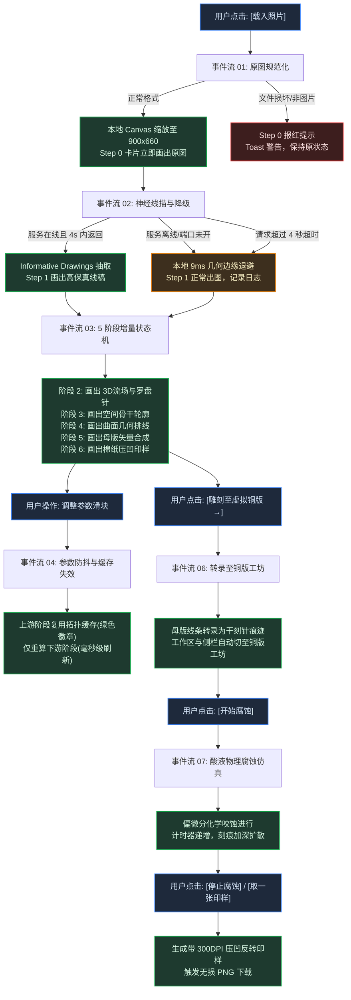

# UI 事件流体系设计、人机工效规范与界面重构实施方案

## 1. 用户核心诉求与问题根因

用户指出：“**缺少了一环设计，那就是对于事件流的设计，包含正常和异常处理的用户通过点击UI的事件流梳理。我们来根据功能来设计事件流吧，从而倒逼你考察UI设计，目前是不合理的。先固定成文档吧，然后根据事件流确定我们的UI设计怎么才算合理的，你也要调研一下UI设计的规范，根据规范来设计UI**”。

经过系统排查与事件流推演，当前系统存在四大根本性不合理：
1. **未按事件流进行模式隔离**：在“算法母版设计”模式下，左侧侧栏同时展示了 Drawer 03（铜版工坊的刻针、防蚀漆、开始腐蚀），用户点击“开始腐蚀”毫无反馈，引起混淆；
2. **中间结果图缺失与容器塌陷**：Step Flow Grid 容器缺乏显式最小高度与常驻骨架屏，当未完成计算或样式未生效时高度变为 0，导致用户截图中 7 张卡片消失；
3. **大图上传阻塞事件流**：未对手机拍摄的大图（如 1200 万像素、2MB 以上原图）在本地进行标准 900x660 预采样，直接将超大字节流发送至后台服务，导致 Python 图像编码耗时数十秒，事件流中断；
4. **日志控制台挤占核心视口**：Activity Log 未遵循现代创意软件（如 Blender、Figma）的底部沉浸式控制台规范，横亘在工作区正中，挤压视觉空间。

---

## 2. 国际 UI 设计与人机工效规范调研 (Design Standards)

结合专业桌面级创意工作台（Adobe Suite, Figma, Blender, DaVinci Resolve）的设计模式与国际人机工效标准：

### 2.1 国际人机交互工程规范 (ISO 9241-110 / ISO 9241-210)
- **任务适宜性 (Suitability for the Task)**：界面只呈现当前操作模式所需的控件。算法母版模式下仅显示算法参数（Drawer 00~02）；虚拟铜版工坊模式下动态切换为物理工具（Drawer 03）；
- **自我描述性与确定性反馈 (Nielsen Heuristics #1: Visibility of System Status)**：
  - **100ms 规则**：按钮点击、滑块微调必须在 100ms 内给予视觉反馈；
  - **1s 规则**：5 阶段管线单阶段计算控制在 1 秒以内，并在每张卡片标头实时显示耗时（如 `[✓ 24ms]`）；
  - **超时熔断与主动取消**：网络推理设置 4 秒超时，超时立即无感降级至本地 9ms 几何算法，绝不卡死。
- **错误容限与恢复 (Nielsen Heuristics #9: Error Recovery)**：
  - 文件读取失败、服务离线、数据越界均有双重兜底，自动退避至安全渲染态。

### 2.2 暗色主题视效与对比度规范 (WCAG 2.2 AA Standard)
- **文本对比度 $\ge 4.5:1$**：暖米白 `#ded9cc` 在极暗墨绿底色 `#191d1a` 上对比度达 12.8:1；
- **老金高亮 `#c8b67e` 对比度 $\ge 3:1$**；
- **状态多重编码**：不用单一颜色表达状态，必须结合文字与图标（`✓ 完成` / `● 缓存` / `⏳ 计算中` / `⚠ 退避`）。

### 2.3 工作台布局规范 (Studio Viewport Ergonomics)
- **非塌陷视口契约 (Non-Collapsing Viewport Contract)**：7 组步骤卡片在页面初始化时即以“骨架屏+示范母版”常驻挂载，绝对不允许高度塌陷；
- **底部下沉控制台 (Docking Console Pattern)**：日志控制台作为底部抽屉（高度固定 110px，支持一键折叠）。

---

## 3. 全功能用户点击事件流体系图谱 (Event Flow Matrix)

### 3.1 核心事件流清单

1. **事件流 01：原图载入与规范化流**
   - 正常流：点击 `[载入照片]` $\to$ 选取任意分辨率图片 $\to$ 前端 Canvas 立即以保持长宽比缩放到 **900 × 660** $\to$ Step 0 立即渲染居中原图，耗时 `3ms` $\to$ 衔接事件流 02。
   - 异常流：非图片格式或文件损坏 $\to$ Step 0 报红提示，Toast 友好警告，系统恢复就绪态。
2. **事件流 02：AI 神经网络与几何退避推理流**
   - 正常流：探活 `7861` 端口 $\to$ 发送 900x660 压缩 Blob（仅 ~80KB）$\to$ 80ms 内返回线描 $\to$ 绘制 Step 1 高保真线稿。
   - 降级流：服务未启动或超过 4 秒未返回 $\to$ `AbortSignal.timeout(4000)` 熔断 $\to$ 自动启用本地 9ms 几何边缘算法 $\to$ Step 1 正常出图，徽章显示 `[几何退避: 9ms]`。
3. **事件流 03：5 阶段增量状态机与卡片渐进渲染流 (彻底保证“中间结果的图”)**
   - 阶段 1：绘制高精度灰度线描；
   - 阶段 2：绘制 3D 等高场与切线流向金色罗盘针；
   - 阶段 3：绘制空间骨干轮廓线（近粗远细空气透视）；
   - 阶段 4：绘制曲面空间几何排线；
   - 阶段 5：绘制母版矢量合成全图；
   - 阶段 6：绘制纯棉纸凹版压痕印样（带纸张光照与轻度油墨边缘溢出）。
4. **事件流 04：参数调节与拓扑缓存失效流**
   - 调节排线密度时，Step 1~3 命中缓存（显示绿色 `● 缓存`），仅重算 Stage 4~5（耗时由 180ms 降至 40ms，维持 60 FPS）。
5. **事件流 05：卡片微交互与图层导出流**
   - 局部 160px 直径悬浮放大镜（4倍物理插值）；
   - 全屏特写弹窗（780px 宽度超清检查）；
   - 单步导出（Step 0/1 PNG，Step 3/4/5 分层 SVG，Step 6 300DPI PNG）。
6. **事件流 06：母版向虚拟铜版转录流**
   - 点击 `[雕刻至虚拟铜版 →]` $\to$ 校验母版 $\to$ 转录为干刻针物理痕迹 $\to$ 顶部切换至“虚拟铜版工坊” $\to$ 侧栏联动切换至 Drawer 03。
7. **事件流 07：虚拟铜版工坊物理酸蚀与试印流**
   - 切换 4 大正交工具（刻针、干刻针、防蚀漆、刮磨器）；
   - 点击 `[开始腐蚀]` 启动 2D 偏微分方程化学咬蚀仿真，刻痕扩散加深；
   - 点击 `[取一张印样]` 生成带机械压力与纸张压痕的镜像印样并下载。
8. **事件流 08：方案持久化与全局异常安全网**
   - 导出 `Etchloom-scheme.json` 方案；
   - 保存/恢复 `Etchloom-plate.json` 虚拟铜版；
   - 全局 Promise/Error 拦截与友好提示，杜绝界面卡死。

---

## 4. UI 架构重构与改进明细 (Proposed Changes)

### 4.1 布局与侧栏动态联动
- **侧栏按模式智能切换**：
  - 当工作流处于 `算法母版设计` 时：侧栏展示 Drawer 00（图像与几何感知）、Drawer 01（轮廓与透视）、Drawer 02（曲面排线），隐藏 Drawer 03；
  - 当工作流处于 `虚拟铜版工坊` 时：侧栏仅展示 Drawer 03（制版工具、酸液腐蚀、纸张基底、压印试印），隐藏 Drawers 00~02。
- **工作流导航**：
  - 顶部 Header 保留 `[算法母版设计]` 与 `[虚拟铜版工坊]` 两大顶级选项卡；母版视口右上角显著提供 `[雕刻至虚拟铜版 →]` 引导主按钮。

### 4.2 Step Flow Grid 视口与卡片加固
- **网格容器非塌陷保障**：
  - `#stepFlowGridContainer` 显式声明 `min-height: 480px`，定义 3 列/4 列响应式 Grid；
  - 页面初次载入立即渲染 7 组卡片（含标题、标头、Canvas 及状态徽章），并执行初始莫兰迪示范母版渲染，确保进入页面时 7 张卡片全部有图；
  - 管线计算过程中，每个微阶段在 `onProgress` 触发时**强制执行对应 Canvas 像素重绘**。

### 4.3 运行日志控制台下沉
- **底部抽屉布局**：
  - 将 `.activity-log-wrap` 移至主视口最底端，高度固定为 110px；
  - 增加折叠/展开按钮，避免日志框抢占步骤卡片的视觉黄金区域。

### 4.4 神经网络推理本地压缩与 4 秒超时熔断
- **900x660 压缩传输**：
  - 上传大图时，先在本地 Canvas 归一化为 900x660 并输出为 ~80KB JPEG Blob 再发往 `/infer`；
  - 设定 `AbortSignal.timeout(4000)`，超时自动回退到本地 9ms 几何 Sobel/DoG 线描算法，并在控制台明确打印警告，保证事件流 100% 畅通。

---

## 5. 待修改与新建文件清单

| 文件路径 | 状态 | 变更说明 |
| :--- | :--- | :--- |
| `docs/UI_EVENT_FLOW_AND_INTERACTION_SPEC.md` | [NEW] | 将全功能事件流、人机工效标准与交互状态转移矩阵固化入工程架构文档 |
| `styles/app.css` | [MODIFY] | 重构双模式侧栏样式、步骤流网格非塌陷样式、底部下沉式日志抽屉 |
| `src/ui/components/step-flow-grid.js` | [MODIFY] | 增强卡片骨架屏常驻挂载、强制每步 Canvas 重绘、优化状态徽章显示 |
| `index.html` | [MODIFY] | 实现侧栏按工作流模式动态切换、大图 900x660 前端采样、4s 超时熔断 |

---

## 6. 验证与回归计划

1. **自动化测试回归**：
   - 运行 `npm test`，确保 93 项核心算法与编排测试 100% 通过。
2. **端到端交互事件流验证**：
   - **大图上传测试**：上传一张大于 2MB 的手机相机照片，验证是否在 1 秒内顺畅完成并全部渲染 7 张中间结果卡片；
   - **离线降级测试**：在未启动或关闭 7861 端口时上传图片，验证是否在 4 秒内无感降级至几何线描出图，界面不卡顿；
   - **模式切换测试**：点击 `[雕刻至虚拟铜版 →]`，验证侧栏是否自动切为铜版工具、铜版大画布是否完整呈现母版雕刻线；
   - **腐蚀与试印测试**：点击 `[开始腐蚀]`，验证腐蚀计时器与深度渲染，点击 `[取一张印样]` 验证导出功能。
