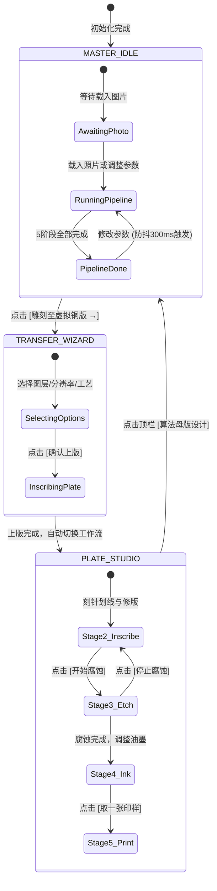

# 用户交互与事件流状态机规范 (EVENT_FLOW_STATE_MACHINE.md)

> **基准实现**：[src/main.js](../../src/main.js), [src/ui/controllers/](../../src/ui/controllers)

---

## 1. 全局工作流状态迁移 (Workflow State Machine)

系统维护两大核心工作区状态：`master`（算法母版设计）与 `plate`（虚拟铜版工坊）。

---

## 2. 步骤流卡片生命周期状态 (StepFlowCard States)

`StepFlowGrid` 中的每个卡片维护自身的状态：

| 状态代码 | 样式类名 | 状态栏描述 | 交互动作权限 |
| :--- | :--- | :--- | :--- |
| `IDLE` | 默认边框 | 等待计算 | 禁用放大镜与特写 |
| `COMPUTING` | `.card-computing` 琥珀色微光 | 正在计算该阶段 | 显示脉冲动画，记录实时耗时 |
| `DONE` | `.card-done` 墨绿边框 | 阶段执行完毕，显示线条数与真实耗时 | 允许点击全屏特写、图层独立导出 |
| `ERROR` | `.card-error` 红色边框 | 算法异常或网络超时 | 提示错误原因并允许重试 |

---

## 3. 模态框与视口事件流 (Viewport Interactions)

### 3.1 步骤流卡片特写 (Lightbox Modal)
1. 用户在卡片视口点击或点击操作按钮 `[⛶ 特写]`；
2. `StepFlowGrid` 触发 `onStepFullscreen(stepIndex, canvas)` 回调；
3. `LightboxController.open(title, canvas, description)` 获取目标高分辨率画布引用，并挂载至模态框视口；
4. 视口内部监听鼠标滚轮事件（缩放范围 100% ~ 500%）与鼠标拖拽平移事件。

### 3.2 图稿上版向导 (Transfer Wizard Modal)
1. 用户点击主工作区顶栏 `[雕刻至虚拟铜版 →]`；
2. `TransferWizardController.open()` 弹出模态框；
3. 用户选择：图层范围（全部 / 仅轮廓 / 仅排线）、网格分辨率（900 / 1500 / 3000）、工艺技法（蚀刻划针 / 干刻直刻）；
4. 用户点击 `[确认上版并转入工坊 →]`；
5. 向导调用 `plateStudio.allocatePlate()` 分配物理网格，遍历选定矢量笔画计算 Bresenham 离散划线并写入 `exposed` 与 `depth` 数组；
6. 自动调用 `switchWorkflow('plate')`，界面平滑过渡至虚拟铜版工坊第 2 阶段（版面刻绘）。
