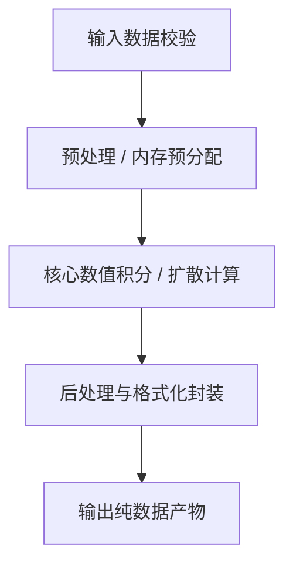

# [模块名称] 详细设计规范文档 (Module Design Specification)

> **文档代号**：`MOD-XXX`  
> **所属层级**：[Layer 0 / 1 / 2 / 3 / 4]  
> **责任模块**：`src/[core|ui|orchestration]/[module-name].js`  
> **状态**：`DRAFT` / `REVIEWING` / `ACCEPTED`  
> **最后修订日期**：YYYY-MM-DD  

---

## 1. 模块定位与职责边界 (Scope & Responsibility)

### 1.1 核心职责
- 说明该模块在系统整体架构中承担的核心职责（不超过 3 点）。

### 1.2 明确非职责与防腐边界 (Non-Goals)
- 明确指出该模块绝对**不做**什么，防止职责膨胀。

---

## 2. 核心数学/物理原理 (Mathematical & Physical Foundations)

- 给出算法公式推导、微积分或偏微分方程、状态演化过程：
  $$\text{公式表达}$$
- 解释关键物理参数的物理学/艺术学意义。

---

## 3. 接口契约与数据结构 (Interfaces & Data Contracts)

### 3.1 输入契约 (Input Schema)
```javascript
/**
 * @typedef {Object} ModuleInput
 * @property {number} paramA - 参数说明
 */
```

### 3.2 输出契约 (Output Schema)
```javascript
/**
 * @typedef {Object} ModuleOutput
 * @property {VectorStroke[]} result - 产出说明
 */
```

### 3.3 核心公开 API 签名
```javascript
/**
 * 函数中文摘要
 * @param {ModuleInput} input
 * @returns {ModuleOutput}
 */
export function executeModule(input) {}
```

---

## 4. 内部工作流程图 (Internal Sequence Flow)



---

## 5. 异常处理与边界测试用例 (Failure Modes & Test Cases)

| 异常输入场景 | 预期处理策略 | 抛出错误类型 / 降级策略 | 对应自动化测试用例 |
| :--- | :--- | :--- | :--- |
| 输入坐标包含 NaN | 按实际实现填写 | 按实际实现填写 | [填写真实测试路径与用例] |
| 数组长度与宽高不匹配 | 按实际实现填写 | 按实际实现填写 | [填写真实测试路径与用例] |
