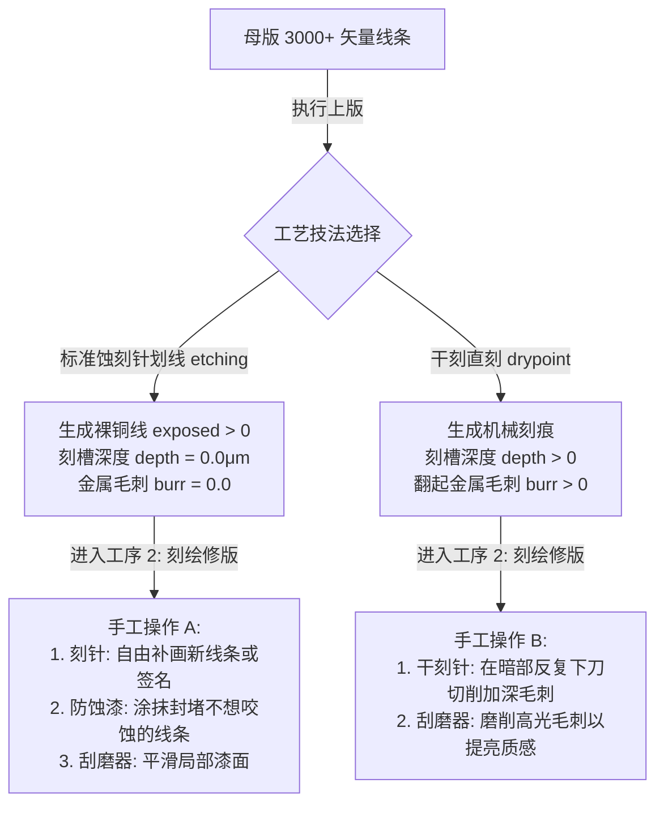

# Etchloom 双阶段渐进披露 UI/UX 详细设计规范说明书 (TWO_STAGE_PROGRESSIVE_UI_SPEC.md)

> **文档适用对象**：Etchloom 核心架构师、前端研发工程师、UI/UX 设计评审人员。  
> **视觉设计基准**：Airy Linen & Pale Sage Atelier Palette (清新工坊浅色体系，参见 [DESIGN_TOKENS.md](./DESIGN_TOKENS.md) 与 [styles/app.css](../../styles/app.css))。  
> **文档遵循标准**：ISO 9241-210 (以人为本的交互设计标准)、WCAG 2.2 (Level AA 焦点顺序与对比度标准)、NN/g 渐进披露模型、Etchloom `DOCUMENTATION_STANDARDS.md`（零虚构、零营销空话、代码与文档双向一致性）。  
> **基准代码实现**：[src/main.js](../../src/main.js), [src/ui/templates/layout-templates.js](../../src/ui/templates/layout-templates.js), [src/ui/controllers/](../../src/ui/controllers), [src/ui/components/step-flow-grid.js](../../src/ui/components/step-flow-grid.js), [src/ui/i18n/i18n.js](../../src/ui/i18n/i18n.js)。

---

## 1. 文档元数据与修订历史 (Metadata & Revision History)

| 版本号 | 修订日期 | 修订人 | 变更摘要 |
| :--- | :--- | :--- | :--- |
| `v1.0.0` | 2026-10-01 | Etchloom Atelier Team | 初始起草：双阶段主流程草图。 |
| `v2.0.0` | 2026-10-01 | Etchloom Atelier Team | 逻辑校准：工序物理边界明晰、四态腐蚀状态机、再次上版覆写确认。 |
| `v2.1.0` | 2026-10-01 | Etchloom Atelier Team | **美学与架构重塑**：① 全面切回既定清新工坊浅色体系（亚麻暖白 `--bg-app: #faf8f5` 与深鼠尾草绿 `--accent-gold: #536957`），彻底废除过时暗金黑底；② 全量界面元素原生绑定 `data-i18n`，实现中/英/越三语无损同构，杜绝硬编码；③ 移除所有装饰性 Emoji 与非生产假按钮，确立克制严谨的专业工坊版画微文案。 |

---

## 2. 视觉设计系统与主题配色 (Visual Design System & Palette)

系统严格采用既定之 **Airy Linen & Pale Sage Atelier Palette**（清新工坊浅色体系），禁止使用暗黑背景或金黄高光，营造纯净典雅的古典版画工作室质感：

```
┌────────────────────────────────────────────────────────────────────────┐
│  --bg-app: #faf8f5 (淡雅亚麻纸白基底)                                  │
│  ┌──────────────────────────────────────────────────────────────────┐  │
│  │  --bg-surface / --bg-card: #ffffff (纯净白表面)                  │  │
│  │  --border-subtle: #eae5dc (羽量细分割线)                         │  │
│  │  --border-strong: #d5cfc4 (聚焦分割线)                           │  │
│  │                                                                  │  │
│  │  主操作按钮: --accent-gold: #536957 (深鼠尾草绿, 白字)            │  │
│  │  次级按钮:   --bg-surface (白底细灰框, 悬停 #ece8e1)             │  │
│  │  铜版边缘:   --copper-glow: #9c755f (柔和陶土温润色)              │  │
│  │  纸张基质:   --paper-ivory: #faf7f0 (典藏象牙白)                 │  │
│  │  主文字:     --text-primary: #2a2b2a (高对比暖炭灰)               │  │
│  │  次文字:     --text-secondary: #5e605d (说明与标签灰)            │  │
│  └──────────────────────────────────────────────────────────────────┘  │
└────────────────────────────────────────────────────────────────────────┘
```

- **视觉符号准则**：全面杜绝任何 Emoji 符号（禁止使用任何表情图标），保持专业排印水准；
- **字体层级**：品牌与主要阶段使用衬线体（Georgia / 宋体 / 思源宋体），操作控件使用无衬线体（PingFang SC / Segoe UI），参数读数与耗时使用等宽字体（JetBrains Mono）。

---

## 3. 核心工序物理边界与离散状态机 (Process Boundaries & State Machines)

### 3.1 “图稿上版”与“亲手刻绘”物理分工
对照 [main.js:228-285](../../src/main.js#L228-L285)，上版动作是将母版矢量线条映射到铜版物理缓冲区的基准灌入过程。两种技法赋予用户不同的动手修版空间：



1. **标准蚀刻针划线 (Etching)**：
   - **上版后物理状态**：母版线条转录为**防酸保护漆上的刻划裸铜线（`exposed > 0`）**，**刻槽深度严格为 0.0 μm**，尚未受到酸液化学侵蚀；
   - **刻绘修版手工职责**：用户执刻针（Needle）增补个性化刻线，或蘸取防蚀漆（Stop-out）涂抹封堵过密线条以减淡灰度，或用刮磨器（Burnisher）平滑边缘；
   - **状态提示**：`漆面已划破 (3,892 条裸铜基准线) · 刻槽深度 0.0 μm · 每一笔手工补线均产生真实咬蚀`。
2. **干刻直刻 (Drypoint)**：
   - **上版后物理状态**：母版线条直接切出基础刻痕并翻起初始金属毛刺（`depth > 0`, `burr > 0`）；
   - **刻绘修版手工职责**：干刻不经酸槽，用户必须使用干刻针（Drypoint）亲手在暗部反复深切以获得浓厚毛刺，或使用刮磨器磨光高光区域。
   - **导航**：选择干刻后，工序 2 的下一步直接进入“填墨与试印”；选择蚀刻针时才进入工序 3 酸液腐蚀。

---

### 3.2 酸液腐蚀离散四态状态机
进入工序 3 时，**绝对禁止自动启动咬蚀模拟**。状态机严格分为四态：

```mermaid
stateDiagram-v2
    [*] --> Standby : 进入工序 3 (铜版悬空于酸槽上方)
    
    state Standby {
        description: 深度保持 0.0μm，按钮显示 [ 放入酸槽，开始腐蚀 ]
    }

    Standby --> Biting : 点击 [开始腐蚀] (浸入酸液)
    
    state Biting {
        description: 2D PDE 偏微分方程推进，动态显示秒数与深度，按钮显示 [ 取出铜版，暂停腐蚀 ]
    }

    Biting --> Paused : 点击 [暂停腐蚀] (取出酸槽，反应停止)
    
    state Paused {
        description: 反应冻结，显示固定深度，提供 [恢复浸酸继续咬深] 与 [冲洗铜版，去试印 →]
    }

    Paused --> Biting : 点击 [恢复浸酸]
    Paused --> ProceedToProof : 点击 [冲洗铜版，去试印 →]
```

- **待开始 (Standby)**：铜版悬置等待。主按钮：`[ 放入酸槽，开始腐蚀 ]`；
- **腐蚀中 (Biting)**：偏微分方程推进，刻槽向深处与侧向咬蚀。主按钮：`[ 取出铜版，暂停腐蚀 ]`；
- **已暂停 (Paused)**：酸液反应冻结。提供分支：`[ 恢复浸酸继续咬深 ]` 或 `[ 冲洗铜版，去试印 → ]`；
- **自主掌控**：完全由用户决定何时下槽浸泡、何时取出检查。

---

### 3.3 状态安全保护机制 (Guarded Retransfer)
1. **随时双向查看（零阻断）**：
   - 切换工作区仅是 DOM 显隐，`VirtualPlateEngine` 内存数据完整保留；
   - 用户在铜版制作过程中点击 `[① 制作母版]` 或 `[← 查看母版]`，系统无条件平滑切换，**绝不弹出任何阻断对话框**。
2. **覆写安全拦截置于“再次执行上版”前**：
   - 真正造成数据清空的是再次执行上版（触发 `engine.clearPlate()`）；
   - 当用户在母版微调后再次进入工序 1 点击 `[ 确认上版并进入刻绘 → ]` 时，若检测到铜版上有手工笔触或深度（`depth.some(v => v > 0) || 用户刻线 > 0`），此时唤起确认模态框：
     - **标题**：`重新上版将覆写当前铜版`
     - **说明**：`当前铜版已包含手工刻绘痕迹或酸液咬蚀深度。再次执行上版将以新母版重写并清空当前版面数据。`
     - **选项**：`[ 取消 (保留当前铜版) ]`、`[ 备份保存当前版并覆盖 ]`（导出 JSON 与快照）、`[ 直接清空覆盖 → ]`。

---

### 3.4 填墨与试印工序合并规范
凹版版画制作中，“填墨 (Inking)”是“试印 (Printing)”不可分割的前置准备步骤。将旧版独立填墨与试印合并为：  
**工序 4 · 填墨与试印 (Inking & Proof Print)**。

- **操作闭环**：进入工序 4，左侧面板集成纸张选择（粗纹棉纸/细纹纸）、油墨饱和度 (`ink`)、滚筒压力 (`pressure`)、版面留墨调子 (`tone`) 与外框样式；
- **实时反馈**：右侧直观呈现纯棉纸压痕印样，调整调墨参数实时重绘预览，提供 `[ 重新调墨压印 ]`；
- **工艺循环回路**：提供快捷跳转按钮 `[ ↩ 刻痕太淡？回工序3继续腐蚀加深 ]`、`[ ↩ 回工序2补充刻线 ]`。

---

## 4. 全量阶段与状态详细线框图 (UI Wireframes & Layout Specs)

### 4.1 阶段 ①：制作母版 (Master Creation)

#### 状态 1-A：初始空态与拖拽区 (Empty Dropzone)
当前实现首次打开停留在此状态，由用户选择照片或主动载入示例；不再自动生成示例母版。文件处理期间显示状态 1-B，生成成功后自动进入状态 1-C。
```
┌────────────────────────────────────────────────────────────────────────────────────────┐
│ Etchloom | 数字古典版画工坊    [ ① 制作母版 ] ─────── [ ② 蚀刻铜版 ]       [导出配置] [关于]  │
├────────────────────────────────────────────────────────────────────────────────────────┤
│                                                                                        │
│                   ┌──────────────────────────────────────────────┐                     │
│                   │                      +                       │                     │
│                   │           载入照片并生成版画母版             │                     │
│                   │   选择静物、建筑或肖像照片，自动分析三维曲率 │                     │
│                   │                                              │                     │
│                   │         [ 选择照片并制作母版 ]               │  <-- 强视觉主焦点   │
│                   │          支持直接拖拽图片到此区域            │                     │
│                   │  ──────────────────────────────────────────  │                     │
│                   │      没有照片？ [ 载入莫兰迪静物示范照片 → ] │                     │
│                   └──────────────────────────────────────────────┘                     │
│                                                                                        │
└────────────────────────────────────────────────────────────────────────────────────────┘
```

#### 状态 1-B：后台运算中 (Pipeline Computing)
```
┌────────────────────────────────────────────────────────────────────────────────────────┐
│                   ┌──────────────────────────────────────────────┐                     │
│                   │                      o                       │                     │
│                   │              正在合成版画母版...             │                     │
│                   │       分析曲面等高流向与透视轮廓 (阶段 3/5)  │                     │
│                   │   [████████████████████░░░░░░░░░░] 68%       │                     │
│                   │   已提取 2,410 条空间轮廓线条    TaskScheduler│                     │
│                   │                                              │                     │
│                   │                    [ 取消任务 ]              │                     │
│                   └──────────────────────────────────────────────┘                     │
└────────────────────────────────────────────────────────────────────────────────────────┘
```

#### 状态 1-C：母版就绪主态 (Master Ready with Hero & Collapsible Drawers)
```
┌────────────────────────────────────────────────────────────────────────────────────────┐
│ 矢量母版已就绪 [3,892 条矢量线条]                    [ 换一张照片 ]  [ 转入铜版制作 → ]   │
├────────────────────────────────────────────────────────────────────────────────────────┤
│                                                                                        │
│                ┌──────────────────────────────────────────────────────┐                │
│                │  ╔════════════════════════════════════════════════╗  │                │
│                │  ║   MOLANDI STILL LIFE · VECTOR MASTER           ║  │                │
│                │  ║                                                ║  │                │
│                │  ║              [ 莫兰迪矢量母版大图 ]            ║  │                │
│                │  ║           高精度曲面排线与古典双层框融合       ║  │                │
│                │  ║                                                ║  │                │
│                │  ║ 1500 × 1100 px (2K)         ETCHLOOM ATELIER   ║  │                │
│                │  ╚════════════════════════════════════════════════╝  │                │
│                │           [ 全屏特写 ]   |   [ 导出母版 SVG ]        │                │
│                └──────────────────────────────────────────────────────┘                │
│                                                                                        │
│ ┌────────────────────────────────────────────────────────────────────────────────────┐ │
│ │ ▸ 制作过程 (7个阶段流向图)                         点击展开查看各阶段产物            │ │
│ ├────────────────────────────────────────────────────────────────────────────────────┤ │
│ │ [00 原图] → [01 线描] → [02 流场] → [03 轮廓] → [04 排线] → [05 母版] → [06 印样]  │ │
│ └────────────────────────────────────────────────────────────────────────────────────┘ │
│                                                                                        │
│ ┌────────────────────────────────────────────────────────────────────────────────────┐ │
│ │ ▼ 常用外观效果 (外框样式 · 排线密度 · 轮廓刀宽)                           [常用 ▾] │ │
│ ├────────────────────────────────────────────────────────────────────────────────────┤ │
│ │ ▼ 高级调光 (曝光度 · 黑场截断 · 白场保留)                                 [展开 ▾] │ │
│ ├────────────────────────────────────────────────────────────────────────────────────┤ │
│ │ ▼ 专家算法参数 (3D深度感知 · 轮廓密度 · 透视强度 · 曲率门控 · 交叉排线)    [展开 ▾] │ │
│ └────────────────────────────────────────────────────────────────────────────────────┘ │
└────────────────────────────────────────────────────────────────────────────────────────┘
```

---

### 4.2 阶段 ②：蚀刻铜版 (Virtual Copper Workshop)

#### 工序 2-A：图稿上版 (Transfer)
```
┌────────────────────────────────────────────────────────────────────────────────────────┐
│ 工序:  [1. 上版] ─── 2. 刻绘 ─── 3. 腐蚀 ─── 4. 试印                     [← 查看母版]    │
├───────────────────────┬────────────────────────────────────────────────────────────────┤
│ 工序 1 · 图稿上版      │                                                                │
│ 将母版线条转录为刻线  │                   ┌────────────────────────┐                   │
│                       │                   │                        │                   │
│ [ 当前母版: 就绪 ]    │                   │     [ 虚拟抛光铜版 ]   │                   │
│ 3,892 矢量线条        │                   │   1500 × 1100 表面就绪 │                   │
│                       │                   │                        │                   │
│ 选择雕刻工艺技法:     │                   │                        │                   │
│ (●) 标准蚀刻划线(推荐)│                   │                        │                   │
│ (○) 干刻直刻(Drypoint)│                   └────────────────────────┘                   │
│                       │                                                                │
│ ▸ 更多上版设置 ▾      │                                                                │
│                       │                                                                │
│ [ 确认上版并进入刻绘 →]│                                                               │
└───────────────────────┴────────────────────────────────────────────────────────────────┘
```

#### 工序 2-B：刻绘修版 (Inscribe)
```
┌────────────────────────────────────────────────────────────────────────────────────────┐
│ 工序:  1. 上版 ✓ ─── [2. 刻绘修版] ─── 3. 腐蚀 ─── 4. 试印             参考导线已显露   │
├───────────────────────┬────────────────────────────────────────────────────────────────┤
│ 工序 2 · 刻绘修版      │   漆面已划破 (3,892 条裸铜基准线) · 刻深 0.0 μm · 可手工补线修抹│
│ 沿参考线刻划或修抹    │                                                                │
│                       │                   ┌────────────────────────┐                   │
│ 常用修绘工具:         │                   │      ░░░░░░░░░░        │                   │
│ [ 蚀刻针 (划线破漆) ] │                   │    ░░  裸铜金线痕迹 ░░  │                   │
│ [ 刮磨器 (压平修光) ] │                   │      ░░░░░░░░░░        │                   │
│                       │                   │ (针尖划开漆面·裸露金铜)│                   │
│ 工具直径: [==●=====] 4px│                  │                        │                   │
│                       │                   │                        │                   │
│ [ 撤销刻线 ] [ 清空 ] │                   └────────────────────────┘                   │
│                       │                                                                │
│ ▸ 进阶工具与模式 ▾    │                                                                │
│                       │                                                                │
│ [完成刻绘，去浸酸腐蚀→]│                                                               │
└───────────────────────┴────────────────────────────────────────────────────────────────┘
```

#### 工序 2-C：酸液腐蚀 (Acid Bite / Standby State)
```
┌────────────────────────────────────────────────────────────────────────────────────────┐
│ 工序:  1. 上版 ✓ ─── 2. 刻绘 ✓ ─── [3. 酸液腐蚀] ─── 4. 试印     状态: 待开始浸酸       │
├───────────────────────┬────────────────────────────────────────────────────────────────┤
│ 工序 3 · 酸液腐蚀      │                                                                │
│ 酸液沿刻痕向下向侧咬蚀│                   ┌────────────────────────┐                   │
│                       │                   │                        │                   │
│ ┌───────────────────┐ │                   │      ░░░░░░░░░░        │                   │
│ │ 累计时间:   0.0 秒│ │                   │    ░░  铜版悬空等待 ░░  │                   │
│ │ 平均深度:  0.0 μm │ │                   │      ░░░░░░░░░░        │                   │
│ │ [░░░░░░░░░░░░]  0%│ │                   │ (等待放入酸槽)         │                   │
│ └───────────────────┘ │                   │                        │                   │
│                       │                   └────────────────────────┘                   │
│ [ 放入酸槽，开始腐蚀 ]│                                                                │
│                       │                                                                │
│ ▸ 酸液微调 ▾          │                                                                │
│                       │                                                                │
│ [ 冲洗铜版，去试印 → ]│                                                                │
└───────────────────────┴────────────────────────────────────────────────────────────────┘
```

#### 工序 2-D：填墨与试印 (Inking & Proof Print)
```
┌────────────────────────────────────────────────────────────────────────────────────────┐
│ 工序:  1. 上版 ✓ ─── 2. 刻绘 ✓ ─── 3. 腐蚀 ✓ ─── [4. 试印]            纯棉纸压印完成   │
├───────────────────────┬────────────────────────────────────────────────────────────────┤
│ 工序 4 · 填墨与试印    │                                                                │
│ 纯棉纸经滚筒高压压印  │               ┌────────────────────────────────┐               │
│                       │               │ ╔════════════════════════════╗ │  Plate-mark   │
│ 纸张材质:             │               │ ║  1/50 E.A.  ATELIER INTAGLIO║ │ (四周压印凹痕)│
│ [ 暖白 · 粗纹棉纸 ▾ ] │               │ ║                            ║ │               │
│                       │               │ ║         纯棉纸凹版正向印迹 ║ │               │
│ [ 下载纯棉印样 (PNG) ]│               │ ║       (饱满黑墨与留墨调子) ║ │               │
│                       │               │ ║                            ║ │               │
│ [ ↩ 回工序3继续腐蚀加深]│             │ ╚════════════════════════════╝ │               │
│ [ ↩ 回工序2补充刻线 ] │               │  Etchloom Studio 2026          │               │
│ [ 重新调墨压印 ]      │               └────────────────────────────────┘               │
│                       │                                                                │
│ ▸ 调墨与高级印刷参数 ▾│                                                                │
└───────────────────────┴────────────────────────────────────────────────────────────────┘
```

---

## 5. 7 阶段流水线中间图呈现与可访问性规范 (7-Stage Pipeline Specification)

### 5.1 7 阶段全景数据类型与导出矩阵
| 阶段编号 | 阶段名称 | 内部核心数据结构 | 屏幕渲染预览 | 支持导出格式 |
| :--- | :--- | :--- | :--- | :--- |
| **Step 00** | 原图输入 (Raw Input) | RGB 栅格位图 (`HTMLImageElement` / `ImageData`) | Canvas 2D 像素位图渲染 | PNG (原始像素) |
| **Step 01** | 线描感知 (Neural Lines) | 2D Float32 亮度连续梯度张量 | 灰度梯度 Canvas 渲染 | PNG (连续灰度场) |
| **Step 02** | 等高流场 (3D Flow Field)| 2D 结构张量角度场 (`Float32Array[W*H]`) | HSV/RGB 彩色向量场 Canvas 渲染 | PNG (彩色流场图) |
| **Step 03** | 透视轮廓 (Contours) | 矢量多折线对象集 (`Array<{ points, width, role }>`) | 骨架矢量线渲染 | **SVG (无损矢量)** / PNG |
| **Step 04** | 曲面排线 (Hatching) | 顺形流线曲线集 (`Array<{ points, width, role }>`) | 密集顺形矢量曲线渲染 | **SVG (无损矢量)** / PNG |
| **Step 05** | 母版合成 (Master Vector)| 复合矢量拓扑 (`contours + hatching + frame`) | 完整黑白版画图稿渲染 | **SVG (生产级矢量母版)** / PNG |
| **Step 06** | 上版母稿 (Transfer Master) | 母版矢量线条与外框参数 | 冷白底、蓝黑线条、定位标记 | SVG / PNG |

### 5.2 胶片视口自适应与 WCAG 2.2 焦点规范
制作过程默认折叠，避免首次生成后用七张阶段卡片占据主操作区域；用户展开后可检查或导出单个阶段。
各卡片底部说明由翻译键和真实尺寸、路径数量组成；语言切换后，已完成卡片的说明也立即重新翻译。
1. **比例联动**：胶片卡片宽度由视口决定，限制在 `160px` 至 `260px`；高度遵循源图宽高比（`aspect-ratio: var(--source-aspect-ratio, 900 / 660)`）。母版主画布与铜版画布使用 `max-width`、`max-height` 和 `object-fit: contain` 在窗口内等比缩放；
2. **WCAG 2.2 焦点顺序**：卡片上 `[特写]` 与 `[导出]` 原生 `<button>` 声明 `tabindex="0"` 与 `aria-label`；键盘 Tab 聚焦时，操作层自动保持可见并附带深鼠尾草绿外边框（`outline: 2px solid var(--accent-sage)`）。

### 5.3 语言与窄屏布局
顶栏提供中文、English、Tiếng Việt 三个明确的语言选项卡。每个选项卡设置 `aria-selected` 和键盘焦点顺序；左右方向键、Home、End 可切换。语言容器保留稳定宽度，工作阶段和顶栏操作采用独立布局区域。窄屏时顶栏与铜版工序栏换行，入口卡片随视口缩放；文案使用三语等义的短句，不通过重复说明填充界面。

### 5.4 计算反馈、外框与滚动
选中照片后，制作中卡片显示原图缩略预览和不确定进度条；进度条仅表示任务进行中，不显示未经测量的完成百分比。参数重绘时，已完成的母版仍可见，结果页另显示重绘状态与不确定进度条，最新一次任务结束后关闭。外框选项直接重绘第 06 阶段母稿并同步主预览。结果页滚动容器占满视口宽度，内容保持居中且最大宽度为 `1400px`，使纵向滚动条靠窗口右缘。

输入图片在处理前等比缩至最多 1200 万像素、单边最多 4096 像素；第 06 阶段保持可上版的平面线稿，纸张材质、着墨与压痕只在铜版试印中出现。试印纸张切换立即重绘；粗纹纸偏暖且纹理和着墨变化更强，细纹纸偏浅且表面更平整。铜版画布周围使用暖色工作台背景。

酸液仿真的累计时间仍使用真实经过秒数；侧向扩散、刻深增长与毛刺消退统一使用 `0.4` 倍反应步长，达到同一刻深约需原来的 2.5 倍时间。该速度是交互模拟参数，不代表真实铜版腐蚀速率。

---

## 6. 全量 25 项参数矩阵与三语国际化字典 (25-Parameter & Trilingual Matrix)

全量 25 项交互参数严格对应代码库，从结构层原生实现 `data-i18n` 属性绑定，绝不硬编码：

| 序号 | 参数代码 ID | 控件类型 | 默认值 | 取值范围 | 中文 (`zh-CN`) | 英文 (`en-US`) | 越南语 (`vi-VN`) | 呈现层级 |
| :---: | :--- | :--- | :--- | :--- | :--- | :--- | :--- | :--- |
| **1** | `frameStyle` | Select | `double` | double/fine/rough/none | 版画外框 | Frame Style | Khung viền bản in | **常用外观效果 (直接可见)** |
| **2** | `density` | Range | 80% | 0 ~ 100% | 排线密度 | Hatch Density | Mật độ nét đan | **常用外观效果 (直接可见)** |
| **3** | `needleWidth` | Range | 8 (0.8mm) | 1 ~ 30 (0.1 ~ 3.0mm) | 轮廓刀宽 | Needle Width | Độ dày dao khắc | **常用外观效果 (直接可见)** |
| **4** | `exposure` | Range | 50% | 0 ~ 100% | 曝光度 | Exposure | Độ phơi sáng | **高级调光抽屉 ▾** |
| **5** | `blackPoint` | Range | 0% | 0 ~ 50% | 黑场截断 | Black Point | Điểm đen | **高级调光抽屉 ▾** |
| **6** | `whitePoint` | Range | 100% | 50 ~ 100% | 白场保留 | White Point | Điểm trắng | **高级调光抽屉 ▾** |
| **7** | `lotus3D` | Checkbox | `true` | true / false | 开启 3D 几何流场感知 | 3D Geometry Flow (Lotus) | Tăng cường hình học 3D | **专家算法参数 ▾** |
| **8** | `contourDetail` | Range | 75% | 0 ~ 100% | 轮廓密度 | Contour Density | Mật độ đường bao | **专家算法参数 ▾** |
| **9** | `aerialStrength`| Range | 60% | 0 ~ 100% | 透视强度 | Aerial Perspective | Phối cảnh không khí | **专家算法参数 ▾** |
| **10**| `curvatureGate` | Range | 70% | 0 ~ 100% | 曲率门控 | Curvature Gate | Ngưỡng lọc độ cong | **专家算法参数 ▾** |
| **11**| `crossHatch` | Range | 65% | 0 ~ 100% | 交叉排线 | Cross Hatching | Nét đan chéo | **专家算法参数 ▾** |
| **12**| `transferTechnique` | Radio | `etching` | etching / drypoint | 雕刻工艺技法 | Engraving Technique | Kỹ thuật khắc chuyển bản | **表面主选单选卡** |
| **13**| `transferRes` | Radio | 1500 | 900 / 1500 / 3000 | 物理规格 | Plate Resolution | Quy cách độ phân giải | 更多上版设置 ▾ |
| **14**| `transferLayer` | Radio | `all` | all / contours / hatching | 转录图层 | Transfer Layers | Lớp vector chuyển bản | 更多上版设置 ▾ |
| **14a**| `transferLineWidth` / `wizardLineWidth` | Range | 100% | 50% ~ 200% | 上版线宽 | Transfer Line Width | Độ rộng nét chuyển bản | 上版面板及细节弹窗同步 |
| **15**| `wizardNeedlePressure` | Range | 65% | 10 ~ 100% | 针尖下压力 | Needle Pressure | Áp lực mũi kim | 更多上版设置 ▾ |
| **16**| `tool` | ToolBtn | `needle` | needle/dry/stop/polish | 修绘工具 | Retouching Tools | Công cụ khắc sửa | 蚀刻针/刮磨器外层，进阶折叠 |
| **17**| `size` | Range | 4 px | 1 ~ 50 px | 工具直径 | Tool Diameter | Đường kính mũi khắc | **表面常驻滑块** |

蚀刻页顶部仅显示当前铜版精度；修改精度必须通过上版细节中的转录流程完成，以免重新分配版面数组时丢失刻线。上版线宽按母版栅格化笔画的百分比缩放；刻绘阶段的 `size` 独立控制用户手工工具直径。

“关于”使用独立对话框，章节依次为产品用途、制作母版、蚀刻铜版、操作提示、保存与导出、许可。内容只描述用户可操作的现有功能；中文、英文、越南文共用相同结构和翻译键。窄屏将两个阶段卡片改为单列，正文区域可滚动。关闭按钮、遮罩点击和 Esc 均可退出，并将焦点返回“关于”按钮。
“项目与反馈”章节位于两步流程卡片之后，显示 GitHub 仓库地址，并分别链接到仓库和 Issues；文案邀请用户查看代码、下载说明并提交问题或建议，不预设仓库已有 Release 包。
| **18**| `irreversible` | Checkbox | `false` | true / false | 不可逆工坊模式 | Irreversible Mode | Chế độ bất khả nghịch | 进阶工具与模式 ▾ |
| **19**| `acid` | Range | 45% | 1 ~ 100% | 酸液浓度 | Acid Strength | Nồng độ axit | 酸液微调 ▾ |
| **20**| `grain` | Range | 45% | 0 ~ 100% | 金相颗粒噪点 | Grain Roughness | Hạt sần kim loại | 酸液微调 ▾ |
| **21**| `paper` | Select | `rough` | rough / smooth / linen / rosaspina | 纸张材质 | Paper Type | Chất liệu giấy | **表面常驻下拉框** |

试印纸张新增两种真实凹版纸参考：`linen` 依据 [ARCHES Moulin du Gué](https://arches-papers.com/arches-range-of-papers/art-publishing/moulin-du-gue/) 的棉与亚麻配比及自然粗纹；`rosaspina` 依据 [Fabriano Rosaspina](https://fabriano.com/en/product/rosaspina/) 的 60% 棉和自然纸纹。屏幕渲染仅以底色、纹理和着墨变化区分纸张，属于视觉近似，不代表实体纸的精确物理仿真。
| **22**| `ink` | Range | 90% | 0 ~ 150% | 油墨饱满度 | Ink Richness | Độ no mực | 调墨与高级印刷参数 ▾ |
| **23**| `pressure` | Range | 65% | 0 ~ 100% | 滚筒压印压力 | Press Pressure | Áp lực con lăn | 调墨与高级印刷参数 ▾ |
| **24**| `tone` | Range | 4% | 0 ~ 35% | 留墨调子 | Plate Tone | Màng mực nền bản | 调墨与高级印刷参数 ▾ |
| **25**| `plateFrameStyle` | Select | `double` | double/fine/rough/none | 印样外框 | Print Frame Style | Khung viền mẫu in | 调墨与高级印刷参数 ▾ |

---

## 7. 核心操作动作微文案对照 (Trilingual Action Microcopy)

| 词条 Key | 中文 (`zh-CN`) | 英文 (`en-US`) | 越南语 (`vi-VN`) |
| :--- | :--- | :--- | :--- |
| `nav.step1` | 制作母版 | Create Master | Tạo Bản Mẫu |
| `nav.step2` | 蚀刻铜版 | Etch Plate | Khắc Bản Đồng |
| `cta.selectPhoto` | 选择照片并制作母版 | Select Photo & Create Master | Chọn Ảnh & Tạo Bản Mẫu |
| `cta.transferToPlate` | 转入铜版制作 → | Transfer to Copperplate → | Chuyển Sang Bản Đồng → |
| `cta.confirmTransfer` | 确认上版并进入刻绘 → | Confirm Transfer & Inscribe → | Xác Nhận Chuyển Bản & Khắc → |
| `cta.startEtchNav` | 完成刻绘，去浸酸腐蚀 → | Finish Inscription, Proceed to Etch → | Hoàn Thành Khắc, Đi Ăn Mòn → |
| `cta.startEtch` | 放入酸槽，开始腐蚀 | Submerge Plate & Start Etch | Nhúng Bản Vào Axit, Bắt Đầu Ăn Mòn |
| `cta.pauseEtch` | 取出铜版，暂停腐蚀 | Lift Plate & Pause Etch | Nhấc Bản Lên, Tạm Dừng |
| `cta.resumeEtch` | 恢复浸酸继续咬深 | Resume Acid Bite | Tiếp Tục Ăn Mòn |
| `cta.toProofPrint` | 冲洗铜版，去试印 → | Rinse Plate & Proof Print → | Rửa Bản Đồng & In Thử → |
| `cta.reprint` | 重新调墨压印 | Re-ink & Press Print | Thoa Mực & In Lại |
| `dialog.retransferTitle`| 重新上版将覆写当前铜版 | Re-transfer Will Overwrite Current Plate | Chuyển Lại Sẽ Ghi Đè Bản Khắc Hiện Tại |
| `dialog.retransferDesc` | 当前铜版已包含手工刻绘痕迹或酸液咬蚀深度。再次执行上版将以新母版重写并清空当前版面数据。 | The active plate contains manual inscription or acid bite depth. Re-transferring will clear the plate and apply the new master. | Bản đồng hiện tại có nét khắc thủ công hoặc độ sâu ăn mòn axit. Chuyển lại sẽ xóa toàn bộ để áp dụng mẫu mới. |
| `dialog.saveAndOverwrite`| 备份保存当前版并覆盖 | Save Backup & Overwrite | Lưu Bản Sao & Ghi Đè |
| `dialog.directOverwrite`| 直接清空覆盖 (不备份) → | Overwrite Directly → | Ghi Đè Trực Tiếp → |

---

## 8. 技术实现契约与集成测试 (Technical Contracts & Test Matrix)

为确保新方案平滑无损交付，实施阶段必须恪守以下技术契约：
1. **DOM ID 与控制器解耦**：
   - 保证全量 25 项参数 DOM ID 与 [layout-templates.js](../../src/ui/templates/layout-templates.js) 保持稳定；
   - 现有的 125 项自动化测试套件必须持续保持 100% 绿色通过。
2. **当前测试套件**：
   - `tests/two-stage-ui.test.cjs`：覆盖初始选择入口、模板翻译键、四步状态及再次上版保护。
   - `tests/app-entry-mount.test.cjs`：验证应用入口装配。
   - 页面显隐、画布尺寸和工序按钮的最终呈现仍需在浏览器中逐步检查，不能仅凭 DOM 属性测试判断可见性。

---

*文档结束 (End of Two-Stage Progressive UI Spec v2.1)*
