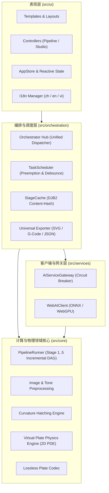
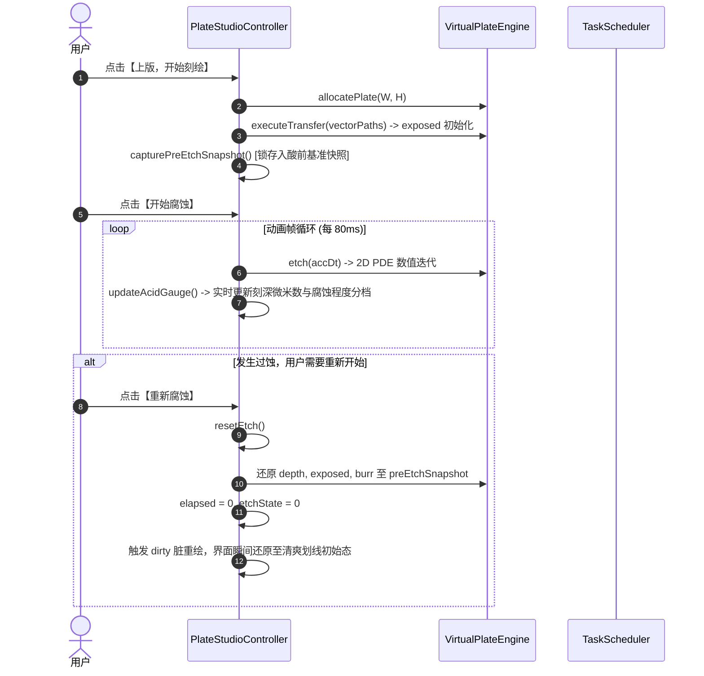

# 系统架构总览与模块依赖拓扑 (ARCHITECTURE)

> **文档标识**：DES-ARCH-TOP-001  
> **上级依据**：[docs/requirements/REQUIREMENTS.md](../requirements/REQUIREMENTS.md)  
> **权威范围**：全系统一级模块边界、依赖拓扑与通信规范  

---

## 1. 系统边界与顶层架构

Etchloom 采用严格的分层单向依赖架构。系统严禁跨层反向依赖，计算核心与物理仿真层保持纯函数式与零 DOM 依赖。

---

## 2. 一级模块职责与边界定义

| 模块名称 | 物理路径 | 核心职责 | 依赖约束 |
| :--- | :--- | :--- | :--- |
| **`src/core`** | 领域计算核心 | 提供图像色调解构、微分曲率排线场计算、虚拟铜版离散化及偏微分物理酸咬仿真。 | **严格零 DOM 依赖**，严禁引入 `document`、`window` 或 UI 样式。 |
| **`src/orchestration`**| 调度与生命周期 | 维护 5 阶段管线 DAG 拓扑、任务防抖与抢占调度、增量阶段缓存及跨端数据导出。 | 依赖 `src/core` 与 `src/services`；不直接操作 DOM 节点。 |
| **`src/services`** | 服务与硬件网关 | 管理 WebGPU 加速、ONNX Runtime Web 本地推理、离线权重加载及三态熔断降级。 | 纯业务无头逻辑，向 `src/orchestration` 暴露强类型 Promise 契约。 |
| **`src/ui`** | 交互与工坊视图 | 实现两阶段渐进式工作流（母版制作 $\leftrightarrow$ 铜版工坊）、Canvas 压印渲染及三语国际化。 | 顶层调用方，通过控制器触发调度中枢，响应式消费数据。 |

---

## 3. 跨模块协作时序

### 业务场景：母版上版并进行酸液咬蚀与重置

---

## 4. 下级模块文档导航

* 领域计算核心：[src/core/docs/ARCHITECTURE.md](../../src/core/docs/ARCHITECTURE.md)
* 虚拟铜版引擎：[src/core/plate/docs/ARCHITECTURE.md](../../src/core/plate/docs/ARCHITECTURE.md)
* 神经排线引擎：[src/core/hatching/docs/ARCHITECTURE.md](../../src/core/hatching/docs/ARCHITECTURE.md)
* 调度与编排层：[src/orchestration/docs/ARCHITECTURE.md](../../src/orchestration/docs/ARCHITECTURE.md)
* 客户端网关层：[src/services/docs/ARCHITECTURE.md](../../src/services/docs/ARCHITECTURE.md)
* 前端界面总装：[src/ui/docs/ARCHITECTURE.md](../../src/ui/docs/ARCHITECTURE.md)
