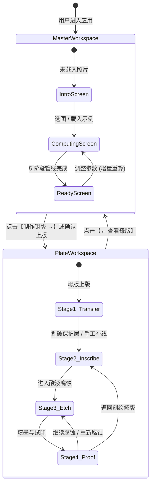
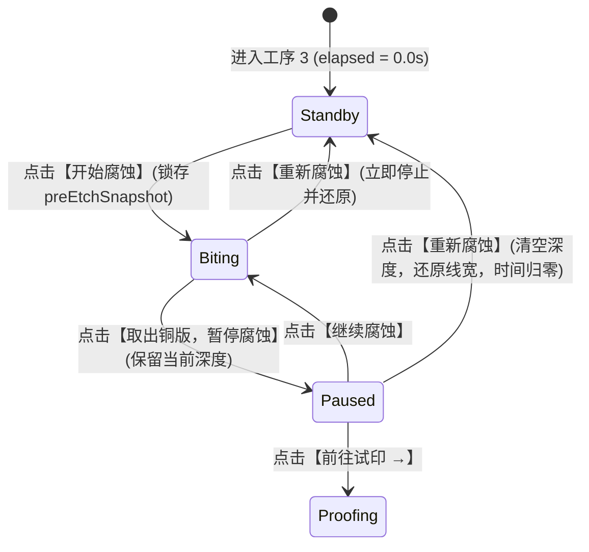

# 端到端业务工作流与跨模块状态机 (WORKFLOW)

> **文档标识**：DES-WF-STATE-001  
> **上级依据**：[docs/requirements/REQUIREMENTS.md](../requirements/REQUIREMENTS.md)  
> **设计边界**：描述系统级端到端业务流程与状态迁移；模块内部局部事件流留在模块内部。  

---

## 1. 系统两阶段顶层工作流 (Two-Stage Atelier Flow)

系统在顶层划分为两大独立又紧密串联的工坊空间：

---

## 2. 铜版酸液物理腐蚀 4 态状态机

在「工序 3 · 控制腐蚀」中，铜版与酸液模拟严格遵循离散状态机转换：

* **状态转移守恒约束**：
  * **未咬蚀状态（Standby）**：【重新腐蚀】与【前往试印】保持禁用（disabled）；
  * **腐蚀中（Biting）**：启动物理帧循环，每 80ms 迭代解算一次反应增量；
  * **已暂停（Paused）**：刻深固定，此时允许进入试印；
  * **重置操作（resetEtch）**：无条件安全退回到 Standby，且不会破坏工序 1 与工序 2 的划线图样；
  * **撤销栈对称性（Undo Synchronization）**：历史快照栈完整捕获 `etchState` 与全量 TypedArray 深克隆（`.slice()`），撤销时自动回退时钟状态机并同步 UI 仪表盘。

---

## 3. 并发交互与抢占容错机制

1. **滑块高频拖拽抢占**：
   当用户在 200ms 内连续调整滑块参数时，调度器通过 `TaskScheduler` 进行 60ms 防抖，并发起的旧管线任务通过 `AbortController` 立即收到中断信号，由 Worker 释放资源，只响应最新的用户意图。
2. **再次上版防覆写安全拦截 (Guarded Retransfer)**：
   若用户在工序 2 或工序 3 已产生任何人工创作与物理修改——包括刻针划线（`exposed > 0`）、干刻毛刺（`burr > 0`）、酸咬深度（`depth > 0`）以及**防腐清漆保护层（`blocked > 0`）**——再次返回尝试上版覆盖时，系统强制弹出安全拦截模态对话框，提供“备份当前版面并覆盖”或“取消并保留当前铜版”，严禁发生静默抹除。
3. **铜版分辨率重设与时钟归零**：
   当用户在工坊切换分辨率重置铜版（`allocatePlate()`）时，物理仿真状态机同步强制归零（`running = false; elapsed = 0; etchState = 0; etchAcc = 0;`），清空所有内部累加器，避免残余时间污染新版或导致假阳性拦截。

