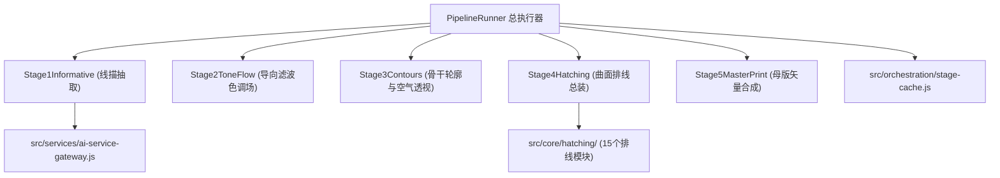
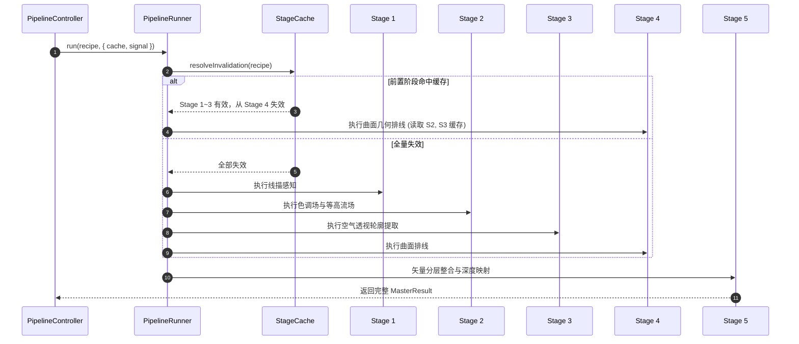

# 5 阶段算法管线内部架构与状态时序规范 (ARCHITECTURE.md)

> **模块定位**：`src/core/`  
> **上级体系规范**：[docs/00_architecture/ARCHITECTURE_OVERVIEW.md](../../../docs/00_architecture/ARCHITECTURE_OVERVIEW.md)

---

## 1. 架构拓扑与组件关系

---

## 2. 执行时序与增量复用时序图

