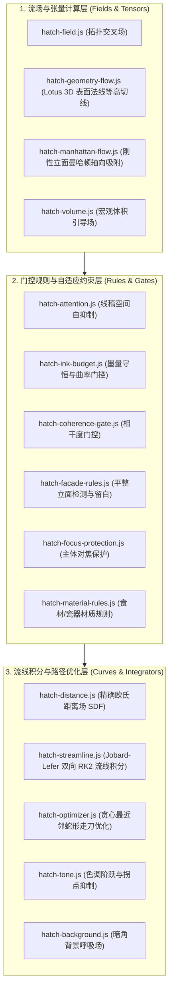

# 排线与流场子系统内部架构设计规范 (ARCHITECTURE.md)

> **模块定位**：`src/core/hatching/`  
> **上级体系规范**：[docs/design/ARCHITECTURE.md](../../../../docs/design/ARCHITECTURE.md)

---

## 1. 15 个细分排线模块三层拓扑分工

---

## 2. 数据处理管道流动

1. **输入阶段**：接收 `ToneField`（色调场）、`LineMap`（线描图）与 `NormalMap`（Lotus 表面法线）；
2. **第一阶段 (流场生成)**：`HatchGeometryFlow` 或 `HatchField` 输出切线场 $\vec{v}(x, y)$；
3. **第二阶段 (门控过滤)**：`HatchAttention` 注入自抑制势场，`HatchInkBudget` 计算可用墨量配额；
4. **第三阶段 (积分与优化)**：`HatchStreamline` 发射种子点追踪流线，`HatchOptimizer` 串联路径并输出矢量笔画集合。
