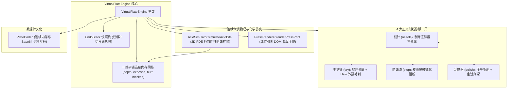
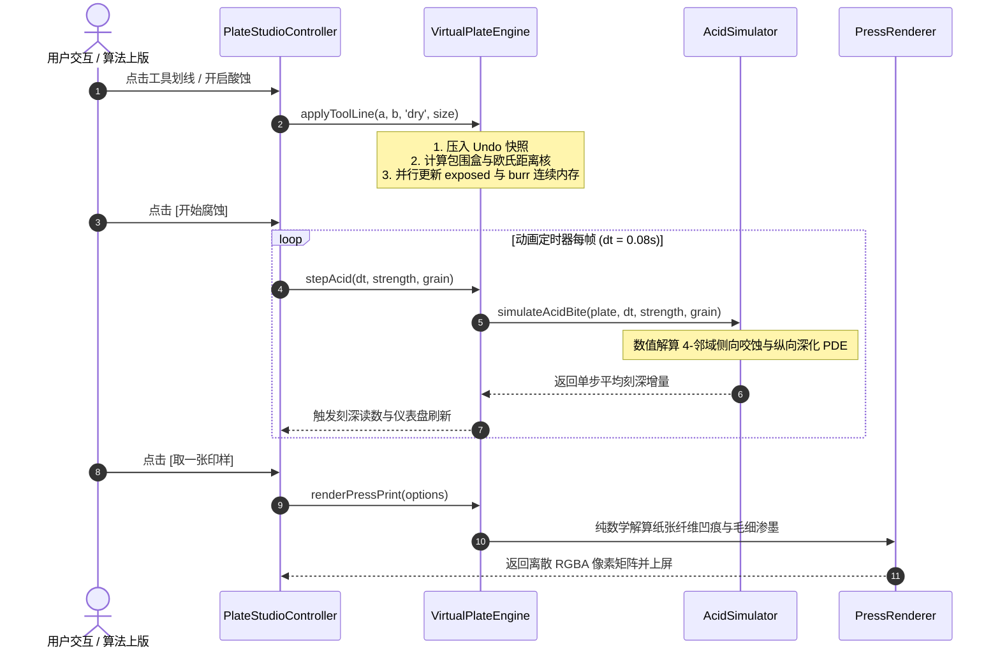

# 虚拟铜版仿真引擎内部架构与数据流设计 (ARCHITECTURE.md)

> **模块定位**：`src/core/plate/`  
> **上级体系规范**：[docs/00_architecture/ARCHITECTURE_OVERVIEW.md](../../../../docs/00_architecture/ARCHITECTURE_OVERVIEW.md)

---

## 1. 模块定位与依赖倒置原则

虚拟铜版物理引擎是系统的底层物理模型核心：
- **向上暴露纯数据操作接口**：接收工具坐标、压力、时间步长 $\Delta t$；
- **向下严格杜绝浏览器 DOM 依赖**：全流程操作平铺一维 `Float32Array` 与 `Uint8Array`，可在无头 Node.js 与 Web Worker 中独立运行；
- **零逆向依赖**：严禁引用任何 UI 控制器或展示层对象。

---

## 2. 内部组件调用拓扑图 (Internal Component Topology)

---

## 3. 数据流向与执行时序图 (Execution Sequence Diagram)

---

## 4. 连续内存生命周期与垃圾回收优化

1. **零 GC 垃圾回收停顿保证**：
   - 在 `allocatePlate(w, h)` 时一次性分配全部连续数组，严禁在 `applyToolDab` 或 `stepAcid` 循环内创建任何临时对象或数组；
   - `AcidSimulator` 采用预分配的双缓冲 `nextExposedField`，通过指针与 `set()` 批量拷贝，保证在 60fps 高频交互下内存曲线完全水平。
2. **快照内存控制**：
   - 撤销栈深度严格限制为 10 步，采用环形队列丢弃最旧快照，防止内存无节制增长。
