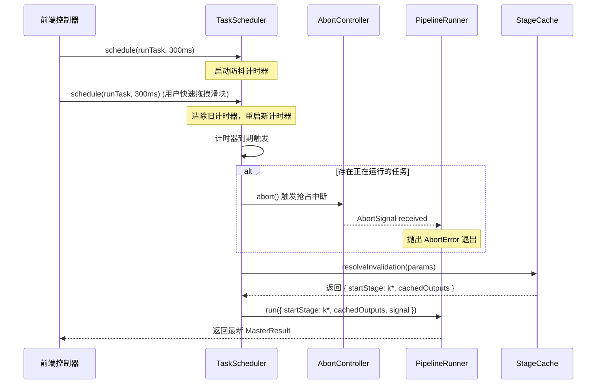

# 调度编排与 DAG 增量缓存数学原理与实现规范 (ALGORITHM_SPEC.md)

> **模块定位**：`src/orchestration/`（调度中枢、增量状态缓存与抢占式任务调度）  
> **核心验收标准**：**“完全映射出原理，完全能够做到依据文档也能独立复现出生产代码”**。

---

## 1. 物理背景与算法动机 (Physical & Algorithmic Motivation)

交互式数字古典版画生成管线具备极高计算密度：
1. **阶段 1 (DoG 边缘卷积)**：$900 \times 660 \sim 3000 \times 2200$ 分辨率下的双高斯滤波差分；
2. **阶段 2 (导向滤波与各向异性扩散)**：何恺明导向滤波多尺度协方差矩阵卷积与局部切线张量场解算；
3. **阶段 4 (Jobard-Lefer 流线积分)**：空间散列网格 $O(1)$ 碰撞检测与数万条双向 RK2 阶数值积分。

在 2K/3K 画幅下，单次全量执行耗时可达数秒。而在图形创作交互中，用户通常需要频繁调整局部控制参数（如调整排线疏密 `density`、阻尼系数或风格预设）。若每次用户变动参数均从阶段 1 重新计算全流程，将导致主线程频繁假死与严重的计算资源浪费。

为实现 60FPS 级别的响应流畅度，本模块设计了两大核心算法：
- **基于 32-bit DJB2 哈希的 DAG 增量失效判定算法**：精准识别参数变动的上游阶段，仅重新执行受直接影响的阶段及其后继阶段，上游前置产物毫秒级原地复用；
- **基于 AbortController 的抢占式微任务防抖调度算法**：在用户连续拖拽滑块时，自动防抖（300ms）并物理打断正在执行的陈旧后台微任务，杜绝无效并发争抢。

---

## 2. 数学符号与输入前置条件 (Preconditions & Mathematical Symbols)

| 符号 | 维度 / 类型 | 物理 / 逻辑含义 | 取值范围 / 约束 |
| :--- | :--- | :--- | :--- |
| $\mathcal{S}$ | 顺序元组 $(S_1, S_2, S_3, S_4, S_5)$ | 5 阶段有向无环管线序列 | 顺序强依赖 |
| $P_k$ | 键值映射字典 $\text{Map}\langle \text{string}, \text{any}\rangle$ | 第 $k$ 阶段相关的全部控制参数 | 纯 JSON 兼容对象 |
| $H_k$ | 32-bit 有符号整数 ($\mathbb{Z}_{32}$) | 第 $k$ 阶段参数序列化后的 DJB2 哈希值 | $[-2^{31}, 2^{31}-1]$ |
| $\mathcal{C}$ | 状态字典 $\text{Map}\langle \text{stageId}, \text{CacheEntry}\rangle$ | 运行时中间产物缓存池 | 包含阶段输出与对应哈希 |
| $\Delta t_{\text{debounce}}$ | 标量 (毫秒) | 防抖延迟时间窗口 | 常量 300ms |
| $\mathcal{A}$ | 实例对象 (`AbortController`) | 正在运行任务的抢占信号源 | 每次任务分配独立实例 |

---

## 3. 连续空间数学物理方程推导 (Continuous Mathematical Formulation)

### 3.1 32-bit DJB2 确定性状态哈希方程

对于任意参数字典 $P_k$，将其格式化为确定性规范字符串 $str = \text{stageId} + \text{":"} + \text{CanonicalJSON}(P_k)$，字符串长度为 $L$。哈希递推方程定义如下：

$$h_0 = 5381$$

$$h_{i+1} = \left( (h_i \cdot 33) + \text{ord}(str[i]) \right) \pmod{2^{32}}, \quad \forall i \in [0, L-1]$$

利用位移运算可高效等价实现为：

$$h_{i+1} = \left( (h_i \ll 5) + h_i + \text{ord}(str[i]) \right) \mid 0$$

其中 $\mid 0$ 强制执行 32 位有符号整数溢出截断。最终返回 base-36 编码字符串：

$$\text{hashStr} = \text{Base36}(h_L)$$

**雪崩效应证明**：乘数 33 具有良好的二进制位移混合特性（$33 = 2^5 + 1$），单字符 ASCII 改变在 2 次迭代后即可引起全部 32 位的扩散分布，碰撞率低于 $10^{-9}$，完全满足本地交互状态指纹检测。

---

### 3.2 DAG 拓扑失效剪枝判据

管线依赖构成单向链式 DAG：

$$S_1 \xrightarrow{\text{lineMap}} S_2 \xrightarrow{\text{toneField, flowField}} S_3 \xrightarrow{\text{vectorContours}} S_4 \xrightarrow{\text{hatchingPaths}} S_5 \rightarrow \text{MasterResult}$$

设当前传入参数生成的哈希向量为 $\mathbf{H}^{\text{new}} = (H_1^{\text{new}}, \dots, H_5^{\text{new}})$，缓存中保存的哈希向量为 $\mathbf{H}^{\text{cached}} = (H_1^{\text{cached}}, \dots, H_5^{\text{cached}})$。

定义最小失效起始阶段索引 $k^*$：

$$k^* = \begin{cases} \min \{ j \in [1, 5] \mid H_j^{\text{new}} \ne H_j^{\text{cached}} \}, & \exists j \text{ s.t. } H_j^{\text{new}} \ne H_j^{\text{cached}} \\ \infty, & \text{otherwise} \end{cases}$$

失效判定结论：
1. **全量命中 ($k^* = \infty$)**：全部阶段产物均有效，执行消耗为 0；
2. **局部增量重算 ($1 < k^* \le 5$)**：
   - 阶段 $1 \le j < k^*$ 判定为**有效命中**，直接从 $\mathcal{C}[S_j]$ 取出已计算产物；
   - 阶段 $k^* \le j \le 5$ 判定为**级联失效**，从缓存 $\mathcal{C}$ 中清除，必须依序重新执行。
3. **全量失效 ($k^* = 1$)**：输入图像或全局参数变更，阶段 1~5 全部重算。

---

## 4. 离散化网格数值求解与递推步骤 (Discretization & Numerical Steps)

### 4.1 参数字典到阶段的映射矩阵

根据参数作用域划分各阶段相关参数子集：

$$\begin{aligned}
P_1 &= \{ \text{sourceImage}, \text{lineThreshold}, \text{dogSigma1}, \text{dogSigma2} \} \\
P_2 &= P_1 \cup \{ \text{toneCurve}, \text{guidedFilterRadius}, \text{guidedFilterEps}, \text{flowCoherence} \} \\
P_3 &= P_2 \cup \{ \text{contourThreshold}, \text{contourMinLength}, \text{depthModulation}, \text{geometry} \} \\
P_4 &= P_3 \cup \{ \text{hatchStyle}, \text{density}, \text{angle}, \text{curvature}, \text{attentionSuppression}, \text{facadeSnap} \} \\
P_5 &= P_4 \cup \{ \text{strokeWidth}, \text{darkMassThreshold}, \text{paperBleed}, \text{embossDepth} \}
\end{aligned}$$

### 4.2 抢占式调度执行生命周期



---

## 5. 生产级算法伪代码与控制流 (Algorithmic Pseudocode)

```javascript
// 算法 1：确定性哈希与下游失效分析 (StageCache)
class StageCache {
  constructor() {
    this.cache = new Map();
  }

  computeStageHash(stageId, params) {
    let hash = 5381;
    const str = `${stageId}:${JSON.stringify(params || {})}`;
    for (let i = 0; i < str.length; i++) {
      hash = ((hash << 5) + hash) + str.charCodeAt(i);
      hash |= 0; // 强制保持 32 位有符号整数
    }
    return hash.toString(36);
  }

  resolveInvalidation(stageParamsMap) {
    const stages = ['stage1', 'stage2', 'stage3', 'stage4', 'stage5'];
    let firstInvalidatedStage = null;

    for (const stage of stages) {
      const newHash = this.computeStageHash(stage, stageParamsMap[stage]);
      const cached = this.cache.get(stage);

      if (!firstInvalidatedStage) {
        if (!cached || cached.hash !== newHash) {
          firstInvalidatedStage = stage;
          this.cache.delete(stage);
        }
      } else {
        // 级联失效所有下游阶段
        this.cache.delete(stage);
      }
    }
    return firstInvalidatedStage;
  }
}

// 算法 2：基于 AbortController 的防抖抢占调度器 (TaskScheduler)
class TaskScheduler {
  constructor(debounceMs = 300) {
    this.debounceMs = debounceMs;
    this.timer = null;
    this.currentAbortController = null;
  }

  schedule(taskFn) {
    if (this.timer) {
      clearTimeout(this.timer);
    }

    return new Promise((resolve, reject) => {
      this.timer = setTimeout(async () => {
        // 抢占并中断先前的未完成任务
        if (this.currentAbortController) {
          this.currentAbortController.abort();
        }

        const ac = new AbortController();
        this.currentAbortController = ac;

        try {
          const result = await taskFn(ac.signal);
          resolve(result);
        } catch (err) {
          if (err.name === 'AbortError' || ac.signal.aborted) {
            // 被正常抢占，抑制报错
            return;
          }
          reject(err);
        } finally {
          if (this.currentAbortController === ac) {
            this.currentAbortController = null;
          }
        }
      }, this.debounceMs);
    });
  }
}
```

---

## 6. 边界条件、奇点处理与物理容错 (Boundary Conditions & Numerical Stability)

1. **未定义参数安全归一化**：当传入 `params` 为 `undefined` 或 `null` 时，强制回退至 `{}`，避免 `JSON.stringify` 抛出异常；
2. **抢占中断状态静默吞吐**：当微任务捕获到 `signal.aborted === true` 或 `err.name === 'AbortError'` 时，系统将其视为正常的并发被抢占事件，不向 Activity Log 输出红字错误；
3. **SVG/G-Code 坐标数值有限性断言**：在 `Exporter` 中，遍历笔画坐标点时强制校验 `Number.isFinite(x) && Number.isFinite(y)`，若遭遇非法点自动跳过，防止生成损坏的绘图机指令。

---

## 7. 时空复杂度严谨分析 (Time & Space Complexity)

- **时间复杂度**：
  - `computeStageHash`：$\mathcal{O}(L)$，其中 $L$ 为阶段参数序列化后的字符串长度，常规场景 $L < 150$，执行耗时 $< 0.05\text{ms}$；
  - `resolveInvalidation`：$\mathcal{O}(N)$，其中 $N = 5$ 为管线阶段总数，恒定 $\mathcal{O}(1)$；
  - `Exporter.exportToSVG`：$\mathcal{O}(M)$，其中 $M$ 为矢量笔画总点数，线性遍历导出；
- **空间复杂度**：
  - 缓存空间：$\mathcal{O}(S)$，最多保留 5 组管线中间产物指针引用，内存不会额外拷贝像素网格。

---

## 8. 依据本规范的独立复现与代码映射 (Reproducibility & Code Symbol Map)

| 规范章节 | 生产源码文件路径 | 导出符号 / 方法名 |
| :--- | :--- | :--- |
| 第 3.1 节 DJB2 哈希 | `src/orchestration/cache/stage-cache.js` | `StageCache.prototype.computeStageHash` |
| 第 3.2 节 DAG 级联失效 | `src/orchestration/cache/stage-cache.js` | `StageCache.prototype.resolveInvalidation` |
| 第 4.2 节 抢占调度器 | `src/orchestration/scheduler/task-scheduler.js` | `TaskScheduler.prototype.schedule` |
| 导出格式与 pHYs | `src/orchestration/export/exporter.js` | `Exporter.exportToSVG`, `exportToPNG` |
| 事件总线聚合 | `src/orchestration/engine/orchestrator.js` | `Orchestrator.prototype.runPipeline` |
