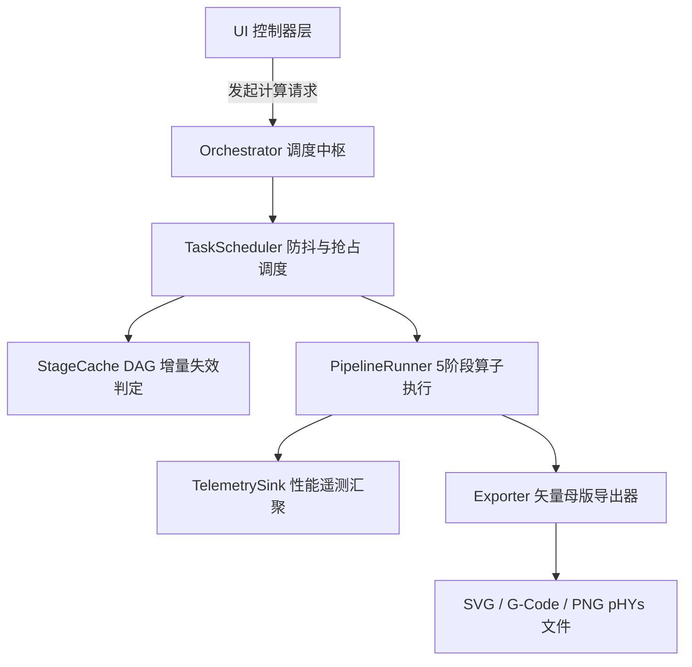
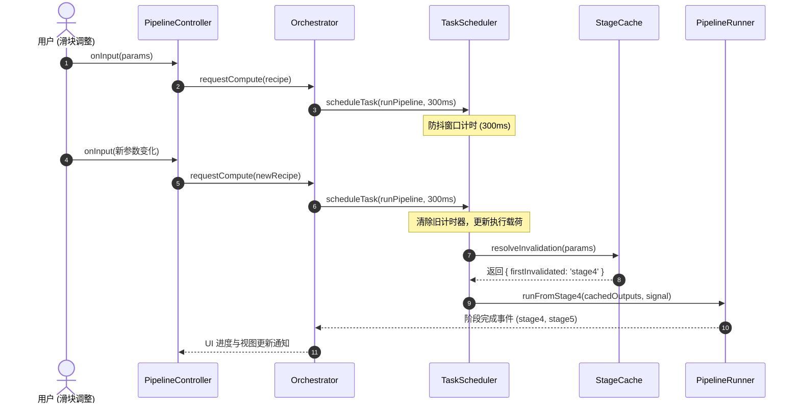
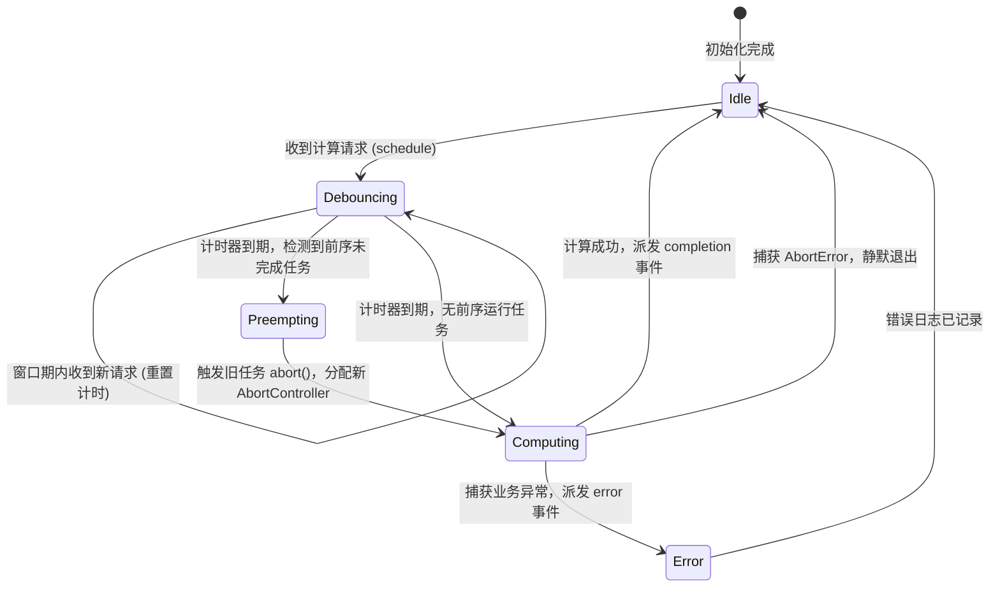

# 调度中枢与生命周期拓扑设计规范 (ARCHITECTURE.md)

> **模块定位**：`src/orchestration/`  
> **上级体系规范**：[docs/00_architecture/ARCHITECTURE_OVERVIEW.md](../../../docs/00_architecture/ARCHITECTURE_OVERVIEW.md)

---

## 1. 系统拓扑与组件关系图 (Topology & Component Diagrams)

---

## 2. 交互时序与调用流程图 (Sequence & Interaction Flows)

---

## 3. 内部数据流动与状态不变量 (Data Flow & Invariants)

1. **单向数据流原则**：`Orchestrator` 永远不直接持有 DOM 元素句柄，所有数据变更均以不可变 Plain Object 形式通过回调派发；
2. **缓存指针不可变性**：`StageCache` 存入的中间产物（如 `LineMap`、`ToneFlow`）为只读引用，后续阶段必须作为纯入参传入，严禁就地（in-place）修改前置阶段属性；
3. **信号源唯一性**：任何正在执行的任务必须且仅能绑定唯一一个 `AbortSignal`，当新的调度请求生效时，旧信号立即触发 `abort` 广播。

---

## 4. 生命周期状态机模型 (Lifecycle State Machine)

