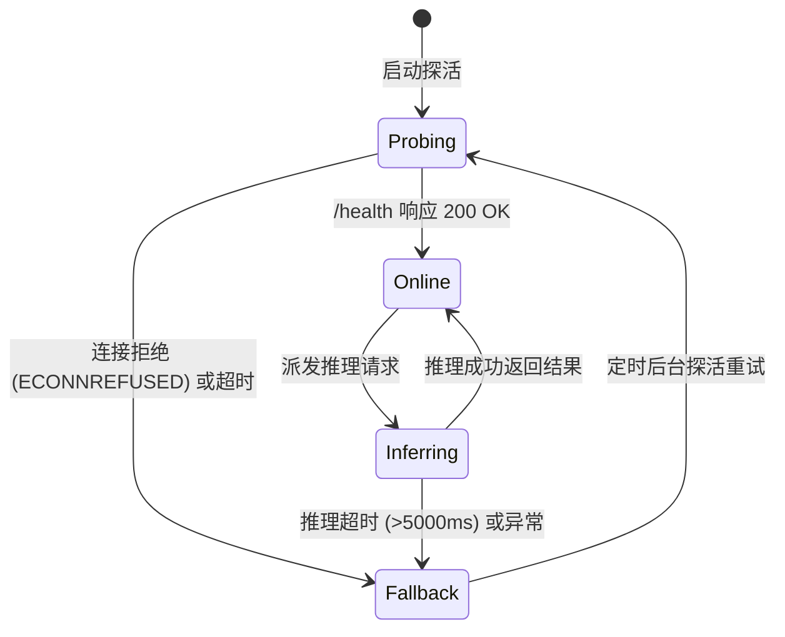

# 微服务网关架构与进程间通信拓扑 (ARCHITECTURE.md)

> **模块路径**：`src/services/`  
> **上级体系规范**：[docs/00_architecture/ARCHITECTURE_OVERVIEW.md](../../../docs/00_architecture/ARCHITECTURE_OVERVIEW.md)

---

## 1. 跨进程客户端-微服务拓扑图 (Topology)

```mermaid
graph LR
    subgraph Browser / Node.js Runtime
        Pipeline[Core Pipeline Stage 1 / Stage 3] --> Gateway[AIServiceGateway (src/services/client/)]
    end

    subgraph Local Python 3.10 Runtime (Port 7861)
        Gateway -->|HTTP JPEG 请求 / PNG 响应| Server[ThreadingHTTPServer (services/informative_drawings/server.py)]
        Server --> LineModel[Informative Drawings GAN]
        Server --> LotusModel[Lotus 3D Geometry Pipeline]
    end

    Gateway -.->|当端口不可达或超时| Fallback[本地纯 JavaScript DoG / 经验几何回退算子]
```

---

## 2. 状态机模型与降级流转 (State Machine)

本机 Python 服务仅向 `http://127.0.0.1:4173` 和 `http://localhost:4173` 返回跨域许可；直接打开的 `file://` 页面仍可运行基础几何模式。浏览器 WebAI 的设备探测只表明可尝试加载模型，不表示模型已就绪。


