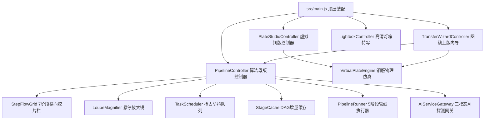
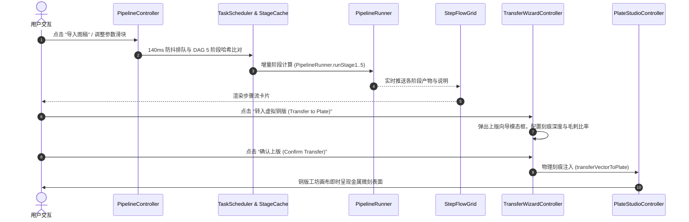

# 前端业务控制器架构与事件状态机规范 (ARCHITECTURE.md)

> **模块路径**：`src/ui/controllers/`  
> **上级体系规范**：[docs/00_architecture/ARCHITECTURE_OVERVIEW.md](../../../../docs/00_architecture/ARCHITECTURE_OVERVIEW.md)

---

## 1. 架构拓扑与装配关系 (Topology & Component Diagrams)

---

## 2. 控制器交互时序与调用流程 (Sequence & Interaction Flows)

参数调整会调用 `PipelineController.scheduleParameterRun()`；控制器在排队时发出 `onRecomputeState(true)`，仅最新一次请求结束后发出 `false`。外框选择直接重绘 `StepFlowGrid` 第 06 阶段，再由 `syncHeroMasterPreview()` 刷新主画布，无须重新运行几何管线。`plate-studio-controller.js` 的 `etch(dt)` 按真实经过秒数累计 `elapsed`，侧蚀、刻深与毛刺消退使用 `dt * 0.4` 作为反应步长。
图片载入时先根据像素总量和最长边计算等比缩放系数，再分配处理画布；`currentLoadedImage` 同时记录处理尺寸和原始尺寸。第 06 阶段导出当前上版母稿画布。试印纸张选择的 `change` 事件立即重新渲染试印视图。
`PipelineController` 在初次计算、增量重绘和示例生成时均以 `{ key, args }` 更新七阶段卡片说明；尺寸和路径数量作为参数保存，由组件在语言切换时重新翻译。

---

## 3. 控制器核心职责与状态契约 (Controller Contracts)

### 3.1 `PipelineController`
- **生命周期**：管理照片输入、阶段进度指示条、各阶段真实耗时计时器（采用 `performance.now()` 精确记录实际毫秒数，杜绝模拟假耗时）；
- **界面通知**：母版预览同步完成时通过 `onMasterReady` 回调通知入口切换到就绪页面；主动载入的示例不填入固定伪造耗时。
- **联动**：与 `LoupeMagnifier`、`StepFlowGrid`、`TaskScheduler`、`StageCache` 及 `PipelineRunner` 单向数据流绑定。

### 3.2 `PlateStudioController`
- **生命周期**：展示当前铜版精度（精度更改由上版向导负责）、4 种物理制版工具划线交互、化学酸蚀控制台与无头纯位图压印；
- **撤销栈**：维护历史快照数组 `history[]`（容量上限 12 步或 128MB 显存），支持多步撤销 `undo()`（当前未实现独立 redo 重做栈）；
- **内存优化**：在 `render()` 中复用 `cachedRenderImageData` 离屏 ImageData 缓冲，消除每帧 6.6MB~26.4MB 的 GC 垃圾回收波动。

### 3.3 `TransferWizardController`
- **生命周期**：图稿上版模态框控制，提供轮廓线条与排线线条分层过滤勾选，按选定物理深度写入 `VirtualPlateEngine`。

### 3.4 `LightboxController`
- **生命周期**：全屏高清特写观察，支持原生手势缩放、滚轮 100%~500% 无级缩放与双缓冲平移。

## 试印纸张更新

试印提供 `rough`、`smooth`、`linen`、`rosaspina` 四种表面预设。后两者参考真实凹版纸的材质与纹理；实现通过底色、确定性空间纹理和着墨变化进行视觉区分，未对实体纸做物理标定。纸张选择会触发试印重绘，说明文案随 zh-CN、en-US、vi-VN 切换。`tests/virtual-plate-engine.test.cjs` 检查四种纸面的像素差异。

蚀刻工作台顶部的精度为只读值，由上版流程选择精度后更新；手工刻绘的 `size` 滑块直接改变刻针足迹。快捷上版固定使用 100% 线宽；上版细节弹窗中的 `wizardLineWidth` 以 50%–200% 缩放转录笔画，和手工工具直径相互独立。
