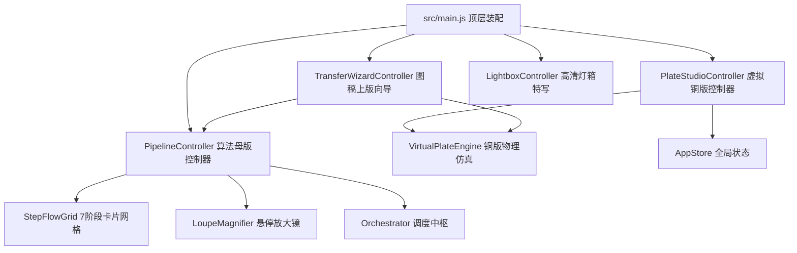
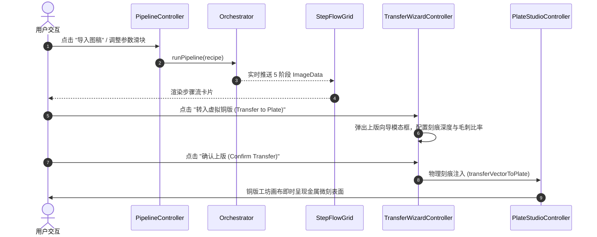

# 前端业务控制器架构与事件状态机规范 (ARCHITECTURE.md)

> **模块路径**：`src/ui/controllers/`  
> **上级体系规范**：[docs/00_architecture/ARCHITECTURE_OVERVIEW.md](../../../../docs/00_architecture/ARCHITECTURE_OVERVIEW.md)

---

## 1. 架构拓扑与装配关系 (Topology & Component Diagrams)

---

## 2. 控制器交互时序与调用流程 (Sequence & Interaction Flows)

---

## 3. 控制器核心职责与状态契约 (Controller Contracts)

### 3.1 `PipelineController`
- **生命周期**：管理照片输入、阶段进度指示条、各阶段真实耗时计时器（采用 `performance.now()` 精确记录实际毫秒数，杜绝模拟假耗时）；
- **联动**：与 `LoupeMagnifier`、`StepFlowGrid` 及 `Orchestrator` 单向数据流绑定。

### 3.2 `PlateStudioController`
- **生命周期**：管理铜版分辨率切换（900、1500 2K、3000 3K）、4 种物理制版工具划线交互、化学酸蚀控制台与无头纯位图压印；
- **撤销栈**：维护完整的历史快照数组 `history[]`，支持多步撤销与重做。

### 3.3 `TransferWizardController`
- **生命周期**：图稿上版模态框控制，提供轮廓线条与排线线条分层过滤勾选，按选定物理深度写入 `VirtualPlateEngine`。

### 3.4 `LightboxController`
- **生命周期**：全屏高清特写观察，支持原生手势缩放、滚轮 100%~500% 无级缩放与双缓冲平移。
