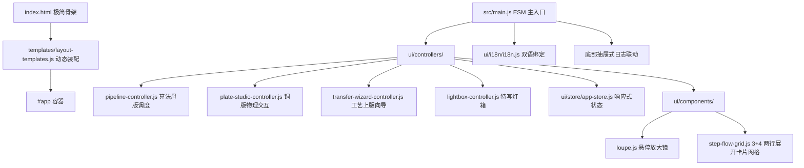

# UI 前端总装架构与分层设计规范 (ARCHITECTURE.md)

> **模块路径**：`src/ui/`  
> **上级体系规范**：[docs/00_architecture/ARCHITECTURE_OVERVIEW.md](../../../docs/00_architecture/ARCHITECTURE_OVERVIEW.md)

---

## 1. 前端分层与组件关系图 (UI Layered Architecture)

---

## 2. 核心架构解耦与设计机制 (Decoupled Architectural Patterns)

1. **3+4 自然并置网格体系**：
   - 主工作区由 `StepFlowGrid` 统领 7 个阶段卡片，通过 12 列弹性 CSS Grid (`repeat(12, 1fr)`) 同时平铺展示全流程（上行 3 卡片各占 4 列，下行 4 卡片各占 3 列），满足用户对全流程连续视野的严苛要求；
   - 悬浮工具条（特写、独立导出）采用微交互毛玻璃胶囊，鼠标悬停时平滑浮现，彻底释放纯净画布净空；
2. **上下文隔离侧边栏 (Contextual Sidebar)**：
   - 严格解耦不同工艺阶段：`body.mode-master` 过滤隐藏铜版工序，`body.mode-plate` 过滤隐藏母版滑块，降低 50% 控件密度与心智负担；
3. **滑出式日志托盘 (Slide-up Activity Log Drawer)**：
   - 将常态占据 150px 高度的静态日志重构为 32px 底部微型抽屉，支持点击展开至 96px，最大化保留画布垂直尺寸；
4. **顶层统一挂载与 ESM 模块化**：
   - `index.html` 极简骨架加载后，`main.js` 统一装配 `mountAppLayout(root)`，各子控制器与纯数学/物理核心按需导入，无任何全局变量污染；
5. **性能与真实耗时**：
   - `PipelineController` 与各阶段算法严格调用 `performance.now()` 计算真实耗时，毫秒级反映 Lotus 3D 与等值线/排线生成开销。

