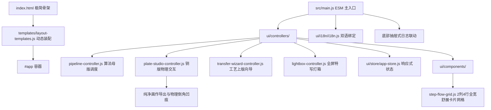

# UI 前端总装架构与分层设计规范 (ARCHITECTURE.md)

> **模块路径**：`src/ui/`  
> **上级体系规范**：[docs/00_architecture/ARCHITECTURE_OVERVIEW.md](../../../docs/00_architecture/ARCHITECTURE_OVERVIEW.md)

---

## 1. 前端分层与组件关系图 (UI Layered Architecture)

---

## 2. 核心架构解耦与设计机制 (Decoupled Architectural Patterns)

1. **2列4行 自然舒展网格体系 (2x4 Studio Grid)**：
   - 主工作区由 `StepFlowGrid` 统领 7 个阶段卡片，通过 2 列弹性 CSS Grid (`repeat(2, minmax(0, 1fr))`) 全宽展开：前 3 行容纳 Steps 00~05（每张卡片占宽 50%），第 4 行通栏跨列展示 Step 06 纯棉印样（占宽 100%）；
   - 卡片拥有充裕视口（高度 380px~460px+），主工作区通过 `overflow-y: auto` 垂直自然滚动；
   - 处于 `COMPUTING` 状态时立即清空画布（`ctx.clearRect`），杜绝旧图残影；
2. **多阶段管线依赖增量合成与拓扑缓存**：
   - 载入照片后将 1~5 各阶段输出与哈希完整存入 `StageCache`；
   - 用户微调滑块参数时，增量管线从失效阶段（如 Stage 4）重算，且始终将前序空间轮廓（Stage 3）与曲面排线（Stage 4）加和复合至母版图稿（Stage 5）与印样（Stage 6），呈现完整画面；
3. **铜版工坊全屏特写与纯净导出**：
   - 铜版画板移除遮挡刻线的放大镜，顶栏集成显式 `[⛶ 全屏特写]` 按钮与双击画布交互，直通 Lightbox 全屏平移缩放；
   - 试印导出与第 06 步导出均只输出纯净画作本身，真实还原棉纸四周留白与 45° 金属倒角凹印压痕（Plate Bevel），剥离工作台边框与辅助 DOM；
4. **极淡清新美学配色 (Airy Linen & Pale Sage)**：
   - 采用亚麻纸白基底 (`#faf8f5`)、柔和淡鼠尾草绿 (`#7a8c7e`)、极细羽量分割线 (`#eae5dc`) 与暖炭灰文本 (`#2a2b2a`)，界面文案极度精简，降低用户认知负荷；
5. **顶层统一挂载与 ESM 模块化**：
   - `index.html` 极简骨架加载后，`main.js` 统一装配 `mountAppLayout(root)`，各子控制器与纯数学/物理核心按需导入，保持高度解耦与零全局污染。

